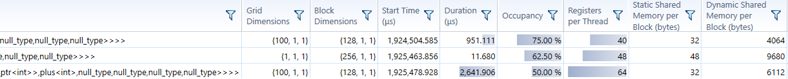
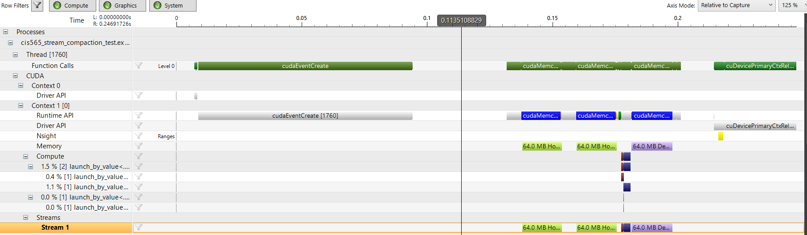
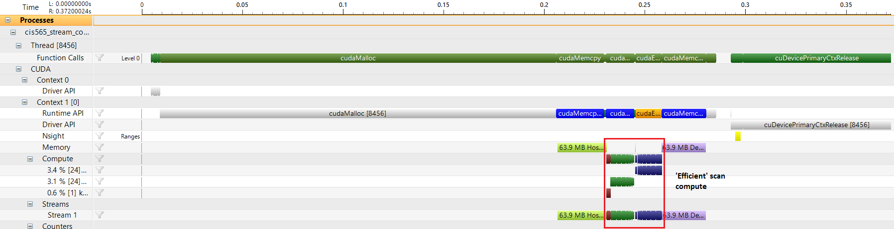

**University of Pennsylvania, CIS 565: GPU Programming and Architecture,
Project 2 - Stream Compaction**

* Josh Lawrence
* Tested on: Windows 10, i7-6700HQ @ 2.6GHz 8GB, GTX 960M 2GB  Personal

**CMakeLists.txt Additions** 
radix.h 
radix.cu 
sharedandbank.h 
sharedandbank.cu 

**NSight** 

**GPU Device Properties** 
https://devblogs.nvidia.com/parallelforall/5-things-you-should-know-about-new-maxwell-gpu-architecture/ 
cuda cores 640 
mem bandwidth 86.4 GB/s 
L2 cache size 2MB 
number of multiprocessor 5 
max blocks per multiprocessor 32 
total shared mem per block 49152 bytes 
total shared mem per MP 65536 bytes 
total regs per block and MP 65536 
max threads per block 1024 
max threads per mp 2048 
total const memory 65536 
max reg per thread 255 
max concurrent warps 64 
total global mem 2G 
 
max dims for block 1024 1024 64 
max dims for a grid 2,147,483,647 65536 65536 
clock rate 1,097,5000 
texture alignment 512 
concurrent copy and execution yes 
major.minor 5.0 

