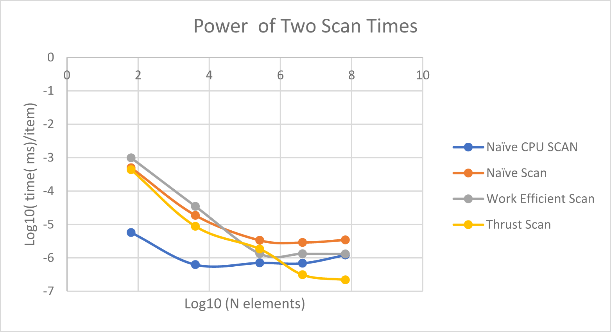
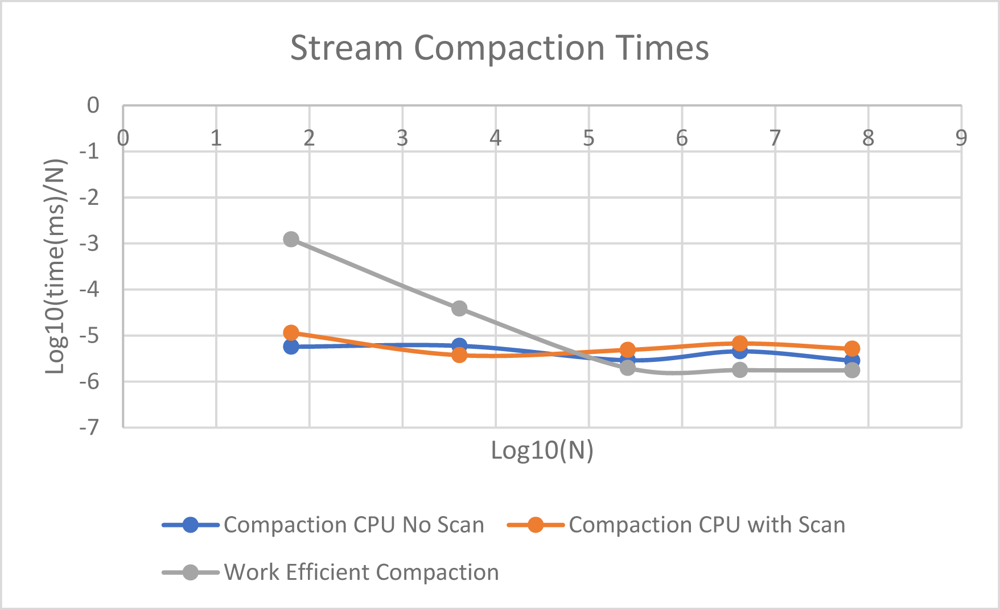

CUDA Stream Compaction
======================

**University of Pennsylvania, CIS 565: GPU Programming and Architecture, Project 2**

* Anton Khabbaz
* pennkey:akhabbaz
* Tested on: Windows 10 surface book i7-6600u at 2.66 GHz with a GPU GTX 965M
Personal computer

### (TODO: Your README)

This project aimed to understand parallel algorithms and how they are implemented on the GPU.  A scan takes a running sum of integers and here we used the scan to implement three versions of scan: a cpu version in series, a naive GPU version, a work efficient version,
and one where we used the thrust library.

To do the work efficient scan I implemented the extra credit.  All the threads are contiguous in both the up and down sweep.  Furthermore, I trimmed the number of threads needed so that the grid size was enough to run all the threads needed. In the end with some 10^8 data elements, my work efficient scan matched the CPU scan in speed.  The GPU and CPU timers measured computation, not the time to copy and transfer data.

For all number of elements all the tests passed.

THis figure plots the log10 of the run time per element in the array.  This measure was relatively constant as N increased. Here we can see that the work efficient scan at first is worse than the CPU scan but as the number of elements increases, it first beats the naive scan and then matches the CPU scan.  Thrust on the other hand is the fastest scan for large data (faster by a factor of about 6).
The non power of two scans were slightly faster but comparable in speed to the power of two scans.

Stream Compaction is one application of scan and it allows one to remove elements from the stream.  Here around 10^5 elements, the work efficient compaction actually beat the other compactions.  A thrust scan would beat the work efficient compaction, since a majority of the time to compact is spent making the exclusive scan.

Here I implemented the efficient scan using contiguous threads.  This worked perfectly up to one block but beyond one block the code failed.   The issue was that threads beyond one block do not synchronize.

I had many difficulties.  First I used syncthreads to synchronize and that worked only when one block had all the threads.  I then changed my code to iterate over strides on the CPU and this allowed all the blocks to be synchronized.

Another major issue I had was that aroud 2^15 or so, I got an allocation error.  I traced it down to the work efficient scan and then used Memtracker in cuda to catch the out of bounds error.  That showed me that I was multiplying 2 65K integers to calculate the index (some threads had high indices).  That produced a negative index.  I got around that by returning depending on the stride, so that the actual index would never be larger that the avalable array.  Ultimately I also chose the grid size so that the minimum number of threads would be available, a number that varied with the stride.  THis culled the number of possible threads and sped up the run time.

A final issue I had was that in the compaction I did not return when index was beyond the array size.  That caused multiple writes to the same location and that was hard to debug.  

The code now works for any N I tride up to the maximum memory, about 2 GB.

