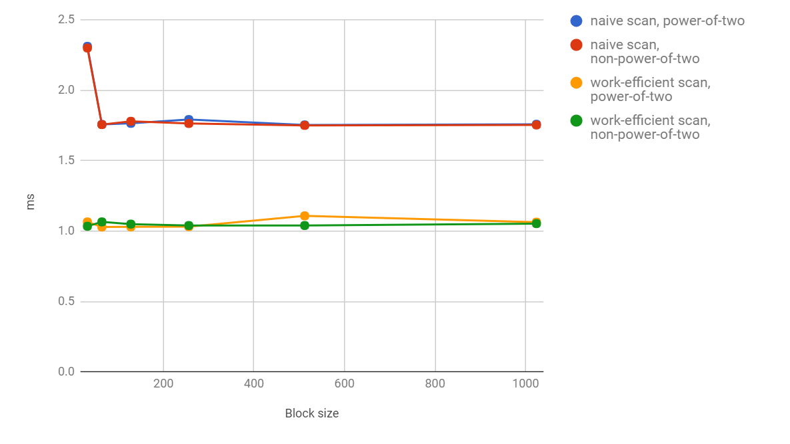
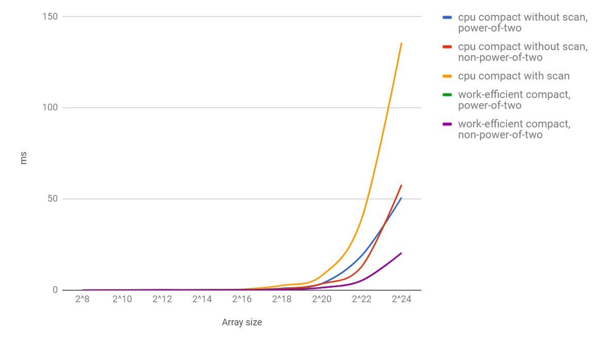

CUDA Stream Compaction
======================

**University of Pennsylvania, CIS 565: GPU Programming and Architecture, Project 2**

* LINSHEN XIAO
* Tested on: Windows 10, Intel(R) Core(TM) i7-6700HQ CPU @ 2.60GHz, 16.0GB, NVIDIA GeForce GTX 970M (Personal computer)

## Features

Part 1 ~ 4, includes:

* CPU Scan
* CPU Stream Compaction
* Naive GPU Scan
* Work-Efficient GPU Scan
* Work-Efficient GPU Stream Compaction
* Thrust's Implementation

Extra Credit:

* Part 5 implemented. After testing the Work-Efficient method with other ones, I find that it's even slower than the CPU one, that's because there are lots of threads that are not used due to the branches, which I have removed in new functions. Check  **newkernScanUp**, **newkernScanDown** and **newkernScan** (compared with **kernScanUp**, **kernScanDown** and **kernScan**) in efficient.cu for more details.
* I use the new Work-Efficient method without branches in the following analysis to show its "efficiency" better.


## Performance Analysis

### Comparison of GPU Scan (Naive, Work-Efficient) for different block size.



| Block   size | Naive scan,   power-of-two | Naive scan,   non-power-of-two | Work-efficient   scan, power-of-two | Work-efficient   scan, non-power-of-two |
|:--------------|:----------------------------|:--------------------------------|:-------------------------------------|:-----------------------------------------|
| 32           | 2.31232                    | 2.30061                        | 1.0649                              | 1.03421                                 |
| 64           | 1.75728                    | 1.75683                        | 1.02925                             | 1.06506                                 |
| 128          | 1.76538                    | 1.77981                        | 1.02992                             | 1.04938                                 |
| 256          | 1.79238                    | 1.76445                        | 1.03142                             | 1.03942                                 |
| 512          | 1.75421                    | 1.75085                        | 1.10819                             | 1.03946                                 |
| 1024         | 1.75885                    | 1.75379                        | 1.06323                             | 1.05293                                 |

The array size is 2^20 in the test above. We can tell from the data that after the blocksize is larger than 32, there is no major performance difference between different blocksize. I use 1024 as the blocksize in my following tests.

### Comparison of GPU Scan (Naive, Work-Efficient & Thrust) and CPU version.


| Array size | CPU scan, power-of-two | CPU scan, non-power-of-two | Naive scan, power-of-two | Naive scan, non-power-of-two | Work-efficient scan, power-of-two | Work-efficient scan, non-power-of-two | Thrust scan, power-of-two | Thrust scan, non-power-of-two |
|:------------|:------------------------|:----------------------------|:--------------------------|:------------------------------|:-----------------------------------|:---------------------------------------|:---------------------------|:-------------------------------|
| 2^8        | 0.00079                | 0.000395                   | 0.046112                 | 0.035296                     | 0.106176                          | 0.074688                              | 0.03664                   | 0.013728                      |
| 2^10       | 0.001975               | 0.001975                   | 0.047552                 | 0.055584                     | 0.106112                          | 0.098848                              | 0.023136                  | 0.013696                      |
| 2^12       | 0.007111               | 0.007506                   | 0.067552                 | 0.065088                     | 0.120032                          | 0.182144                              | 0.029984                  | 0.020512                      |
| 2^14       | 0.030419               | 0.061234                   | 0.074976                 | 0.064032                     | 0.145696                          | 0.140928                              | 0.05952                   | 0.047424                      |
| 2^16       | 0.118124               | 0.120889                   | 0.116256                 | 0.115424                     | 0.185984                          | 0.18752                               | 0.153856                  | 0.163648                      |
| 2^18       | 1.34716                | 0.503309                   | 0.408064                 | 0.397536                     | 0.313952                          | 0.298272                              | 0.228928                  | 0.36768                       |
| 2^20       | 2.25462                | 2.55684                    | 1.7671                   | 1.75427                      | 1.08269                           | 1.07862                               | 0.310208                  | 0.406784                      |
| 2^22       | 8.39032                | 8.32909                    | 7.86064                  | 7.81309                      | 3.96986                           | 3.93744                               | 0.865472                  | 0.864512                      |
| 2^24       | 37.5455                | 35.584                     | 34.8642                  | 34.8712                      | 15.5057                           | 15.5434                               | 2.62048                   | 2.70346                       |

### Comparison of GPU Stream compaction (Naive, Work-Efficient & Thrust) and CPU version.



| Array size | CPU compact without scan, power-of-two | CPU compact without scan, non-power-of-two | CPU compact with scan | Work-efficient compact, power-of-two | Work-efficient compact, non-power-of-two |
|:------------|:----------------------------------------|:--------------------------------------------|:-----------------------|:--------------------------------------|:------------------------------------------|
| 2^8        | 0.001185                               | 0.001186                                   | 0.003951              | 0.094752                             | 0.093824                                 |
| 2^10       | 0.00395                                | 0.00316                                    | 0.024493              | 0.176832                             | 0.10768                                  |
| 2^12       | 0.011851                               | 0.012247                                   | 0.076246              | 0.174656                             | 0.202976                                 |
| 2^14       | 0.047407                               | 0.063605                                   | 0.126025              | 0.20528                              | 0.160288                                 |
| 2^16       | 0.193975                               | 0.185284                                   | 0.463013              | 0.211744                             | 0.243264                                 |
| 2^18       | 1.04138                                | 0.776692                                   | 2.61413               | 0.368416                             | 0.360832                                 |
| 2^20       | 3.66025                                | 3.52553                                    | 8.02608               | 1.46659                              | 1.40083                                  |
| 2^22       | 18.9922                                | 12.979                                     | 39.1909               | 5.3247                               | 5.31274                                  |
| 2^24       | 50.8401                                | 57.8019                                    | 135.726               | 20.4587                              | 20.4935                                  |

We can tell from the data above that in both scan and stream compaction:

* When the array size < 2^16, CPU method is still faster than GPU version. Elapsed time used: CPU < Thrust < Naive < Work-efficient;
* When the array size > 2^16, parallel computation in GPU is better when the number of elements is very large. Elapsed time used: Thrust < Work-efficient < Naive < CPU;

## Questions

* Roughly optimize the block sizes of each of your implementations for minimal run time on your GPU.
  
  Check [**Performance Analysis**](#performance-analysis) for graph comparison. 
  
  As I mentioned above, there is no major performance difference between different blocksize.

* Compare all of these GPU Scan implementations (Naive, Work-Efficient, and Thrust) to the serial CPU version of Scan. Plot a graph of the comparison (with array size on the independent axis).
  
  Check [**Performance Analysis**](#performance-analysis) for graph comparison.
  
  In conclusion, when the array size is not too huge, CPU implementation is always better than GPU versions. However, if the array size is very huge, the parallel computation in GPU is faster. Also, Thrust method is always very stable no matter how the size of array changes.
  
  As for Thrust implementation, I guess that share memory may be used, so it's more efficient than other GPU methods as the memory access is faster.
    
* Write a brief explanation of the phenomena you see here.
  
  The performance bottlenecks may be different for different methods. For CPU implementation, it doesn't have memory issues, so it is faster when the array size is not too huge, but will have worse performance than GPU versions if the size of array is too large, for it can only compute on one single process.
  
  As for GPU implementations, compared to Naive method, Work-Efficient method use more time on computation, so it may be slower when the array size is not huge. Due to the branch which leads to numbers of unused threads, old Work-Efficient method is way slower, not until the branches are removed to improve its performance. Also, compared to Thrust implementation, I did not use any shared memory for other GPU methods, which is better to improve performance.

* Paste the output of the test program into a triple-backtick block in your README.
  
  Check [**Output**](#output).

## Output

Array size: 2 ^ 20; Block size: 1024;
```
****************
** SCAN TESTS **
****************
    [  25  26  46  21   5  19  20   6   5  10  15   2  47 ...  13   0 ]
==== cpu scan, power-of-two ====
   elapsed time: 2.19694ms    (std::chrono Measured)
    [   0  25  51  97 118 123 142 162 168 173 183 198 200 ... 25692588 25692601 ]
==== cpu scan, non-power-of-two ====
   elapsed time: 2.12583ms    (std::chrono Measured)
    [   0  25  51  97 118 123 142 162 168 173 183 198 200 ... 25692495 25692534 ]
    passed
==== naive scan, power-of-two ====
   elapsed time: 1.75926ms    (CUDA Measured)
    passed
==== naive scan, non-power-of-two ====
   elapsed time: 1.74765ms    (CUDA Measured)
    passed
==== work-efficient scan, power-of-two ====
   elapsed time: 1.07485ms    (CUDA Measured)
    passed
==== work-efficient scan, non-power-of-two ====
   elapsed time: 1.09978ms    (CUDA Measured)
    passed
==== thrust scan, power-of-two ====
   elapsed time: 0.440448ms    (CUDA Measured)
    passed
==== thrust scan, non-power-of-two ====
   elapsed time: 0.343456ms    (CUDA Measured)
    passed

*****************************
** STREAM COMPACTION TESTS **
*****************************
    [   0   2   0   0   0   3   3   0   1   0   1   2   2 ...   2   0 ]
==== cpu compact without scan, power-of-two ====
   elapsed time: 4.24494ms    (std::chrono Measured)
    [   2   3   3   1   1   2   2   2   2   2   2   3   3 ...   3   2 ]
    passed
==== cpu compact without scan, non-power-of-two ====
   elapsed time: 3.14983ms    (std::chrono Measured)
    [   2   3   3   1   1   2   2   2   2   2   2   3   3 ...   1   3 ]
    passed
==== cpu compact with scan ====
   elapsed time: 9.90341ms    (std::chrono Measured)
    [   2   3   3   1   1   2   2   2   2   2   2   3   3 ...   3   2 ]
    passed
==== work-efficient compact, power-of-two ====
   elapsed time: 1.45267ms    (CUDA Measured)
    passed
==== work-efficient compact, non-power-of-two ====
   elapsed time: 1.38931ms    (CUDA Measured)
    passed
```
