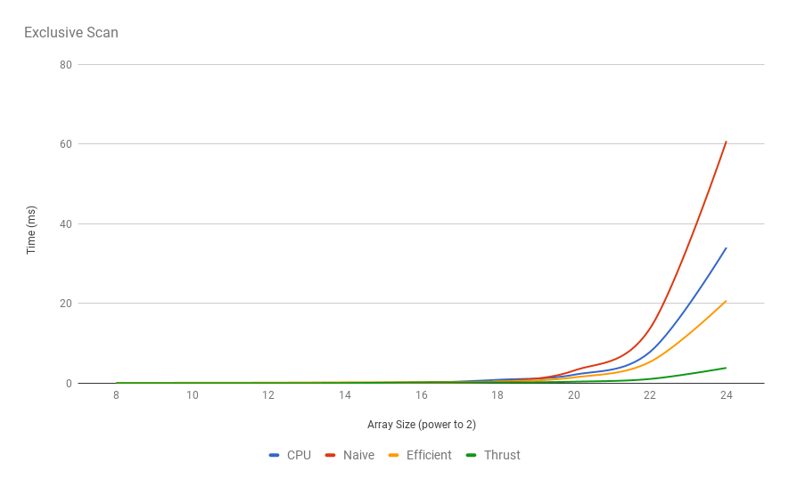
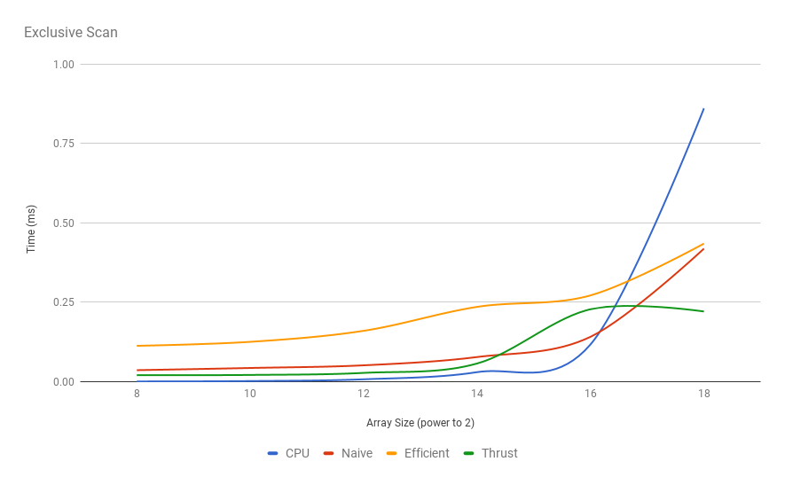
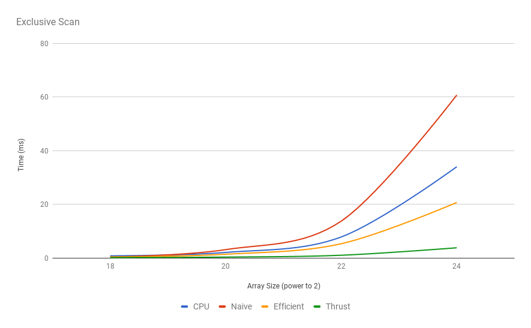
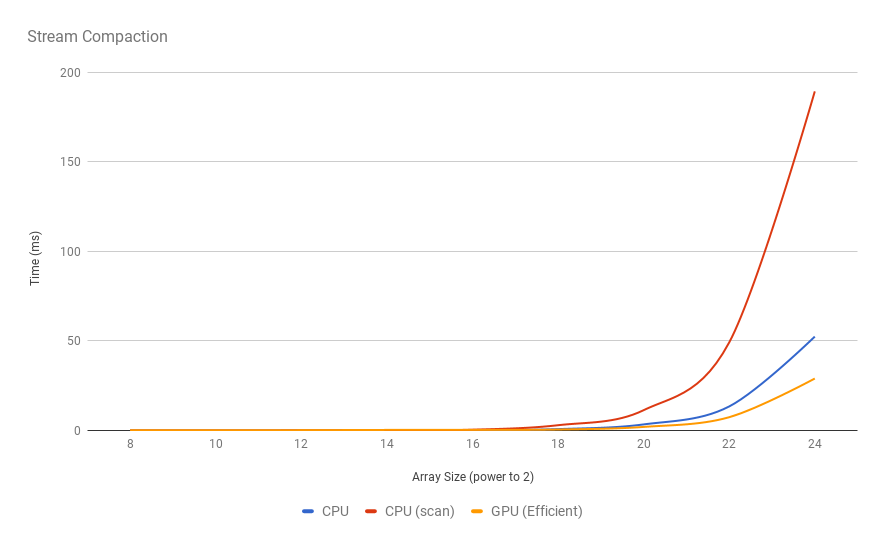

CUDA Stream Compaction
======================

**University of Pennsylvania, CIS 565: GPU Programming and Architecture, Project 2**

* Rishabh Shah
* Tested on: Windows 10, i7-6700HQ @ 2.6GHz 16GB, GTX 960M 4096MB (Laptop)

## Overview

In this project, I explored parallel algorithms to find the sum of elements of an array. Inclusive and Exclusive scan algorithms for CPU and GPU are implemented. These algorithms can be used in a number of applications like stream compaction, path tracing, etc. As a part of the project, I also implemented stream compaction using exclusive scan on the GPU.

The performance of the GPU implementation is very high compared to the CPU implementation when the input array is very large.

## Functionalities Implemented

*   Required functionalities
    *   Part 1: CPU Scan and Stream Compaction
    *   Part 2: Naive GPU Scan
    *   Part 3: Work-Efficient GPU Scan and Stream Compaction
    *   Part 4: Thrust's GPU Scan
*   Part 5: Optimizing work-efficient GPU implementation

## Performance Analysis

The GPU implementations are compared with a CPU implementation and Thrust's implementation. At first glance on the plots, it seems that GPU implementations are faster than CPU. But when we take a closer look, it becomes clear that GPU implementations are slower upto array sizes of 2<sup>16</sup> and becomes faster for longer arrays. This must be due to the calculation overhead with the parallel algorithms, compared to simple summation on the CPU.

A same trend can be seen in stream compaction. Both, CPU and GPU methods, take a considerably longer to perform compaction compared to only scan, suggesting that scan is not the only heavy task performed during compaction, and the rest of the algorithm also contributes significantly to the total time. Yet, similar to scan, GPU becomes more efficient only for array sizes greater than 2<sup>16</sup>.

###### Optimizing work-efficient GPU scan

Much of the performance gain for work-efficient GPU algorithm is due to the fact that the number of threads at each level reduces to half, so more the number of levels, faster it is compared to naive GPU scan and CPU scan. Mathematically, for array of size N, there are log<sub>2</sub>N levels. So, there would be N*log<sub>2</sub>N threads without this optimization. By not creating extra threads, we will only create threads equal to the number of nodes at each level of the binary tree, which is equal to 2<sup>log<sub>2</sub>N+1</sup>. Thus the number of threads required to compute the result is much less for very large array sizes.

###### Performance Bottlenecks

The GPU implementations seem to be very slow compared to thrust's implementation, probably because I am not using shared memory which is way faster than global memory. For CPU implementation, memory access should not be an issue, but it just becomes increasingly slower as it is a single threaded sequential process.


##### Exclusive Scan

|   Array Size (exp)   |   CPU   |   GPU (Naive)   |   GPU (Efficient)   |  Thrust  |
|---------------------:|-------:|---------------:|-------------------:|--------:|
|8	|0.00079	|0.036256	|0.112896	|0.020512|
|10	|0.001975	|0.043136	|0.12544	|0.021248|
|12	|0.007507	|0.05152	|0.160096	|0.02768|
|14	|0.030025	|0.077568	|0.235488	|0.057216|
|16	|0.117333	|0.14128	|0.271616	|0.228|
|18	|0.860445	|0.418816	|0.434656	|0.220896|
|20	|2.12425	|3.16147	|1.45034	|0.389504|
|22	|7.8724	    |13.7757	|5.36339	|1.076|
|24	|34.0334	|60.7282	|20.7226	|3.8527|

*Plot: exclusive scan for entire data*



*Plot: exclusive scan for 2<sup>8</sup> to 2<sup>18</sup> array sizes*



*Plot: exclusive scan for 2<sup>18</sup> to 2<sup>24</sup> array sizes*



##### Stream Compaction

| Array Size (exp) | CPU (without scan) | CPU (with scan) | GPU (Efficient) |
|-----------------:|-------------------:|----------------:|----------------:|
|8	|0.00079	|0.002766	|0.162496|
|10	|0.003161	|0.005531	|0.1424|
|12	|0.012642	|0.033975	|0.16608|
|14	|0.046617	|0.112593	|0.304896|
|16	|0.181729	|0.436939	|0.318752|
|18	|0.764839	|2.9361	    |0.541664|
|20	|3.37936	|11.3189	|1.98714|
|22	|13.412	    |49.1414	|7.40618|
|24	|52.4042	|189.27	    |28.9966|




_Console output for 16777216 (2<sup>24</sup>) elements in the input array._
```
****************
** SCAN TESTS **
****************
    [   7  42  17  29  31  49   9   9  40  35   8  48  15 ...  23   0 ]
==== cpu scan, power-of-two ====
   elapsed time: 33.9812ms    (std::chrono Measured)
    [   0   7  49  66  95 126 175 184 193 233 268 276 324 ... 410894172 410894195 ]
==== cpu scan, non-power-of-two ====
   elapsed time: 36.3137ms    (std::chrono Measured)
    [   0   7  49  66  95 126 175 184 193 233 268 276 324 ... 410894088 410894124 ]
    passed
==== naive scan, power-of-two ====
   elapsed time: 60.7475ms    (CUDA Measured)
    passed
==== naive scan, non-power-of-two ====
   elapsed time: 60.0793ms    (CUDA Measured)
    passed
==== work-efficient scan, power-of-two ====
   elapsed time: 20.6467ms    (CUDA Measured)
    passed
==== work-efficient scan, non-power-of-two ====
   elapsed time: 20.7787ms    (CUDA Measured)
    passed
==== thrust scan, power-of-two ====
   elapsed time: 3.81834ms    (CUDA Measured)
    passed
==== thrust scan, non-power-of-two ====
   elapsed time: 3.69171ms    (CUDA Measured)
    passed

*****************************
** STREAM COMPACTION TESTS **
*****************************
    [   1   2   2   3   0   0   0   2   3   3   1   2   1 ...   2   0 ]
==== cpu compact without scan, power-of-two ====
   elapsed time: 73.5653ms    (std::chrono Measured)
    [   1   2   2   3   2   3   3   1   2   1   3   1   1 ...   2   2 ]
    passed
==== cpu compact without scan, non-power-of-two ====
   elapsed time: 54.5126ms    (std::chrono Measured)
    [   1   2   2   3   2   3   3   1   2   1   3   1   1 ...   3   2 ]
    passed
==== cpu compact with scan ====
   elapsed time: 283.844ms    (std::chrono Measured)
    passed
==== work-efficient compact, power-of-two ====
   elapsed time: 29.1447ms    (CUDA Measured)
    passed
==== work-efficient compact, non-power-of-two ====
   elapsed time: 29.2029ms    (CUDA Measured)
    passed
Press any key to continue . . .
```

##### Changes in CMakeLists
OPTIONS -arch=sm_50
