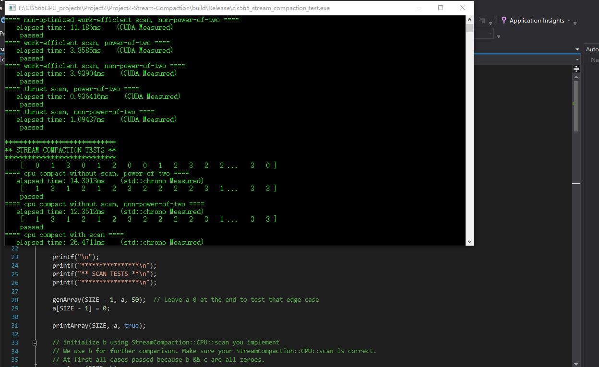
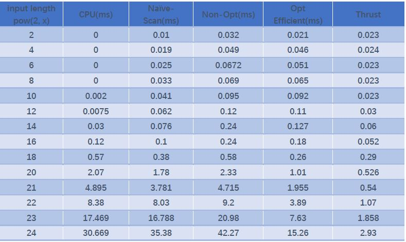
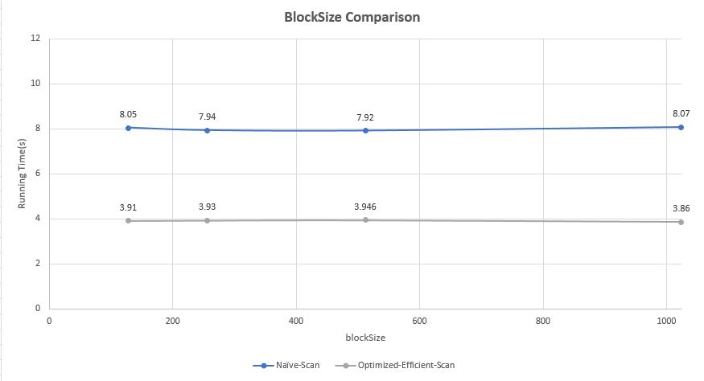

CUDA Stream Compaction
======================

**University of Pennsylvania, CIS 565: GPU Programming and Architecture, Project 2**

* Jiawei Wang 
* Tested on:  Windows 10, i7-6700 @ 2.60GHz 16.0GB, GTX 970M 3072MB (Personal)

## Results
___


## Extra Credit:
___
* ***Why is My GPU Approach So Slow? (Extra Credit) (+5)***
I add extra tests for non-optimized efficient scan in `main()`
#### *non-optimized version*
```C++
//Up-Sweep
for (int d = 0; d <= celllog - 1; d++) {
  blockNum = (pow2len + blockSize) / blockSize;
  non_opt_cudaSweepUp << <blockNum, blockSize >> >(pow2len, d, dev_data);
}

//cudaMemcpy(odata, dev_data, n * sizeof(int), cudaMemcpyDeviceToHost);

//Down-Sweep
cudaMemset(dev_data + pow2len - 1, 0, sizeof(int));
checkCUDAError("cudaMemset failed!");

for (int d = celllog - 1; d >= 0; d--) {
  blockNum = (pow2len + blockSize) / blockSize;
  non_opt_cudaSweepDown << <blockNum, blockSize >> >(pow2len, d, dev_data);
}
```

```C++
__global__ void non_opt_cudaSweepUp(int n, int d, int *data) {
  int index = threadIdx.x + (blockIdx.x * blockDim.x);
  int interval_length = 1 << (d + 1);
  if (index >= n)
    return;
  if (index % interval_length == 0) {
    data[index + (1 << (d + 1)) - 1] += data[index + (1 << d) - 1];
  }
}

__global__ void non_opt_cudaSweepDown(int n, int d, int *data) {
  int index = threadIdx.x + (blockIdx.x * blockDim.x);
  int interval_length = 1 << (d + 1);
  // k from 0 to n-1
  if (index >= n)
    return;
  if (index % interval_length == 0) {
    int temp = data[index + (1 << d) - 1];
    data[index + (1 << d) - 1] = data[index + (1 << (d + 1)) - 1];
    data[index + (1 << (d + 1)) - 1] += temp;
  }
}
```

#### *optimized version*

```C++
//Up-Sweep
for (int d = 0; d <= celllog - 1; d++) {
  int num_operations = (1 << (d + 1));
  blockNum = (pow2len / num_operations + blockSize) / blockSize;
  cudaSweepUp<<<blockNum, blockSize>>>(pow2len / num_operations, d, dev_data);
}

//cudaMemcpy(odata, dev_data, n * sizeof(int), cudaMemcpyDeviceToHost);

//Down-Sweep
cudaMemset(dev_data + pow2len - 1, 0, sizeof(int));
checkCUDAError("cudaMemset failed!");

for (int d = celllog - 1; d >= 0; d--) {
  int num_operations = (1 << (d + 1));
  blockNum = (pow2len / num_operations + blockSize) / blockSize;
  cudaSweepDown<<<blockNum, blockSize >>>(pow2len / num_operations, d, dev_data);
}
```

```C++
__global__ void cudaSweepUp(int n, int d, int *data) {
  int index = threadIdx.x + (blockIdx.x * blockDim.x);		
  int interval_length = 1 << (d + 1);
  if (index >= n)
    return;
  //int idx1 = index * interval_length + (1 << (d + 1)) - 1;
  //int idx2 = index * interval_length + (1 << d) - 1;
  data[index * interval_length + (1 << (d + 1)) - 1] += data[index * interval_length + (1 << d) - 1];
}

__global__ void cudaSweepDown(int n, int d, int *data) {
  int index = threadIdx.x + (blockIdx.x * blockDim.x);
  int interval_length = 1 << (d + 1);
  // k from 0 to (n-1)/interval_length
  if (index >= n)
    return;

  int temp = data[index * interval_length + (1 << d) - 1];
  data[index * interval_length + (1 << d) - 1] = data[index * interval_length + (1 << (d + 1)) - 1];
  data[index * interval_length + (1 << (d + 1)) - 1] += temp;
}
```

## Performance Analysis
___
### Scan Efficiency Comparasion

.JPG)
.JPG)

According to the images, when the input length is lower than 2^12, the ***CPU-Scan*** is faster than any other methods. But as the input length increasing, GPU's parrelling computation shows its advantage. The final results is ***Thrust*** > ***Optimized Efficient Scan*** > ***Naive Scan*** > ***CPU*** > ***Non-Optimized Efficient Scan***. `>` means better here.

### Questions
___
* ***Roughly optimize the block sizes of each of your implementations for minimal run time on your GPU.***

  
  Actually, it seems no difference between different blockSize in my experiment. 

* ***Compare all of these GPU Scan implementations (Naive, Work-Efficient, and Thrust) to the serial CPU version of Scan. Plot a graph of the comparison (with array size on the independent axis).***

  See in ***Performance Analysis***
  The reason why ***Thrust*** is much better than others, I guess it could because ***Thrust*** method takes the advantage of *shared memory* in GPU. It has much lower memory accessing time than others.
  
* ***Write a brief explanation of the phenomena you see here.***

  It's obvious that ***CPU-scan*** is slower than ***Naive-Scan***, ***Optimized Efficient Scan*** and ***Thrust*** is because of the parralled computation. 
  For ***Non-optimized version*** and ***Optimized version***, this is because that the ***non-opt version*** uses `n` threads each loop, and most of them are useless. While the ***opt version*** only uses `n/(2^(d+1))` threads each loop, which is the number of the additions, this save lots of the threads wasting.
  
* ***Paste the output of the test program into a triple-backtick block in your README.***

**input length** = 2^22

```

****************
** SCAN TESTS **
****************
    [  45  33  48  22  14   1  23   1   6  26  37  33  18 ...  39   0 ]
==== cpu scan, power-of-two ====
   elapsed time: 8.2485ms    (std::chrono Measured)
    [   0  45  78 126 148 162 163 186 187 193 219 256 289 ... 102731847 102731886 ]
==== cpu scan, non-power-of-two ====
   elapsed time: 8.88179ms    (std::chrono Measured)
    [   0  45  78 126 148 162 163 186 187 193 219 256 289 ... 102731758 102731807 ]
    passed
==== naive scan, power-of-two ====
   elapsed time: 8.04083ms    (CUDA Measured)
    passed
==== naive scan, non-power-of-two ====
   elapsed time: 8.02941ms    (CUDA Measured)
    passed
==== non-optimized work-efficient scan, power-of-two ====
   elapsed time: 11.1232ms    (CUDA Measured)
    passed
==== non-optimized work-efficient scan, non-power-of-two ====
   elapsed time: 11.0782ms    (CUDA Measured)
    passed
==== work-efficient scan, power-of-two ====
   elapsed time: 3.87306ms    (CUDA Measured)
    passed
==== work-efficient scan, non-power-of-two ====
   elapsed time: 3.94886ms    (CUDA Measured)
    passed
==== thrust scan, power-of-two ====
   elapsed time: 1.06224ms    (CUDA Measured)
    passed
==== thrust scan, non-power-of-two ====
   elapsed time: 1.11709ms    (CUDA Measured)
    passed

*****************************
** STREAM COMPACTION TESTS **
*****************************
    [   0   0   2   3   0   3   2   3   2   2   1   1   1 ...   2   0 ]
==== cpu compact without scan, power-of-two ====
   elapsed time: 13.6522ms    (std::chrono Measured)
    [   2   3   3   2   3   2   2   1   1   1   1   3   2 ...   1   2 ]
    passed
==== cpu compact without scan, non-power-of-two ====
   elapsed time: 12.6862ms    (std::chrono Measured)
    [   2   3   3   2   3   2   2   1   1   1   1   3   2 ...   1   3 ]
    passed
==== cpu compact with scan ====
   elapsed time: 28.8403ms    (std::chrono Measured)
    [   2   3   3   2   3   2   2   1   1   1   1   3   2 ...   1   2 ]
    passed
==== work-efficient compact, power-of-two ====
   elapsed time: 3.86467ms    (CUDA Measured)
    [   2   3   3   2   3   2   2   1   1   1   1   3   2 ...   1   2 ]
    passed
==== work-efficient compact, non-power-of-two ====
   elapsed time: 3.85891ms    (CUDA Measured)
    [   2   3   3   2   3   2   2   1   1   1   1   3   2 ...   1   3 ]
    passed
```
