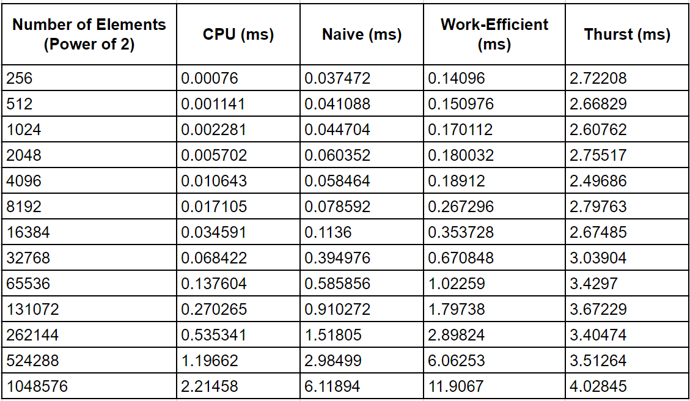
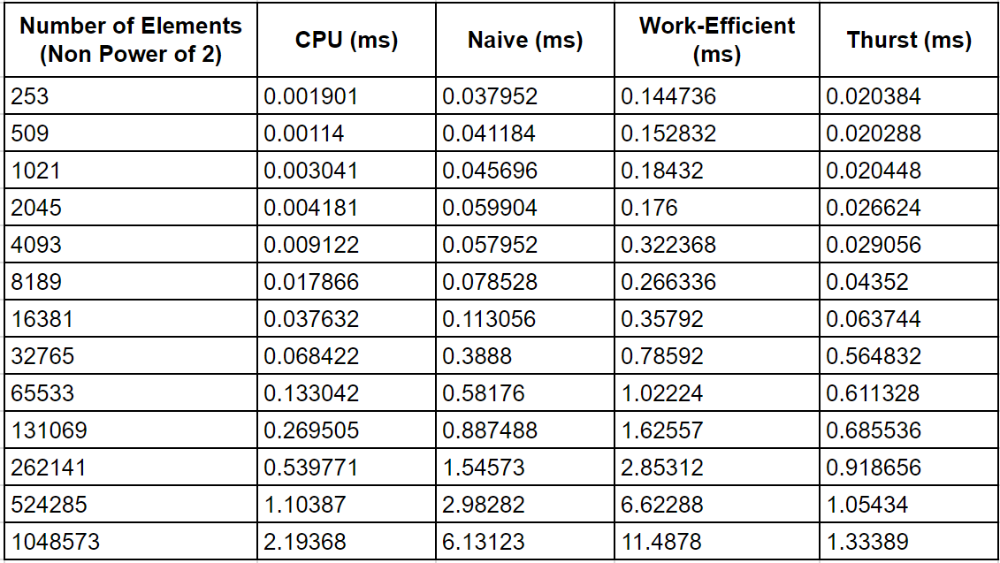
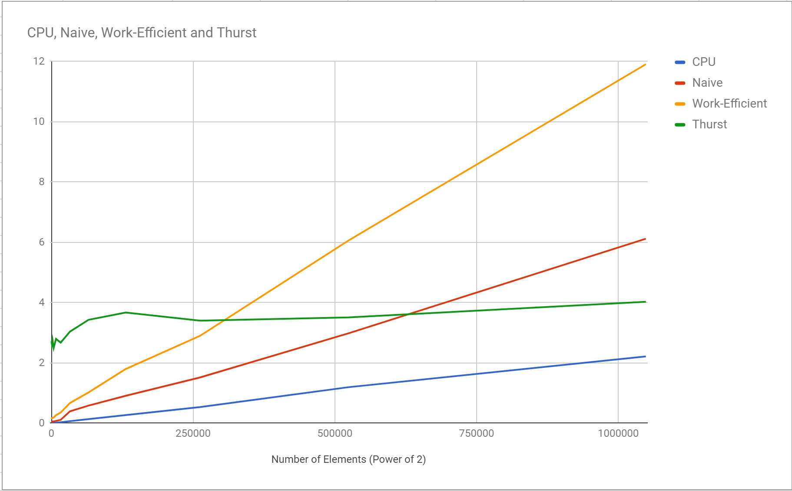
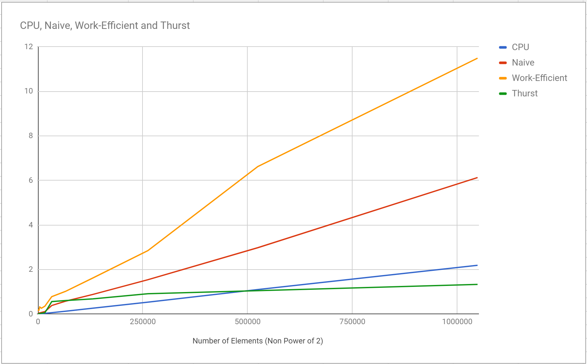

CUDA Stream Compaction
======================

**University of Pennsylvania, CIS 565: GPU Programming and Architecture, Project 2**

* Mohamed Soudy
* Tested on: Windows 10 Enterprise, i7 @ 2.7 GHz 16GB, GT 650M 1024 MB

### Description

An implementation of CPU and GPU compaction. Two versions of the Scan (Prefix Sum) algorithm were implemented for GPU compaction and compared against CPU and thrust implementations. These include naive and work-efficient implementations.

### Performance Analysis

The following tables show comparisons between CPU, naive, work-efficient and thrust implementations with arrays of up to approximately 1 million elements.









#### CPU vs Naive vs Work-Efficient

Surprisingly, the CPU implementation is much faster than all the other implementations. The work efficient implementation should be faster but this isn't the case mainly because in both the down sweep and up sweep kernels most of the threads are not being occupied because the thread indexes are skipped by powers of 2 depending on the depth. Therefore, the threads aren't being utilized efficiently causing it to be much slower than the CPU implementation.

#### Power of 2 vs Non Power of 2 Array Sizes

The performance between power of 2 array sizes and non power of 2 array sizes is very similar in all implementations except with thrust. When tested with power of 2 array size the thrust implementation is significantly slower than non power of 2 array size.

### Program Output

```
****************
** SCAN TESTS **
****************
    [  48   5  46  40  32  43  10  49  32  34   3  41  49 ...  38   0 ]
==== cpu scan, power-of-two ====
   elapsed time: 0.00076ms    (std::chrono Measured)
    [   0  48  53  99 139 171 214 224 273 305 339 342 383 ... 6200 6238 ]
==== cpu scan, non-power-of-two ====
   elapsed time: 0.000761ms    (std::chrono Measured)
    [   0  48  53  99 139 171 214 224 273 305 339 342 383 ... 6132 6147 ]
    passed
==== naive scan, power-of-two ====
   elapsed time: 0.037632ms    (CUDA Measured)
    [   0  48  53  99 139 171 214 224 273 305 339 342 383 ... 6200 6238 ]
    passed
==== naive scan, non-power-of-two ====
   elapsed time: 0.0376ms    (CUDA Measured)
    [   0  48  53  99 139 171 214 224 273 305 339 342 383 ... 6132 6147 ]
    passed
==== work-efficient scan, power-of-two ====
   elapsed time: 0.142432ms    (CUDA Measured)
    [   0  48  53  99 139 171 214 224 273 305 339 342 383 ... 6200 6238 ]
    passed
==== work-efficient scan, non-power-of-two ====
   elapsed time: 0.14176ms    (CUDA Measured)
    [   0  48  53  99 139 171 214 224 273 305 339 342 383 ... 6132 6147 ]
    passed
==== thrust scan, power-of-two ====
   elapsed time: 2.66266ms    (CUDA Measured)
    [   0  48  53  99 139 171 214 224 273 305 339 342 383 ... 6200 6238 ]
    passed
==== thrust scan, non-power-of-two ====
   elapsed time: 0.020128ms    (CUDA Measured)
    [   0  48  53  99 139 171 214 224 273 305 339 342 383 ... 6132 6147 ]
    passed

*****************************
** STREAM COMPACTION TESTS **
*****************************
    [   0   3   2   2   0   1   0   3   2   0   3   3   3 ...   2   0 ]
==== cpu compact without scan, power-of-two ====
   elapsed time: 0.00076ms    (std::chrono Measured)
    [   3   2   2   1   3   2   3   3   3   1   2   3   1 ...   3   2 ]
    passed
==== cpu compact without scan, non-power-of-two ====
   elapsed time: 0.001141ms    (std::chrono Measured)
    [   3   2   2   1   3   2   3   3   3   1   2   3   1 ...   1   3 ]
    passed
==== cpu compact with scan ====
   elapsed time: 0.0019ms    (std::chrono Measured)
    [   3   2   2   1   3   2   3   3   3   1   2   3   1 ...   3   2 ]
    passed
==== work-efficient compact, power-of-two ====
   elapsed time: 0.519744ms    (CUDA Measured)
    [   3   2   2   1   3   2   3   3   3   1   2   3   1 ...   3   2 ]
    passed
==== work-efficient compact, non-power-of-two ====
   elapsed time: 0.769056ms    (CUDA Measured)
    [   3   2   2   1   3   2   3   3   3   1   2   3   1 ...   1   3 ]
    passed
Press any key to continue . . .

```
