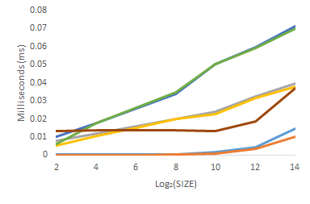
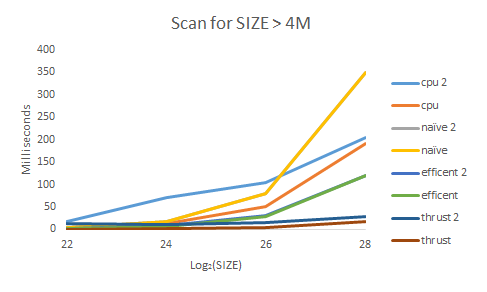
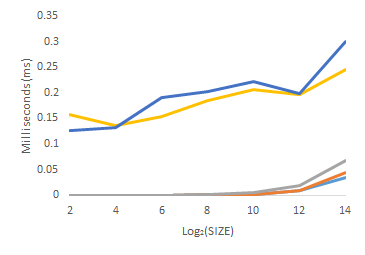
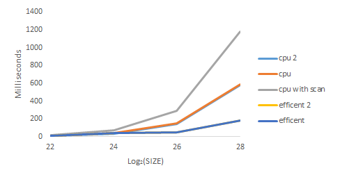
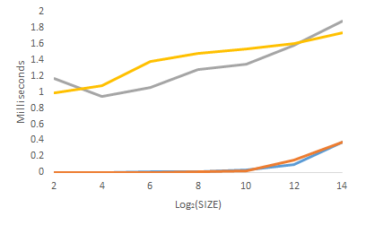
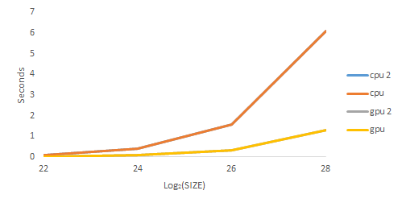

CUDA Stream Compaction
======================

**University of Pennsylvania, CIS 565: GPU Programming and Architecture, Project 2**

Sarah Forcier
Tested on GeForce GTX 1070

### Parallel Algorithm Descriptions
#### Scan
Computes a exclusive sum of all integers that came before each element.

#### Stream Compaction
Removes 0's from an array of integers. 

#### Radix Sort
Sorts an array of integers from low to high.

### Test Program Output

#### Scan

```
 [   0  31  19  29  27   6  28  18  48  16  43   0   5  49  24   0 ]
==== cpu scan, power-of-two ====
   elapsed time: 0ms    (std::chrono Measured)
    [   0   0  31  50  79 106 112 140 158 206 222 265 265 270 319 343 ]
==== cpu scan, non-power-of-two ====
   elapsed time: 0ms    (std::chrono Measured)
    [   0   0  31  50  79 106 112 140 158 206 222 265 265 ]
    passed
==== naive scan, power-of-two ====
   elapsed time: 0.011904ms    (CUDA Measured)
    [   0   0  31  50  79 106 112 140 158 206 222 265 265 270 319 343 ]
    passed
==== naive scan, non-power-of-two ====
   elapsed time: 0.0112ms    (CUDA Measured)
    [   0   0  31  50  79 106 112 140 158 206 222 265 265 ]
    passed
==== work-efficient scan, power-of-two ====
   elapsed time: 0.018048ms    (CUDA Measured)
    [   0   0  31  50  79 106 112 140 158 206 222 265 265 270 319 343 ]
    passed
==== work-efficient scan, non-power-of-two ====
   elapsed time: 0.017888ms    (CUDA Measured)
    [   0   0  31  50  79 106 112 140 158 206 222 265 265 ]
    passed
==== thrust scan, power-of-two ====
   elapsed time: 10.8968ms    (CUDA Measured)
    [   0   0  31  50  79 106 112 140 158 206 222 265 265 270 319 343 ]
    passed
==== thrust scan, non-power-of-two ====
   elapsed time: 0.013568ms    (CUDA Measured)
    [   0   0  31  50  79 106 112 140 158 206 222 265 265 ]
    passed
```

#### Stream Compaction

```
	[   0   3   3   3   1   0   0   0   2   2   3   2   1   3   2   0 ]
==== cpu compact without scan, power-of-two ====
   elapsed time: 0.000277ms    (std::chrono Measured)
    [   3   3   3   1   2   2   3   2   1   3   2 ]
    passed
==== cpu compact without scan, non-power-of-two ====
   elapsed time: 0.000277ms    (std::chrono Measured)
    [   3   3   3   1   2   2   3   2   1 ]
    passed
==== cpu compact with scan ====
   elapsed time: 0.000278ms    (std::chrono Measured)
    [   3   3   3   1   2   2   3   2   1   3   2 ]
    passed
==== work-efficient compact, power-of-two ====
   elapsed time: 0.217408ms    (CUDA Measured)
    [   3   3   3   1   2   2   3   2   1   3   2 ]
    passed
==== work-efficient compact, non-power-of-two ====
   elapsed time: 0.201632ms    (CUDA Measured)
    [   3   3   3   1   2   2   3   2   1 ]
    passed
```

#### Radix Sort

```
    [   8  15   7   7  13  12  12   8  14  14   3   2   1   3  10   0 ]
==== cpu sort, power-of-two ====
   elapsed time: 0.00111ms    (std::chrono Measured)
    [   0   1   2   3   3   7   7   8   8  10  12  12  13  14  14  15 ]
==== cpu sort, non-power-of-two ====
   elapsed time: 0.000555ms    (std::chrono Measured)
    [   1   2   3   7   7   8   8  12  12  13  14  14  15 ]
==== radix sort, power-of-two ====
   elapsed time: 0.784896ms    (CUDA Measured)
    [   0   1   2   3   3   7   7   8   8  10  12  12  13  14  14  15 ]
    passed
==== radix sort, non-power-of-two ====
   elapsed time: 0.656448ms    (CUDA Measured)
    [   1   2   3   7   7   8   8  12  12  13  14  14  15 ]
    passed
 ```

### Performance Analysis

| Scan for SIZE < 20K | Scan for SIZE > 4M | 
| ------------- | ----------- |
|  |  |

The CPU method on non-power-of-two arrays is faster than that for power-of-two arrays because the CPU performs serially, and the non-power-of-two arrays have 3 fewer elements, so it finished faster because it has 3 less iterations in for-loops. The difference in performance between these differently sized arrays on the GPU side is the opposite because warps are allocated for 32 threads, so non-power-of-two sized arrays cannot fill an entire warp. Thus not all threads are utilized and the warp has lower occupancy. For an array with 3 less elements than a power-of-two (as was tested here), the different is marginal. But the difference is much more apparent for arrays with 1 more element than a power-of-two. 

| Compact for SIZE < 20K | Compact for SIZE > 4M | 
| ------------- | ----------- |
|  |  |

The difference in performance between the CPU method, the CPU method with scan, and the GPU efficient method illustrates why different algorithms are required for parallel and serial executes. The CPU method with scan is a CPU version of the GPU efficient method. Without multiple threads running at once, the CPU version must rely on multiple for-loops, more than its compaction implementation without scan. Therefore it is the slowest of the methods.

| Radix Sort for SIZE < 20K | Radix Sort for SIZE > 4M | 
| ------------- | ----------- |
|  |  |

Much like scan and compaction, GPU radix sort performs faster for large array sizes even though parallel radix sort requires more sort passes becauce the GPU works on bits in order to benefit from scan whereas the CPU version works on digits in decimal. The CPU algorithm calculates the maximum value in the array to determine how many sort passes are required. The maximum number of passes the GPU could do on an integer array is 32, but since the CPU version only loops for the maximum number of digits. So for performance comparison sake, the GPU method takes the number of bits in the input array that contain 1s, and the calculation of the CPU maximum is not included in the time.  

### Q&A

#### Compare GPU Scan implementations to the serial CPU version?
The GPU version performs better for scan, stream compaction, and radix sort for large arrays (SIZE < 2^[18]). Since the intersection between the CPU and GPU methods occurs at the same sized array, it suggests that the slow GPU performance for small arrays is based on a overhead required for creating and distributing threads. One that is only surpassed with large arrays.  

#### Where are the performance bottlenecks?
For the work efficient implementation, the upsweep and downsweep kernel functions require a similar amount of time, because they have the same ratio of compute to memory instructions. Most time is spent in memory reads and writes, but since there are not many of either type of instruction, it is not possible to space out the memory instructions with computations. 

#### How does the GPU Scan implementation compare to thrust?
Thrust exclusive scan on power-of-two sized arrays performs poorly but consistently for most array size except the largest. The consistency indicates that the thrust implementation might have a large overhead. While other implementations' runtimes increase exponentially with array size, thrust with power-of-two arrays remains around 10ms for all array sizes. However, the thrust method on non-power-of-two arrays behaves more closely to the other gpu scan implementations with an exponential increase but with a much better performance. An explanation for the poor performance with power-of-two arrays might be that thrust implementation might allocate and compute on more memory with these sizes but not for non-power-of-two arrays - the opposite of what the work efficient method does. According to the Nsight performance analysis, thrust also has low warp occupancy (25%) and high number of required registers per thread (78), which could also explain the poor perform for these sized arrays. However, thrust makes good use of shared memory.

