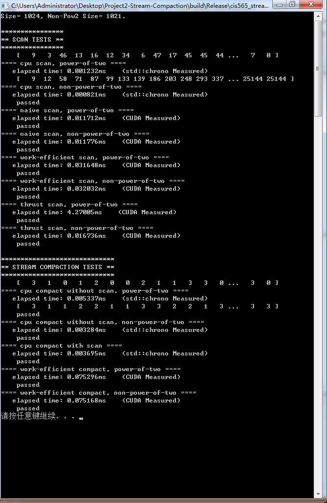
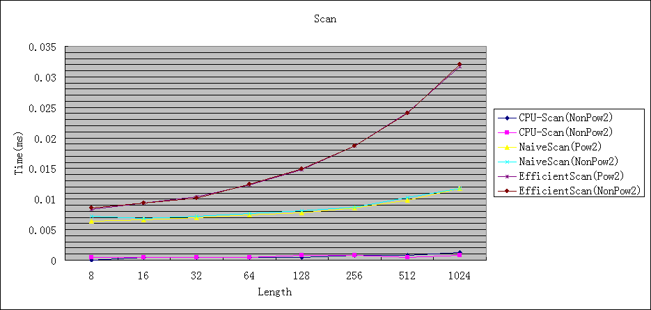

CUDA Stream Compaction
======================

###University of Pennsylvania, CIS 565: GPU Programming and Architecture, Project 2

Ju Yang 

### Tested on: Windows 7, i7-4710MQ @ 2.50GHz 8GB, GTX 870M 6870MB (Hasee Notebook K770E-i7)

## TODOs finished: 
  ### 1. naive.cu 
  
  __global__ void naive_sum(int n,int* odata, int* idata);
  
  void scan(int n, int *odata, const int *idata);  
  
  ### 2. efficient.cu 
  
  __global__ void prescan(int *g_odata, int *g_idata, int n, int*temp);
  
  void scan(int n, int *odata, const int *idata);
  
  int compact(int n, int *odata, const int *idata);
  

  ### 3 thrust.cu 
  
  void scan(int n, int *odata, const int *idata);
  
  
  ### 4 cpu.cu 
  
  void scan(int n, int *odata, const int *idata);
  
  int compactWithoutScan(int n, int *odata, const int *idata) ;
  
  int compactWithScan(int n, int *odata, const int *idata);
  
  ### 5 common.cu 
  
  __global__ void kernMapToBoolean(int n, int *bools, const int *idata);
  
  __global__ void kernScatter(int n, int *odata,
                const int *idata, const int *bools, const int *indices);
                
 ### Modified the main.cpp a little bit for display. 

## Performance Graph

 ### Scanning
 
 ### Thrust Scanning
 
 ### Compact
 
 
## Analysis
 ### Thrust
 As we can see, the thrust::exclusive_scan is rather time-costing compared with other methods. Even if I used device_vector to store the data, it is still the slowest. 
 But since I did not free the device_vectors, the non-pow2 as second round's speed is much faster. 
 I think the reason is, when calling thrust functions, it will apply for some blocks/threads inside the GPU, and will release later on. 
 Although I tried my best to avoid any read/write from CPU to GPU, the scan function still cost some time to arrange for some place. 
 
 ### Unfixed Known Bugs
  #### 1. When using multiple blocks, sometimes the result is not right. I think it is because __syncthreads() doesn't sync blocks?
  #### 2. Since I used only 1 block, when the SIZE is more than 1024(which is the limit), apperently the result is wrong. 
  #### 3. CPU performace is much better, and sometimes the calculating time doesn't always raise with the SIZE. 
