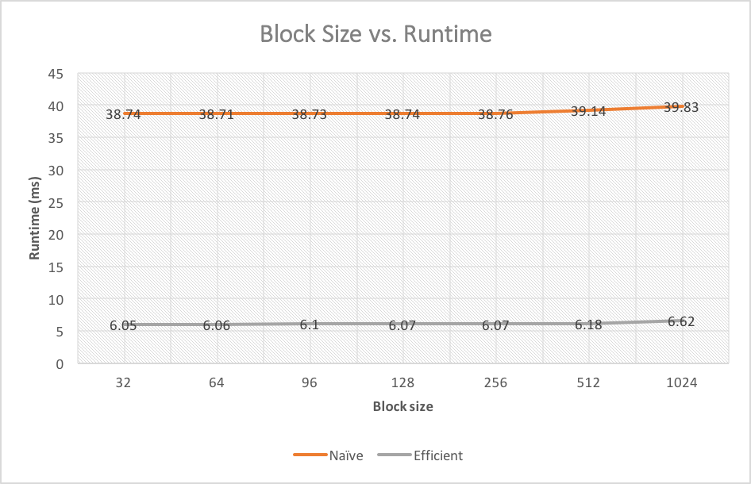
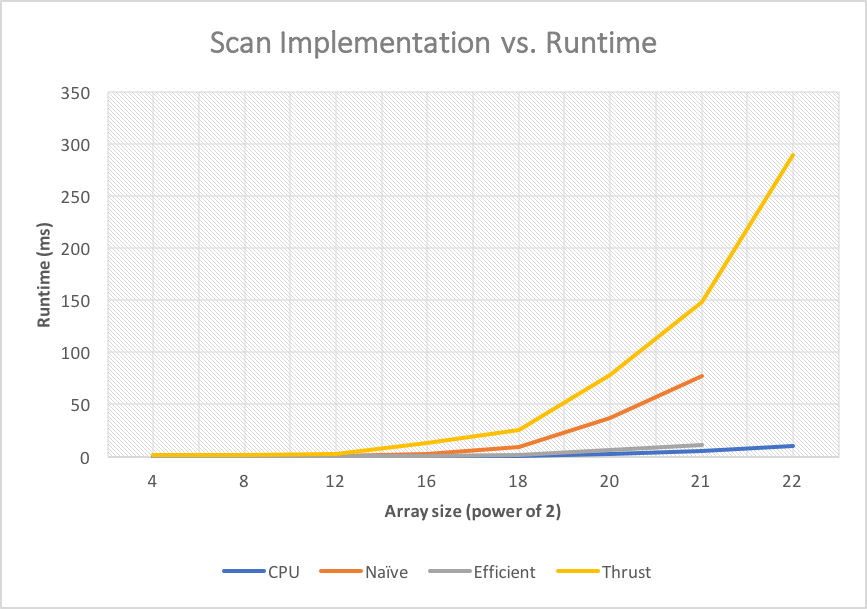

CUDA Stream Compaction
======================

**University of Pennsylvania, CIS 565: GPU Programming and Architecture, Project 2**

* Carolina Zheng
* Tested on: Windows 7, i7-6700 @ 3.40GHz 16GB, Quadro K620 (Moore 100 Lab)

### Performance Analysis

I determined the runtimes by running each implementation on arrays seeded with fixed values and averaging the times over 10 runs.

#### Block Size vs. Performance




The optimal block size for the naive implementation was 64 threads vs. 32 threads for the work-efficient implementation. I was surprised by the fact that a small block size was optimal: I would have expected smaller block sizes to decrease performance because it would max out the block slots on each SM before maxing out the thread slots. The runtime difference between block sizes was very small (<1 ms), however, which makes me think that block size didn't factor in too much overall.

In terms of occupancy, the limiting factor was likely thread slots. My kernel functions didn't use shared memory and used few registers.

#### Scan Implementation vs. Performance




| Array size (2^x) | CPU | Naive | Efficient | Thrust |
|:----------------:| ---:|------:|----------:|-------:|
| 4  | 0.00033  | 0.0453 | 0.0694    | 1.183  |
| 8  | 0.00228  | 0.0712 | 0.127     | 1.106  |
| 12 | 0.00982  | 0.175  | 0.2007    | 2.002  |
| 16 | 0.166    | 2.091  | 0.595     | 12.76  |
| 18 | 0.853    | 8.757  | 1.528     | 25.78  |
| 20 | 2.56     | 37.38  | 5.82      | 78.57  |
| 21 | 4.96     | 77.58  | 11.43     | 148.22 |
| 22 | 10.28    | -      | -         | 289.54 |


Overall, the CPU implementation had the best performance, following by my work-efficient GPU implementation, then the naive GPU implementation, and finally the thrust library call.

The results for work-efficient vs. naive were as expected. On small arrays, the naive implementation was faster. However, once the array size increased from 2^12 to 2^16, the naive scan jumped in runtime by a factor of 20, while the efficient runtime only increased by a factor of 3. As the array size kept doubling, the two implementations' performance deteriorated by about the same multiplier, but because of this initial jump, the efficient scan outperformed the naive scan by a factor of about 7 for array sizes of 2^18 to 2^21. My GPU implementations failed to run on array size 2^22.

The CPU implementation's runtime increased rather smoothly as array size increased, and did not exhibit any jumps.

The thrust library call was much slower than the other implementations: on large array sizes, it was twice as slow as the naive scan and slower by a factor of over 10 compared to the work-efficient scan. It scaled well to increasing array size.

I believe that the performance bottlenecks were different for CPU vs. GPU implementations vs. thrust. For the CPU, computation time was probably the bottleneck due to the fact that all operations had to be performed serially. For the naive and work-efficient scans, I think global memory access was the bottleneck. GPU compute capability is much better than memory accesses, and the kernels I wrote in particular were independent of each other and consisted of only a few floating-point computations, as well as global memory reads and writes. I also used hardware-optimized branching, which should minimize divergence within warps. I was surprised at how slow the thrust library call was. It's likely that the library call is using an optimized algorithm under the hood, but may have been slowed down due to layers of other function calls, error checking, etc. It's hard to say exactly why it was slow without examining the source code.

To mitigate the bottlenecks of my GPU implementations, I could improve my code by utilizing shared memory instead of global memory. I'm also interested in whether moving the loops from the host to the device would increase performance. Also, I could refactor my work-efficient stream compaction so that there is no memory copying between host and device, which might make it faster than the CPU compaction.

#### Test Program Output
The following is a sample test program output from `main.cpp` for an array of size 2^20.

```
****************
** SCAN TESTS **
****************
    [   1  42  48  47   9  36  13  34  28  39   3   2  38 ...   1   0 ]
==== cpu scan, power-of-two ====
   elapsed time: 2.4675ms    (std::chrono Measured)
==== cpu scan, non-power-of-two ====
   elapsed time: 2.47652ms    (std::chrono Measured)
    passed
==== naive scan, power-of-two ====
   elapsed time: 38.5892ms    (CUDA Measured)
    passed
==== naive scan, non-power-of-two ====
   elapsed time: 37.0342ms    (CUDA Measured)
    passed
==== work-efficient scan, power-of-two ====
   elapsed time: 6.30717ms    (CUDA Measured)
    passed
==== work-efficient scan, non-power-of-two ====
   elapsed time: 6.17421ms    (CUDA Measured)
    passed
==== thrust scan, power-of-two ====
   elapsed time: 84.909ms    (CUDA Measured)
    passed
==== thrust scan, non-power-of-two ====
   elapsed time: 78.5352ms    (CUDA Measured)
    passed


*****************************
** STREAM COMPACTION TESTS **
*****************************
    [   0   0   0   3   1   0   1   3   1   0   0   2   0 ...   2   0 ]
==== cpu compact without scan, power-of-two ====
   elapsed time: 4.67753ms    (std::chrono Measured)
    passed
==== cpu compact without scan, non-power-of-two ====
   elapsed time: 4.78749ms    (std::chrono Measured)
    passed
==== cpu compact with scan ====
   elapsed time: 12.9883ms    (std::chrono Measured)
    passed
==== work-efficient compact, power-of-two ====
   elapsed time: 13.6215ms    (CUDA Measured)
    passed
==== work-efficient compact, non-power-of-two ====
   elapsed time: 13.4029ms    (CUDA Measured)
    passed
Press any key to continue . . .
```
