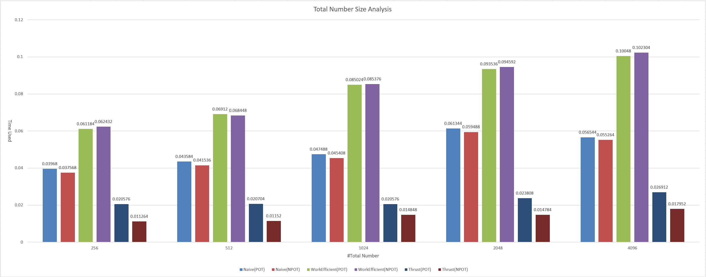
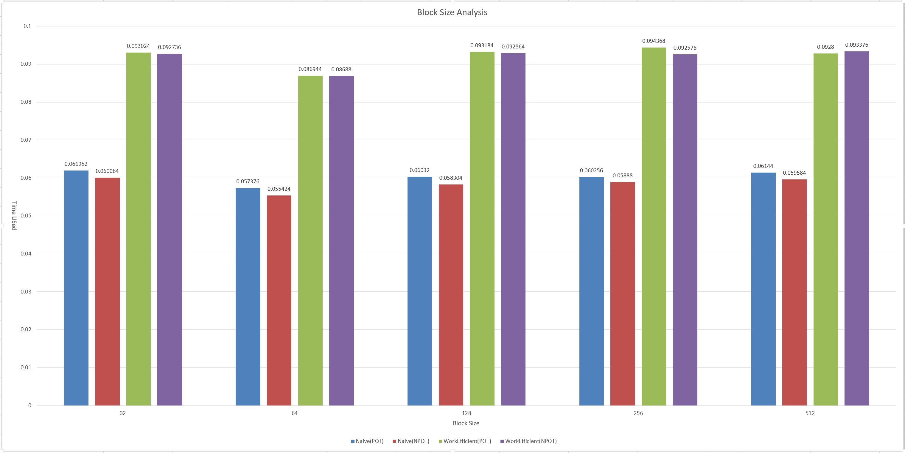
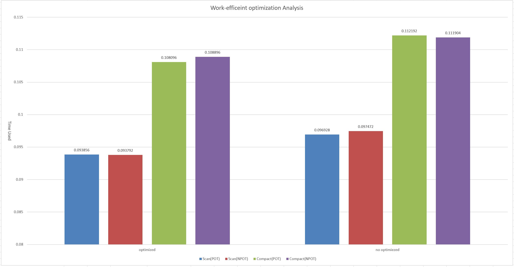
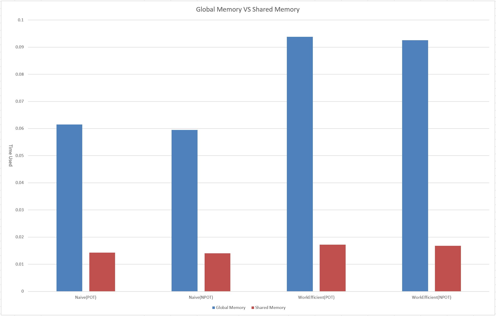
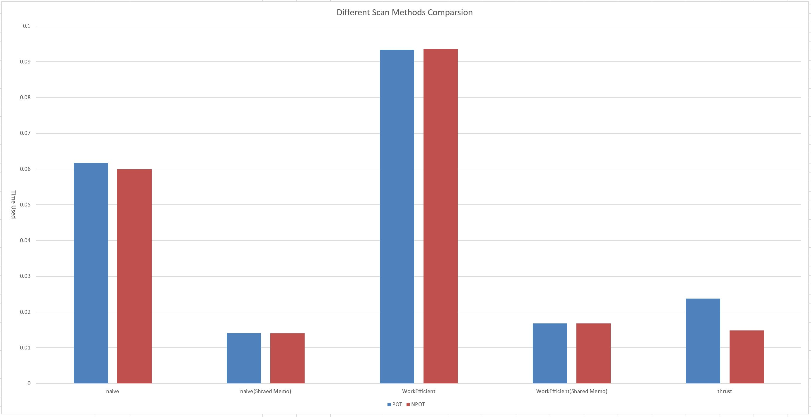

CUDA Stream Compaction
======================

**University of Pennsylvania, CIS 565: GPU Programming and Architecture, Project 2**

* Hanming Zhang
* Tested on: Windows 10 Education, i7-6700K @ 4.00GHz 16.0GB, GTX 980 4096MB (Personal Desktop)

### Project Features
##### (All scans are exclusive. To make inclusive scan result become exclusive, just shift the result right by one element and insert the identity on the head. I implemented a kernel to realize this on naive.cu. On the other hand, to make a exclusive scan result become inclusive, shift the result left by one element and insert the sum of previous elements on the last place)

- CPU Scan
- CPU Compaction without Scan
- CPU Compaction with Scan
- Naive GPU Scan
- Work-Efficient GPU Scan
- Work-Efficient GPU Stream Compaction
- Thrust's Scan

#### Extra Credits implemented:
- Work-Efficient GPU Scan Optimization(Why-is-my-GPU-approach-so-slow Optimization) : All old branches in the kernel are removed, and all threads launched do work now. See **kernEffcientUpSweep** and **kernEffcientUpSweep** in **efficient.cu** for details.
- Radix Sort : see the last part of **main** function(**line 179 - 207**) for test and **RadixSort.h** and **RadixSort.cu** for details. Call **RadixSort::sort** to use it.
- GPU Scan using shared memory & hardware Optimization : see **StreamCompaction::Efficient::scanDynamicShared** and **StreamCompaction::Naive::scanDynamicShared** for details

### Project Analysis (Under x64 Release mode)

- #### Total number size performance analysis
  ###### in this SCAN analysis, all GPU block sizes are temporarily set *64*, and Efficient Scan method is *optimized(branches in the kernel is removed)*. *No shared memory* so far. No Power Of Two = Power Of Two - 3

  

  ###### Analysis:
  First of all, in case of POT and NPOT, Naive's and Thrust's POT always consume more time bsed on the data we get. This is understandable because there is just less operations needed. However, in case of Work-Efficient method, we fill our NPOT array zeroes in this case to make it a POT array (power + 1) so that we can use efficient algorithm. As a result, there is no clear time-consuming difference between POT and NPOT.

  Besides that, navie and Work-Efficient method all appear some sudden consuming time increasing conditions, like from size 512 to 1024 for Work-Efficient and from 1024 to 2048 for naive. I think this can be explained as since there are always limited numbe of blocks can be processed at one time, when that limitation is passed, there will be a relatively huge consuming time increase.

  Finally, Thrust scan method appears pretty stable under different size conditions.

- #### Block Size performance analysis
  ###### in this SCAN analysis, the total number size is set *2048*, and Efficient Scan method is *optimized(branches in the kernel is removed)*. *No shared memory* so far. No Power Of Two = Power Of Two - 3

  

  ###### Analysis:
  Based on the data we got, apparently, there is no clear time-consuming difference between different block sizes, except that the time size 64 used is very slightly smaller than others. I think it's just a choice between more blocks with smaller single block size OR less block with larger block size and it won't influence a SM so much in terms of the total time to process them. Besides that, no matter naive or Work-Efficient, we all use **global memory** here, so both methods spend a lot of time on that.


- #### Efficient-working GPU kernel Optimization analysis(before and after branches are removed in kernel, EC 1)
 ###### in this analysis, all GPU block sizes are set *64*, total number size *2048*. No Power Of Two = Power Of Two - 3

 

 ###### Analysis:
 As we can see on the data, after I optimized the code, removed the if statement in the kernel and only launch threads that actually do the work, our performance improve slightly. This is understandable because **the number of threads actually do the work doesn't change at all**. Since we use global memory here and for loop happens on the host side, the only difference is that we launch 2048 threads 11 times(since  2^11 = 2048), most of which actually doesn't do any work, and launch (2^10 + 2^9 + 2^8 + ... + 2^0) threads that all do the work. However, we have to notice, the luck thing is that **there is not so much to do in the if statement in the kernel, so the stall time is no so long**, if there is much more work to do in the if statement, the performance will improve further.


- #### Global memory VS (Shared memory + Hardware Optimization) (EC 3)
  ###### in this SCAN analysis, all GPU block sizes are set *64*, total number size *2048*. Efficient Scan method is *optimized(branches in the kernel is removed)*. No Power Of Two = Power Of Two - 3

  

  ###### Analysis:
  Result is pretty clear, Naive method improves about **300%** and Work-Efficient improves about **450%** in performance. **K.O.**

  First of all, the loop times of global memory method and shared memory method are different. For the **global**, in our case, since 2^11 = 2048, we have to run kernel **11 times** in the host side. However, for the **shared memory**, since block size is 64 (2^6), we run for loop 6 + 1 = **7 times** in each kernel.

  We also largely reduce our global memory access, for the **global**, we have to access global memory (1 read + 1 write) x 11 = **22 times**. However, in the **shared memory**, we only need to access global memory 1 read + 1 write = **2 times** for each kernel.

  Hardware optimization also works well here. Just like the difference between stride = 1, 2, 4 .... and stride = 4, 2, 1 ... In our case, it's **stride = 64, 32, 16, 8, 4, 2, 1**, which means, instead of just waiting for certain threads in the block to finish its tasks, most blocks just finish their tasks earlier and leave rest tasks only certain small amount of blocks to finish.


- #### Scan Methods Comparsion & Analysis
  ###### in this SCAN analysis, all GPU block sizes are set *64*, total number size *2048*. Efficient Scan method is *optimized(branches in the kernel is removed)*. No Power Of Two = Power Of Two - 3

  

  ###### Analysis:

  Work-Efficient is not so efficient in our case, although I tried to optimize it and remove the branch(if statement) in the kernel and only launch threads that do the work.

  Global memory access is still where our performance bottlenecks are. If we use global memory, we have to access it so many times, which really take "long" time here. The result(such huge performance improvement) we get about shared memory tell everything about it.

  Naive method has a better performance than Work-Efficient in this case and the reason of which might be our number size is still limited here, only 2048, if we have millions of numbers, Work-Efficient method will definitely have a better performance.

  Thrust keep very stable and always have a relatively good performance.


- #### Radix Sort analysis and comparison with build-in qsort
  ###### in this analysis, all GPU block sizes are set *64*, total number size *2048*. I use global memory efficient Scan method is *optimized(branches in the kernel is removed)*. No Power Of Two = Power Of Two - 3

qsort | Radix Sort
------------ | -------------
0.0539 ms | 1.0717 ms


  ###### Analysis:
  I think the main responsibility for such a long Radix Sort time is that I use global memory (because is before Shared Memory & hardware optimization part in EC list, so I implemented it First). There is so many global memory accesses, especially when we generate the arrays we need. Besides that, the Efficient-working scan method I use here is actually the most inefficient one.

  Qsort runs pretty well, and take less than 0.1 ms to finish sorting.


- #### Output of the test Programming
 ```
  ****************
  ** SCAN TESTS **
  ****************
      [  13  35  38  24  16  12  38  34  30  23  43  19  30 ...  22   0 ]
  ==== cpu scan, power-of-two ====
     elapsed time: 0.002811ms    (std::chrono Measured)
      [   0  13  48  86 110 126 138 176 210 240 263 306 325 ... 50256 50278 ]
  ==== cpu scan, non-power-of-two ====
     elapsed time: 0.002811ms    (std::chrono Measured)
      [   0  13  48  86 110 126 138 176 210 240 263 306 325 ... 50217 50240 ]
      passed
  ==== naive scan, power-of-two ====
     elapsed time: 0.061728ms    (CUDA Measured)
      passed
  ==== naive scan, non-power-of-two ====
     elapsed time: 0.059904ms    (CUDA Measured)
      passed
  ==== naive scan(Dynamic Share Memory), power-of-two ====
     elapsed time: 0.01408ms    (CUDA Measured)
      passed
  ==== naive scan(Dynamic Share Memory), non-power-of-two ====
     elapsed time: 0.014048ms    (CUDA Measured)
      passed
  ==== work-efficient scan, power-of-two ====
     elapsed time: 0.093376ms    (CUDA Measured)
      passed
  ==== work-efficient scan, non-power-of-two ====
     elapsed time: 0.093536ms    (CUDA Measured)
      passed
  ==== work-efficient scan(Dynamic Share Memory), power-of-two ====
     elapsed time: 0.016832ms    (CUDA Measured)
      passed
  ==== work-efficient scan(Dynamic Share Memory), non-power-of-two ====
     elapsed time: 0.0168ms    (CUDA Measured)
      passed
  ==== thrust scan, power-of-two ====
     elapsed time: 0.023744ms    (CUDA Measured)
      passed
  ==== thrust scan, non-power-of-two ====
     elapsed time: 0.014848ms    (CUDA Measured)
      passed

  *****************************
  ** STREAM COMPACTION TESTS **
  *****************************
      [   1   1   2   0   2   0   0   2   2   3   3   3   0 ...   2   0 ]
  ==== cpu compact without scan, power-of-two ====
     elapsed time: 0.004344ms    (std::chrono Measured)
      [   1   1   2   2   2   2   3   3   3   3   2   3   3 ...   1   2 ]
      passed
  ==== cpu compact without scan, non-power-of-two ====
     elapsed time: 0.004343ms    (std::chrono Measured)
      [   1   1   2   2   2   2   3   3   3   3   2   3   3 ...   1   1 ]
      passed
  ==== cpu compact with scan ====
     elapsed time: 0.008431ms    (std::chrono Measured)
      [   1   1   2   2   2   2   3   3   3   3   2   3   3 ...   1   2 ]
      passed
  ==== work-efficient compact, power-of-two ====
     elapsed time: 0.1088ms    (CUDA Measured)
      passed
  ==== work-efficient compact, non-power-of-two ====
     elapsed time: 0.108832ms    (CUDA Measured)
      passed

  *****************************
  ** Radix Sort TEST **
  *****************************
  Randomly Generate Array with maxmium 16.
      [  13   1  14   8  10   4   8  10   6   7   7  15  12 ...  14  13 ]
  qosrt Result :
      [   0   0   0   0   0   0   0   0   0   0   0   0   0 ...  15  15 ]
     elapsed time: 0.053908ms    (std::chrono Measured)
  Radix sort Result :
      [   0   0   0   0   0   0   0   0   0   0   0   0   0 ...  15  15 ]
     elapsed time: 1.07917ms    (CUDA Measured)
  sort result comparison between qsort and radix sort :
      passed
 ```
