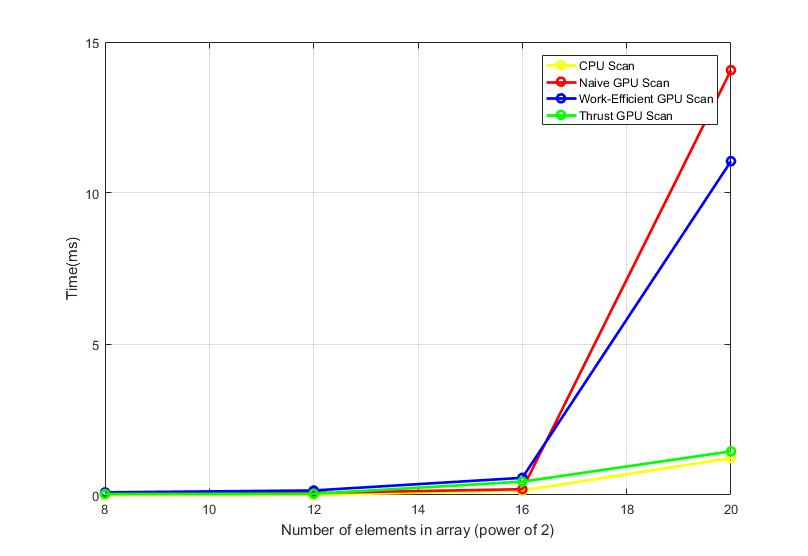
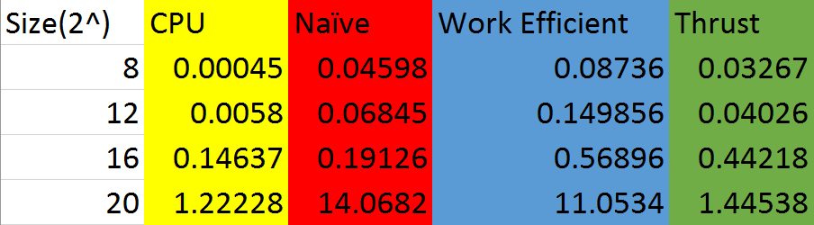
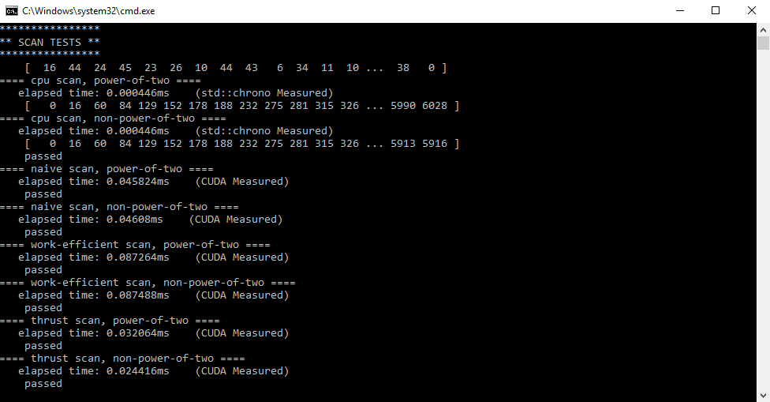
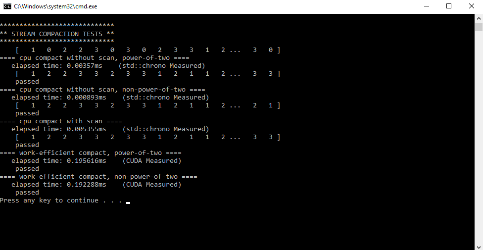

CUDA Stream Compaction
======================

**University of Pennsylvania, CIS 565: GPU Programming and Architecture, Project 2**

* Yash Vardhan
* Tested on: Windows 10 Pro, Intel i5-4200U (4) @ 2.600GHz 4GB, NVIDIA GeForce 840M 2048MB

In this project, I have implemented the stream compaction and scan(prefix sum) in CUDA on both a CPU and a GPU, and have compared the performance of both of these side-by-side. The parallel version of Stream Compaction run on a GPU is a useful tool for many applications like deferred shading, path tracer algorithms. Algorithms like scan (a.k.a. prefix-sum) are the basis of many algorithms. They are specifically designed to run on GPU architecture.

The scan algorithms were implemented on -

- CPU
- Naive Scan on GPU
- Work-efficient Scan on GPU
- Scan using Thrust on GPU.

Performance Analysis
-------------------------

Block Sizes were varied from 16 to 1024. The performance peaked around 64,128 and 256. I selected to benchmark the performance graphs on block size of 128.

### Time(in ms) vs Number of elements in array
----------------------------------------------

The size of array was increased incrementally with a magnitude of 2^4. The transistion from 2^16 to 2^20 showed a signinficant diversion between thrust and naive GPU impementation. Also a difference between Work-Efficient and naive GPU implementation was observed. The Work-efficient GPU Scan could be optimized much more by using shared memory, which will reflect ina future benchmark test. 

### Scan Results
----------------

Tested on array size of 512

### Stream Compaction Results
-----------------------------

Tested on array size of 512

