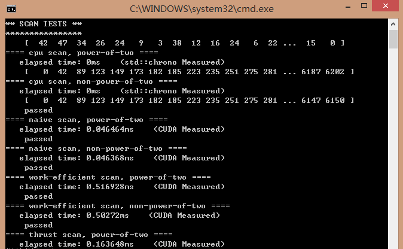
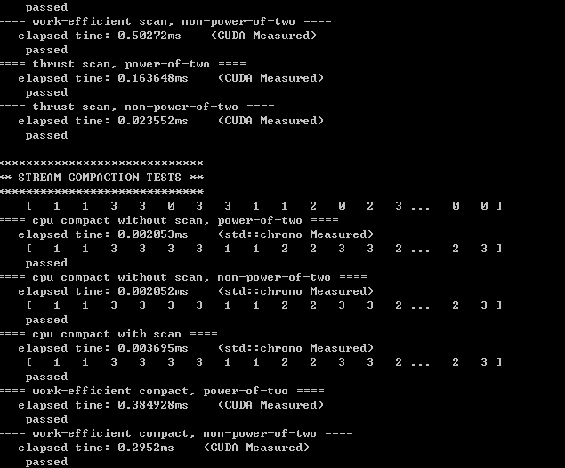
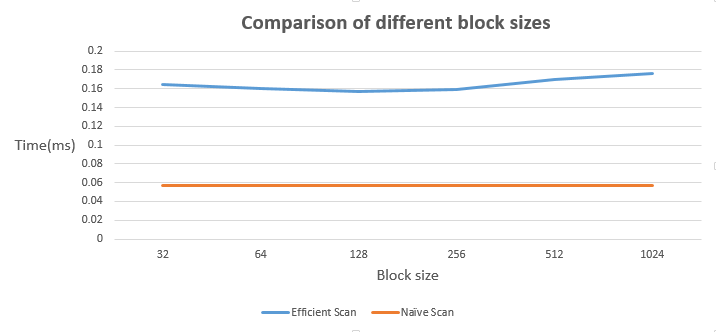
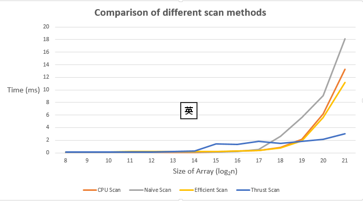

CUDA Stream Compaction
======================

**University of Pennsylvania, CIS 565: GPU Programming and Architecture, Project 2**

* (TODO) Yi Guo
* Tested on:  Windows 8.1, Intel(R) Core(TM)i5-4200M CPU @ 2.50GHz 8GB, NVIDIA GeForce 840M (Personal Notebook)

## Description.
In this project, I implemented the parallel computing algorithm of streaming compaction. For more details, see `INSTRUCTION.md`.

## ScreenShot
These are the test results of all the method I implemented.
;

;

## Performance Analysis
* *Block Size*
I compare the time cost of scan function under different block size value. The result is shown as the graph below.

;

It seems that there is no great difference when the block size value is changed. But there is one thing we need to do. That is when we sweep up or sweep down the array, we should change the value of block size for each loop. Since we don't need to deal with all the elements in the array in each loop, we should adjust the block size for each loop to avoid the waste of computation resource.So it should be something like:

	for (int d = 0; d < layer; d++)
	{
		int nodeNum = 1 << (layer - 1 - d);
		blocknum = nodeNum / threadPerBlock + 1;
		KernUpSweep << <blocknum, threadPerBlock >> >(d, dev_Scatter, nodeNum);
	}

instead of: 

	blocknum = oLength / threadPerBlock + 1;
	for (int d = 0; d < layer; d++)
	{
		int nodeNum = 1 << (layer - 1 - d);		
		KernUpSweep << <blocknum, threadPerBlock >> >(d, dev_Scatter, nodeNum);
	}

* *Efficiency of different scan method*
I compare the efficiency of different scan method and make a plot below.
;

As the plot shows, when the size of array is not very huge,  `cpu scan` will be a little faster than all the other methods run on GPU. But when the size of array is very huge, `efficient scan` on GPU will be much faster than `cpu scan`. From algorithm perspective, GPU scan should always be much faster than cpu scan. The time complexity of `cpu scan` should be O(n) or more, but on GPU it can be reduced to O(logn). But from architecture perspective, GPU will produce greater latency when we access the data in the global memory(I save the data in the global memory in this project. It can be optimized by using sharing memory). When we want to deal with a huge amount of data using GPU, the massive parallel computing will "hide" the feedback of data access latency. But when we only want to deal with a limited amount of data, GPU has no obvious advantage ,or even less efficient, compared to CPU. 

But there is an another thing I don't quite understand. That is the `naive scan` takes the most time when the size of array is very huge. I think `naive scan` should be more efficient than cpu scan, but I don't know what's going on here.

* *Thrust scan*
As the plot above shows, `thrust::scan` is more efficient than the scan methods we implemented on GPU. I think there may be 2 reasons. One is that `thrust::scan` function may use the share memory to store the data and access the data from share memory instead of from global memory. In this way, it will produce less latency because it visits the global memory less times. The other is that `thrust::scan` may make some optimizations on the binary search algorithm. The best proof of this is that the time cost of `thrust::scan` will be much less when the size of the array is not the power of 2, which means when the size value is the power of 2, it is probably the worst case for its algorithm.

* *Test Result*

```
****************
** SCAN TESTS **
****************
    [  34  28  17   4   6  42  43  24  15  44  27  19  13 ...  43   0 ]
==== cpu scan, power-of-two ====
   elapsed time: 0ms    (std::chrono Measured)
    [   0  34  62  79  83  89 131 174 198 213 257 284 303 ... 24338 24381 ]
==== cpu scan, non-power-of-two ====
   elapsed time: 0ms    (std::chrono Measured)
    [   0  34  62  79  83  89 131 174 198 213 257 284 303 ... 24197 24245 ]
    passed
==== naive scan, power-of-two ====
   elapsed time: 0.057184ms    (CUDA Measured)
    passed
==== naive scan, non-power-of-two ====
   elapsed time: 0.057216ms    (CUDA Measured)
    passed
==== work-efficient scan, power-of-two ====
   elapsed time: 0.157728ms    (CUDA Measured)
    passed
==== work-efficient scan, non-power-of-two ====
   elapsed time: 0.153376ms    (CUDA Measured)
    passed
==== thrust scan, power-of-two ====
   elapsed time: 0.156192ms    (CUDA Measured)
    passed
==== thrust scan, non-power-of-two ====
   elapsed time: 0.023776ms    (CUDA Measured)
    passed

*****************************
** STREAM COMPACTION TESTS **
*****************************
    [   2   0   1   2   2   0   1   2   1   0   3   1   1 ...   3   0 ]
==== cpu compact without scan, power-of-two ====
   elapsed time: 0.003695ms    (std::chrono Measured)
    [   2   1   2   2   1   2   1   3   1   1   1   2   1 ...   1   3 ]
    passed
==== cpu compact without scan, non-power-of-two ====
   elapsed time: 0.004105ms    (std::chrono Measured)
    [   2   1   2   2   1   2   1   3   1   1   1   2   1 ...   2   2 ]
    passed
==== cpu compact with scan ====
   elapsed time: 0.009853ms    (std::chrono Measured)
    [   2   1   2   2   1   2   1   3   1   1   1   2   1 ...   1   3 ]
    passed
==== work-efficient compact, power-of-two ====
   elapsed time: 0.212384ms    (CUDA Measured)
    passed
==== work-efficient compact, non-power-of-two ====
   elapsed time: 0.219104ms    (CUDA Measured)
    passed
```
## Extra Credit
* *Efficient scan optimization*
Compared to the basic algorithm, I optimize the kernUpsweep 


