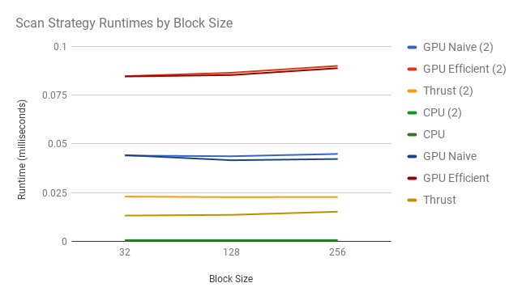
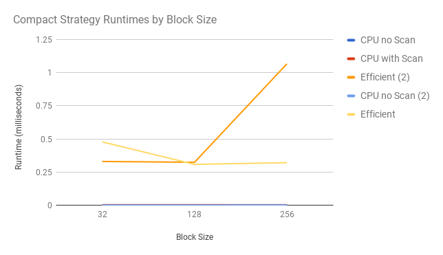
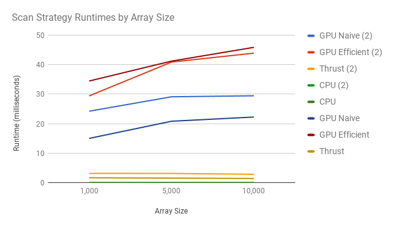

CUDA Stream Compaction
======================

**University of Pennsylvania, CIS 565: GPU Programming and Architecture, Project 2**
* Timothy Clancy (clancyt)
* Tested on: Windows 10, i5-4590 @ 3.30GHz 8GB, GTX 970 4GB (Personal)

## Analysis

*Roughly optimize the block sizes of each of your implementations for minimal run time on your GPU.*

The following graphs show the performance characteristics of all various Scan and Compact implementations, and how these characteristics change as the block size is varied. Implementations featuring a "(2)" are the ones which work with power-of-two sized arrays.

<p align="center">
  
</p>

<p align="center">
  
</p>

From looking at these graphs, we see that the scan implementations appear to be unaffected by the varying block size. The "efficient" GPU Compact implementations seem to have peak performance when the block size is 128, however. Therefore, 128 is used as the block size going forward in the other benchmarking.

*Compare all of these GPU Scan implementations (Naive, Work-Efficient, and Thrust) to the serial CPU version of Scan. Plot a graph of the comparison (with array size on the independent axis). Can you find the performance bottlenecks? Is it memory I/O? Computation? Is it different for each implementation?*

This graph shows the runtime of the various scan implementations with a block size of 128 on arrays of increasing length. Note: I have an unresolved bug where my code crashes in release mode if using a SIZE testing variable (in main.cpp) larger than 2048. Oddly, when I run with the Nsight CUDA Debugger I do not encounter this crash on this range of values. I still crash when approaching arrays with hundreds of thousands of elements, however. Therefore, this next graph has runtime values which were taken with the debugger. This causes the runtimes to be much higher than I would generally expect, but some trends are still visible.

<p align="center">
  
</p>

Weirdly, I see my "efficient" implementations perform the worst, followed by the naive implementation, the thrust implementation, and finally all is outperformed by the simple CPU implementation. The use of power-of-two sized arrays also shows inconsistent performance benefits. While the "efficient" implementations see some small improvements, the naive GPU implementation of scan actually performs better when not operating on arrays with this size restriction.

Perhaps the size bounds for this graph are simply too small to effectively show a point where the GPU implementation begins to be more effective. At this scale, however, I would have to assume that the performance bottleneck for all implementations except for CPU is memory I/O. The simple math operations that make up scan are likely dwarfed by the time it takes to move data to and from the GPU. The CPU implementation, while serial, would not have to incur these additional memory costs. This could be why it appears to be so fast at this scale.

*Paste the output of the test program into a triple-backtick block in your README.*

This is the output from executing the compiled release with a SIZE of 2048 and a block size of 128.

```
****************
** SCAN TESTS **
****************
    [  37  47  24  30  16  12  35  39  42  41  38  17  11 ...   4   0 ]
==== cpu scan, power-of-two ====
   elapsed time: 0.004344ms    (std::chrono Measured)
    [   0  37  84 108 138 154 166 201 240 282 323 361 378 ... 49235 49239 ]
==== cpu scan, non-power-of-two ====
   elapsed time: 0.002172ms    (std::chrono Measured)
    [   0  37  84 108 138 154 166 201 240 282 323 361 378 ... 49112 49157 ]
    passed
==== naive scan, power-of-two ====
   elapsed time: 0.067296ms    (CUDA Measured)
    passed
==== naive scan, non-power-of-two ====
   elapsed time: 0.066752ms    (CUDA Measured)
    passed
==== work-efficient scan, power-of-two ====
   elapsed time: 0.12848ms    (CUDA Measured)
    passed
==== work-efficient scan, non-power-of-two ====
   elapsed time: 0.126272ms    (CUDA Measured)
    passed
==== thrust scan, power-of-two ====
   elapsed time: 0.024992ms    (CUDA Measured)
    passed
==== thrust scan, non-power-of-two ====
   elapsed time: 0.016736ms    (CUDA Measured)
    passed

*****************************
** STREAM COMPACTION TESTS **
*****************************
    [   1   1   0   2   2   2   3   1   0   1   2   3   3 ...   0   0 ]
==== cpu compact without scan, power-of-two ====
   elapsed time: 0.004654ms    (std::chrono Measured)
    [   1   1   2   2   2   3   1   1   2   3   3   2   3 ...   3   2 ]
    passed
==== cpu compact without scan, non-power-of-two ====
   elapsed time: 0.005896ms    (std::chrono Measured)
    [   1   1   2   2   2   3   1   1   2   3   3   2   3 ...   3   2 ]
    passed
==== cpu compact with scan ====
   elapsed time: 0.013032ms    (std::chrono Measured)
    [   1   1   2   2   2   3   1   1   2   3   3   2   3 ...   3   2 ]
    passed
==== work-efficient compact, power-of-two ====
   elapsed time: 0.558432ms    (CUDA Measured)
    passed
==== work-efficient compact, non-power-of-two ====
   elapsed time: 0.383328ms    (CUDA Measured)
    passed
Press any key to continue . . .
```
