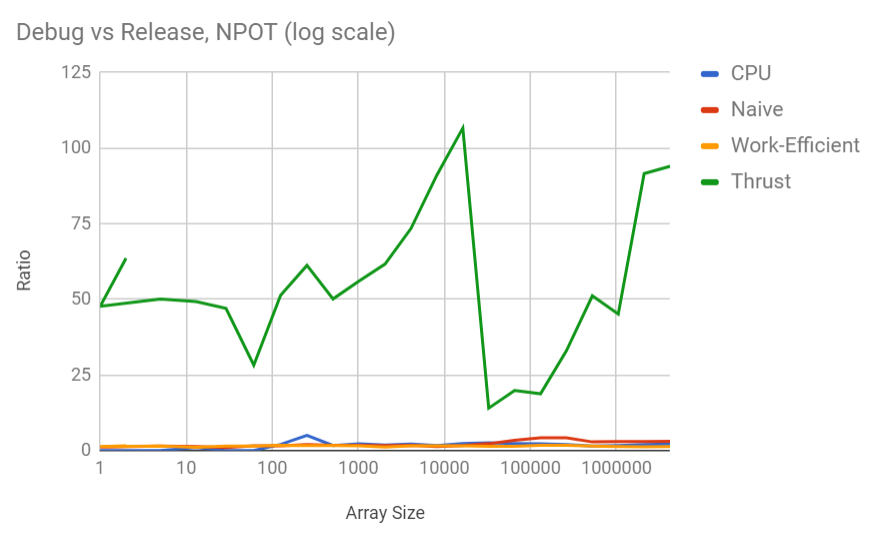
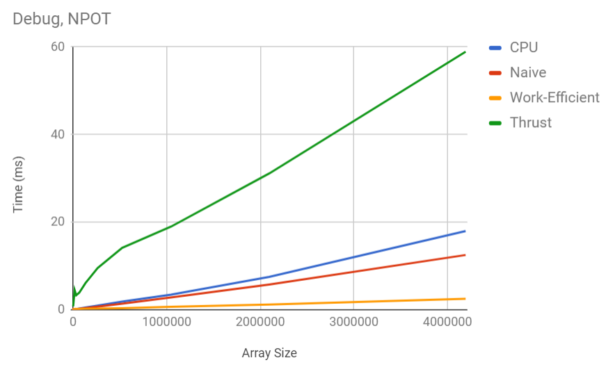
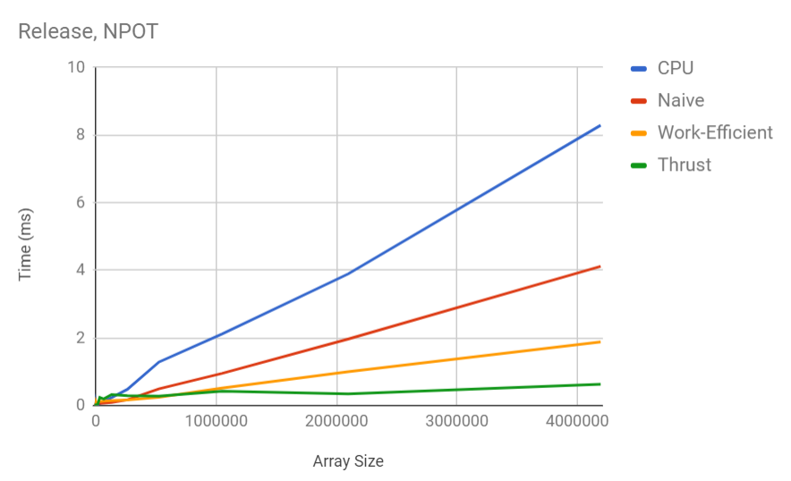
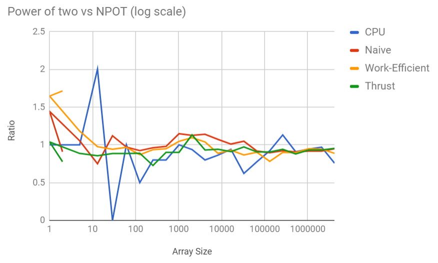

CUDA Stream Compaction
======================

**University of Pennsylvania, CIS 565: GPU Programming and Architecture, Project 2**

* Mariano Merchante
* Tested on
  * Microsoft Windows 10 Pro
  * Intel(R) Core(TM) i7-6700HQ CPU @ 2.60GHz, 2601 Mhz, 4 Core(s), 8 Logical Processor(s)
  * 32.0 GB RAM
  * NVIDIA GeForce GTX 1070 (mobile version)

## Details

This project implements and compares different algorithms for scan and stream compaction, both in GPU and CPU. In particular, it implements a serial version, a naive parallel version, a work efficient version and an implementation from the Thrust library.

## Note about Work Efficient implementation

My implementation of the Work-Efficient approach tries to reduce the amount of threads dispatched to do both the up and down sweep, and thus it performs better than the naive approach. This happens because occupancy is maximized and only threads that do useful work are running.

## Analysis

It is interesting to analyze the results both in debug and release mode, as some behaviours arise. In general, CPU < Naive < Work-Efficient, but the Thrust library implementation radically changes between both.




The relative performances seem to be uniformly correlated, exept for Thrust. I suspect this happens because the library does some precomputation and thus becomes faster after some iterations, as the next graph exemplifies. It is also probably faster than my work efficient implementation, as I didn't do any shared memory optimizations. A clear drop in execution time can be seen after the first Thrust run.


It is also useful to analyze the relationship between using power of two arrays or non power of two. Note that the Thrust pattern still emerges. Although the ratio is close to 1, the non power of two case definitely uses more memory than necessary and is going to impact the overall application.






An example run can be seen here:
```
SIZE: 4194304
****************
** SCAN TESTS **
****************
    [  35  16  14  26  19  39   4  39  24  42  27  45  46 ...  11   0 ]
==== cpu scan, results test ====
==== PASS: YES ====
    [   0   1   6   6   7   9   9 ]
    [   0   1   6   6   7   9   9 ]
==== cpu scan, power-of-two ====
   elapsed time: 8.31961ms    (std::chrono Measured)
    [   0  35  51  65  91 110 149 153 192 216 258 285 330 ... 102731641 102731652 ]
==== cpu scan, non-power-of-two ====
   elapsed time: 8.75102ms    (std::chrono Measured)
    [   0  35  51  65  91 110 149 153 192 216 258 285 330 ... 102731502 102731543 ]
    passed
==== naive scan, power-of-two ====
   elapsed time: 4.20352ms    (CUDA Measured)
    passed
==== naive scan, non-power-of-two ====
   elapsed time: 4.20454ms    (CUDA Measured)
    passed
==== work-efficient scan, power-of-two ====
   elapsed time: 2.05008ms    (CUDA Measured)
    passed
==== work-efficient scan, non-power-of-two ====
   elapsed time: 1.88826ms    (CUDA Measured)
    passed
==== thrust scan, power-of-two ====
   elapsed time: 7.67795ms    (CUDA Measured)
    passed
==== thrust scan, non-power-of-two ====
   elapsed time: 1.47558ms    (CUDA Measured)
    passed

*****************************
** STREAM COMPACTION TESTS **
*****************************
    [   0   3   3   0   1   1   3   2   2   0   1   3   3 ...   0   0 ]
==== cpu compact without scan, power-of-two ====
==== PASS: YES ====
    [   1   5   1   2   3 ]
    [   1   5   1   2   3 ]
==== cpu compact without scan, power-of-two ====
   elapsed time: 7.46312ms    (std::chrono Measured)
    [   3   3   1   1   3   2   2   1   3   3   2   3   2 ...   1   1 ]
    passed
==== cpu compact without scan, non-power-of-two ====
   elapsed time: 4.41561ms    (std::chrono Measured)
    [   3   3   1   1   3   2   2   1   3   3   2   3   2 ...   3   1 ]
    passed
==== cpu compact with scan ====
   elapsed time: 25.8876ms    (std::chrono Measured)
    [   3   3   1   1   3   2   2   1   3   3   2   3   2 ...   1   1 ]
    passed
==== work-efficient compact, power-of-two ====
   elapsed time: 2.75443ms    (CUDA Measured)
    passed
==== work-efficient compact, non-power-of-two ====
   elapsed time: 2.47562ms    (CUDA Measured)
    passed
Press any key to continue . . .


```
