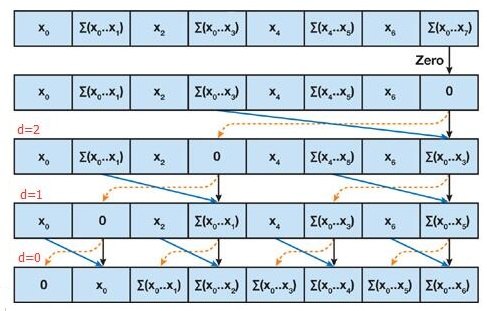
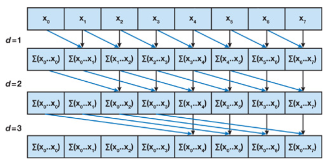
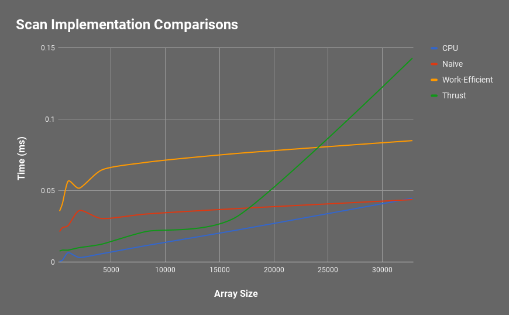

CUDA Stream Compaction
======================

**University of Pennsylvania, CIS 565: GPU Programming and Architecture, Project 2**

* Jonathan Lee
* Tested on: Tested on: Windows 7, i7-7700 @ 4.2GHz 16GB, GTX 1070 (Personal Machine)

## Overview

This project focused on how to implement Stream Compaction using different variations of the Scan (Prefix Sum) algorithm for the CPU and the GPU, including the Naive and Work-Efficient algorithms. 

## Algorithms

**Exclusive Scan** 

The first element of the result will always be 0. The rest of the resulting array is `output[j] = input[j-1] + output[j-1]`.

**Inclusive Scan**

This is also known as prescan. This is essentially `output[j] = input[j] + output[j-1]`.

**General Stream Compaction**

There are three main steps in performing Stream Compaction.
1. Create a temporary boolean array where a 0 is placed if the data doesn't match the conditions and a 1 is placed if the data does match the conditions. For this project, all nonzero values get marked with 1.
2. Run Exclusive Scan on the boolean array and store into another array which stores all the indices for the output array.
3. Scatter to get the final output array. 
    - If `index[i] == 1`
        - `output[scanned[i]] = idata[i]`  

### CPU Scan and Compaction
This follows the general compaction algorithm. During the scatter step, I kept a count of how many elements were nonzero in the temporary array. The output array has only the number of elements that were nonzero. 

### Naive Scan and Compaction (GPU)
With this approach, additional buffers are needed to avoid race conditions. This requires `log2n` iterations over the array.

It follows the algorithm:

### Work-Efficient Scan and Compaction (GPU)
One of the pros of the work-efficient approach is that you can do everything in place and avoid race conditions, unlike the naive approach. 

The other difference in this compaction algorithm is in the scan step which require two steps: **Up-Sweep** and **Down-Sweep**. The boolean and scatter steps are the same.

The best way to think how the sweeps work is to think that we're working on a binary tree. 

#### Up-Sweep
Here we build the "tree" from the bottom up. When we get to the root, we reset its value to 0. 

#### Down-Sweep
In the **down-sweep** phase, we traverse down from the root. At each level `d` we set the left and right children.
- Left child gets the value of the parent
- Right child gets the sum of the parent and the left child's original value

## Performance Analysis
Here are some results of increasing the array size with each of the scan implementations. Each of the following tests were conducted with blocksize 128.

### CPU Scan 

### Naive GPU Scan

### Work-Efficient GPU Scan 

### Thrust's Implementation
Thrust is a parallel algorithms library which also has a scan implementation. 

I had to run an extra scan before the timed portion to get a faster performance. Because of this, I'm not so sure the performance times are accurate.

### Overall Comparison 

My initial assumptions were that the work-efficient scan would perform better than the naive scan. 

Looking at this graph, we can see that the CPU implementation, overall, is *faster* than both the GPU scans and even Thrust's. This seemed counterintuitive to me since working in parallel has the connotation that it should run faster.

But the trend, as the more elements are added to array, is that the CPU implementation's time increases at a more drastic rate. Both the GPU implementations seem to grow at a slower rate as more elements are added.

I think that the overhead in time comes from the constant memory access. Something I would like to explore in the future is implementing shared memory and see how that compares.

## Result
Here is the final result from the terminal: (Blocksize: 128, Array Size: 256)

Images taken from GPU Gems 3, Chapter 39 and CIS565 Lecture.