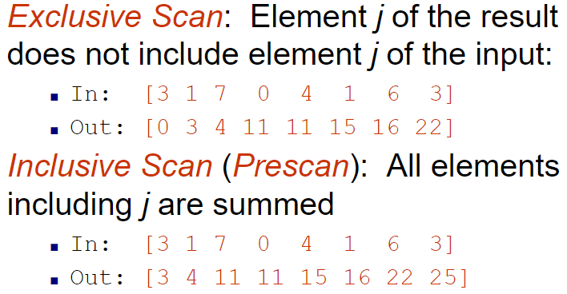
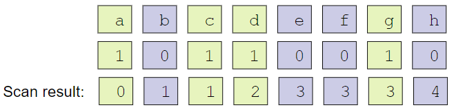
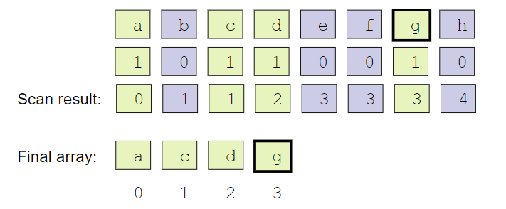
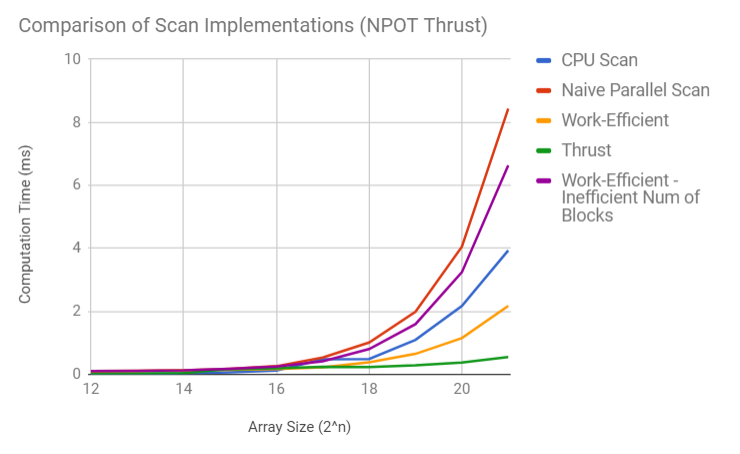

CUDA Stream Compaction
======================

**University of Pennsylvania, CIS 565: GPU Programming and Architecture, Project 2 - Stream Compaction**

* Joseph Klinger
* Tested on: Windows 10, i5-7300HQ (4 CPUs) @ ~2.50GHz, GTX 1050 6030MB (Personal Machine)

### README

This project consists of a series of implementations of the inclusive/exclusive scan and stream compaction across the CPU and GPU.
We implement a sequential CPU scan, a non-work-efficient GPU scan (naive), and an actually work-efficient GPU scan.

A scan is a prefix sum (assuming an array of integers for now), meaning that the index i in the output array will consist of the sum of each previous element
in the input array. Here's a concrete example of each kind of scan, taken from the slides by Patrick Cozzi and Shehzan Mohammed [here](https://docs.google.com/presentation/d/1ETVONA7QDM-WqsEj4qVOGD6Kura5I6E9yqH-7krnwZ0/edit#slide=id.p27)

Stream Compaction utilizes scans as a way to reduce an array of any integers to an array consisting only of the integers that meet a certain criteria (say, not equal to 0).
Taking some images from the same slides as before, here is step 1 to stream compaction - create an array of 1s and 0s indicating whether or not we want to keep a certain element, then
run an exclusive scan on that array:

So, in this example, we want to keep elements a, c, d, and g.

As it turns out, for each element in the input array that has a 1 in the intermediate array, the corresponding value in the summed array is that element's index in the final output array.
This step is called scatter:

Now we are left with our desired array.

## Analysis
Here are the analysis results from my implementations:

yay it all worked p much