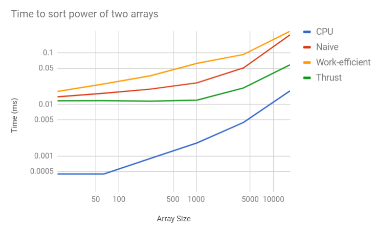
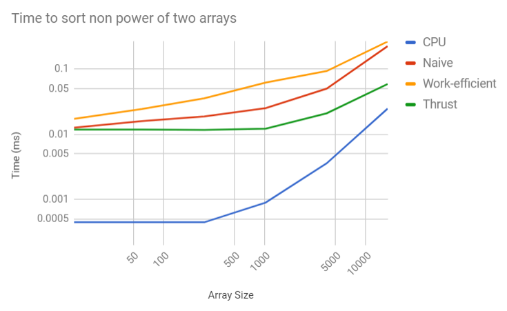
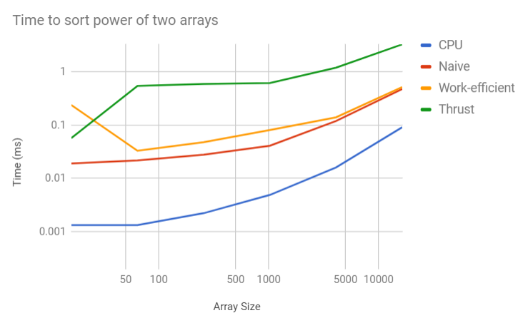

CUDA Stream Compaction
======================

**University of Pennsylvania, CIS 565: GPU Programming and Architecture, Project 2**

* Alexander Perry
* Tested on: Windows 10, i5-2410M @ 2.30GHz 8GB, NVS 4200M

### Analysis

The most obvious thing to note is that longer arrays take longer to sort.
Beyond that we can see that algorithms that are supposed to more efficient are generally less efficient as implemented.
The CPU algorithm is the fastest algorithm, followed by the thrust implementation and then by the naive GPU solution, with the work-efficient GPU solution.

I was able to get occupancy of the GPU for all of my algorithm up to 100\%. There are a maximum of 8 blocks and 1536 threads on my GPU. This leads to an optimum number of threads per block of 192. This is also only 6 warps per block and 48 warps total.

Based on the timeline, there are many back and forth copys from the GPU to main memory in the thrust implementation.
Even though the thrust implementation uses all of these copys, it is still faster than my GPU attempts. I suspect this is due to memory accesses.

The previous graph is based on a debug build.
An interesting thing to note is that the thrust implementation is less optimal in a debug setting compared to the release build.
