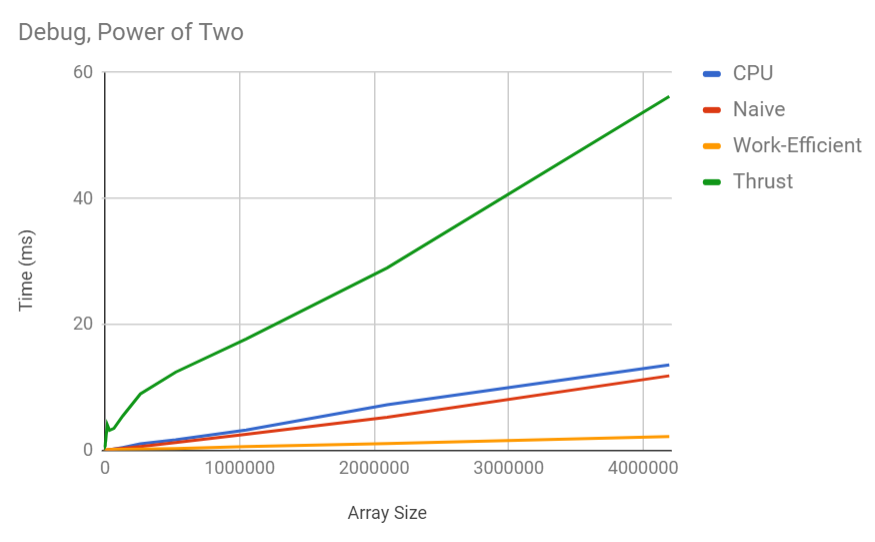
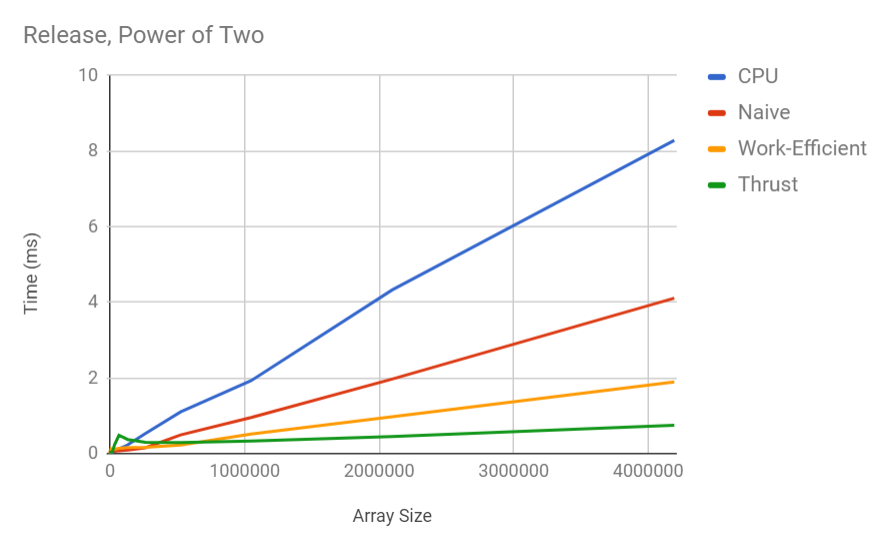
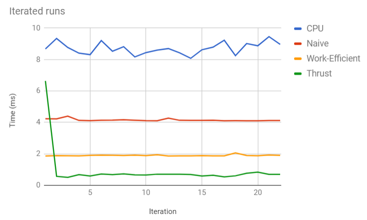

CUDA Stream Compaction
======================

**University of Pennsylvania, CIS 565: GPU Programming and Architecture, Project 2**

* Mariano Merchante
* Tested on
  * Microsoft Windows 10 Pro
  * Intel(R) Core(TM) i7-6700HQ CPU @ 2.60GHz, 2601 Mhz, 4 Core(s), 8 Logical Processor(s)
  * 32.0 GB RAM
  * NVIDIA GeForce GTX 1070 (mobile version)

## Details

This project implements and compares different algorithms for scan and compaction, both in GPU and CPU. In particular, it implements a serial version, a naive parallel version, a work efficient version and an implementation from the Thrust library.

## Note about Work Efficient implementation

The work efficient implementation tries to reduce the amount of threads dispatched to do both the up and down sweep, and thus it performs better than the naive approach.

## Analysis

It is interesting to analyze the results both in debug and release mode, as some behaviour arise. In general, CPU < Naive < Work-Efficient, but the Thrust library implementation radically changes between both.

The relative performances seem to be linearly correlated, exept for Thrust. I suspect this happens because the library does some precomputation and thus becomes faster after some iterations, as the next graph exemplifies.

