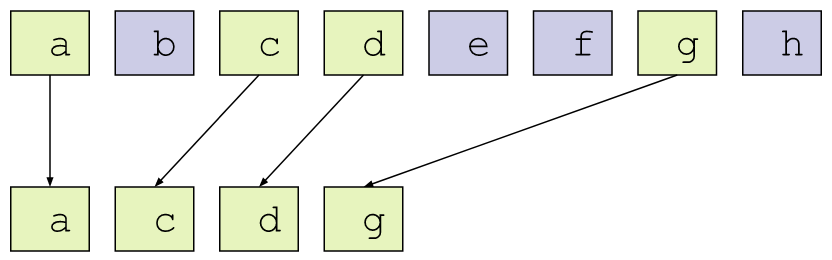

CUDA Stream Compaction
======================

**University of Pennsylvania, CIS 565: GPU Programming and Architecture, Project 2**

* Aman Sachan
* Tested on: Windows 10, i7-7700HQ @ 2.8GHz 32GB, GTX 1070(laptop GPU) 8074MB (Personal Machine: Customized MSI GT62VR 7RE)

### Overview

Stream compaction is a technique that performs the following: given an array and some condition, creates and returns a new array that contains only those elements from the original array that satisy the condition, while preserving the order of the elements.

It is used to reduce the bandwidth from the GPU to the CPU.

It is commonly used in applications such as path tracing, collision detection, sparse matrix compression, etc.

### Performance Analysis

All of the measurements in the performance analysis EXCLUDE memory management (copy, allocations, free) operations whenever they are not necessary for the execution of the algorithm by itself.

