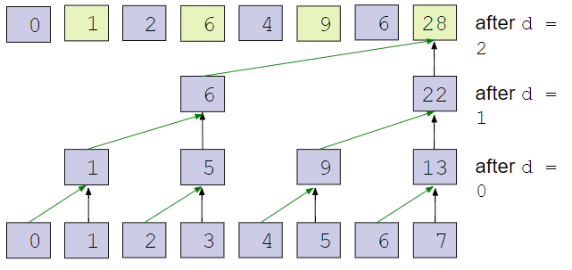
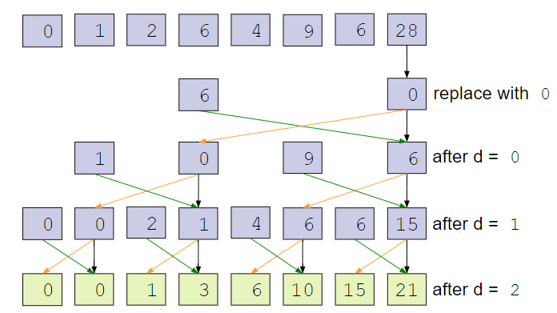
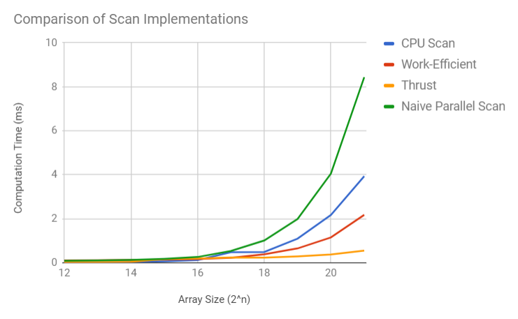
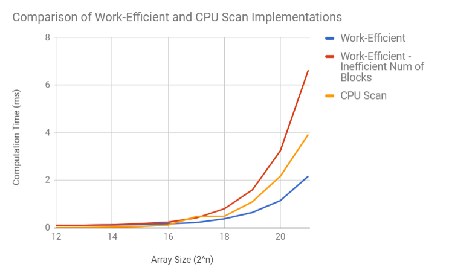
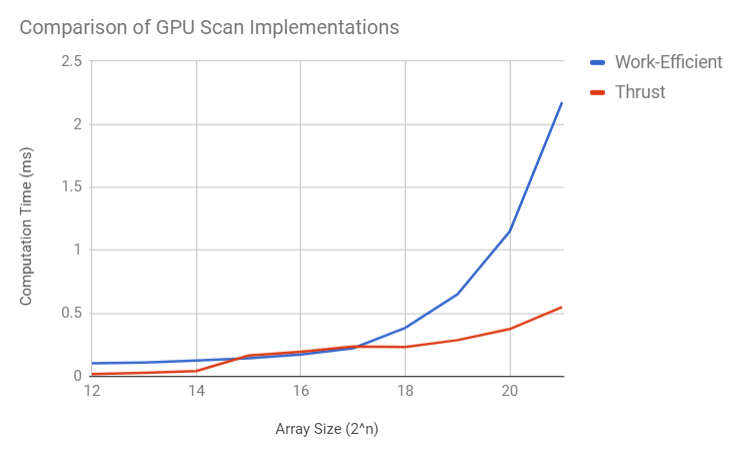
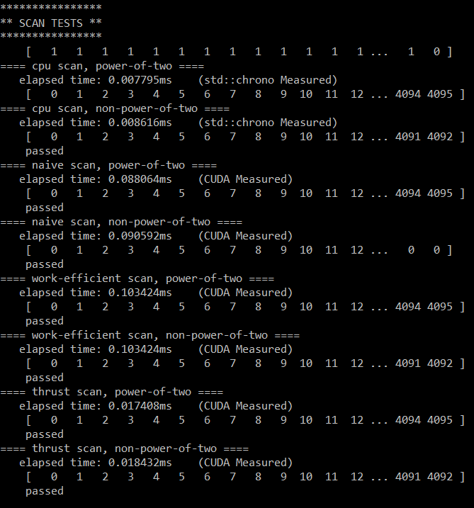
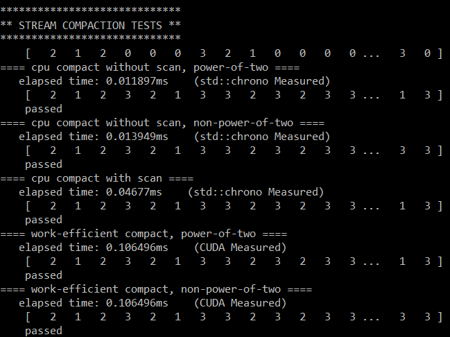

CUDA Stream Compaction
======================

**University of Pennsylvania, CIS 565: GPU Programming and Architecture, Project 2 - Stream Compaction**

* Joseph Klinger
* Tested on: Windows 10, i5-7300HQ (4 CPUs) @ ~2.50GHz, GTX 1050 6030MB (Personal Machine)

### README

This project consists of a series of implementations of the inclusive/exclusive scan and stream compaction across the CPU and GPU.
We implement a sequential CPU scan, a non-work-efficient GPU scan (naive), and an actually work-efficient GPU scan.

A scan is a prefix sum (assuming an array of integers for now), meaning that the index i in the output array will consist of the sum of each previous element
in the input array. Here's a concrete example of each kind of scan, taken from the slides by Patrick Cozzi and Shehzan Mohammed [here](https://docs.google.com/presentation/d/1ETVONA7QDM-WqsEj4qVOGD6Kura5I6E9yqH-7krnwZ0/edit#slide=id.p27)

How do we scan effectively? Well, the naive way would be to run a kernel on every element of the threads and check if a particular element should contribute to the sum. The following image, taken from [this](https://developer.nvidia.com/gpugems/GPUGems3/gpugems3_ch39.html) GPU Gem
shows the algorithm in execution for a sample input array:

Ideally, we don't want to have the GPU do any work for elements that don't contribute to the sum during a later iteration of the algorithm. This naive algorithm requires O(n * log(n)) adds. Turns out,
there is an algorithm that can give us a scan with only O(n) adds (images taken from the aforementioned slides from Patrick and Shehzan):

In the first step, we perform an "up-sweep" where we can compute some partial sums:

After that, we perform a "down-sweep" that completes the other half of our scan:

Now that we have a fast way to scan in parallel, we can perform stream compaction in a reasonable amount of time.

Stream Compaction utilizes scans as a way to reduce an array of any integers to an array consisting only of the integers that meet a certain criteria (say, not equal to 0).
Taking some images from the same slides as before, here is step 1 to stream compaction - create an array of 1s and 0s indicating whether or not we want to keep a certain element, then
run an exclusive scan on that array:

So, in this example, we want to keep elements a, c, d, and g.

As it turns out, for each element in the input array that has a 1 in the intermediate array, the corresponding value in the summed array is that element's index in the final output array.
This step is called scatter:

Now we are left with our desired array.

### Analysis
Here are the analysis results from my implementations:

Here we can get a general vibe that the naive parallel scan didn't work so well, the CPU scan performed decently (relying on the cache isn't that bad in this case where we are simply iterating down the array sequentially!), adding the work-efficient optimization is a must, and thrust wins easily.

One major aspect to note is the difference between the two work-efficient parallel scans. One utilizes a naive arrangement of block launching and the other is more intelligent (only launching
threads as needed). To be more specific, during the work-efficient algorithm, we are not updating every element of the input array during every iteration of the algorithm - in fact, we are updating
half as many for each iteration. So, we should only have as many threads do work as are needed.

In the following graph, we can see that this optimization is what allows the parallel implementation to outperform the CPU implementation:

Now the work-efficient parallel scan is good, but still, the 3rd party Thrust implementation still by far outperforms all other implementations (as you can see in the first graph too):

There are further optimizations that can be added to the work-efficient parallel scan that can help it compete with Thrust, such as utilizing shared memory to minimize reads from global memory (a major slowdown), but they weren't completed for this project (yet!).

Here is the raw output from the program:

