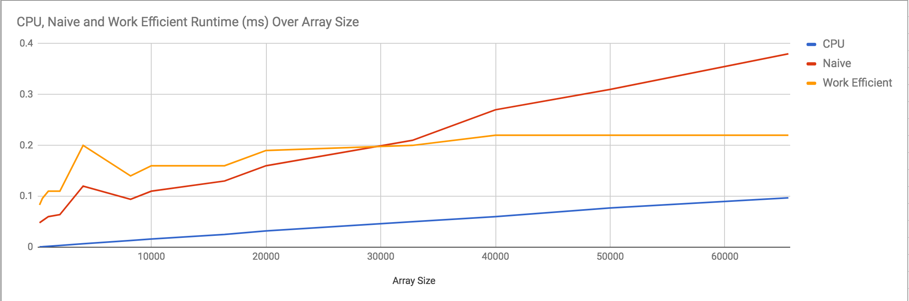
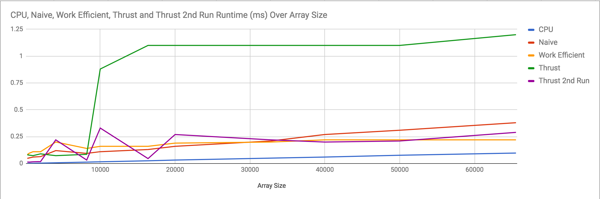
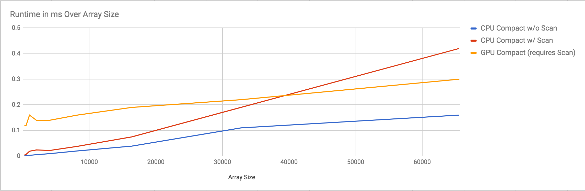

CUDA Stream Compaction
======================

**University of Pennsylvania, CIS 565: GPU Programming and Architecture, Project 2**

* Name: William Ho
* Email: willho@seas.upenn.edu
* Tested on: Windows 7 Professional, i7-6700 @ 3.40 GHz 16.0GB, NVIDIA QuadroK620 (Moore 100C Lab)

## Overview

**Stream Compaction** is a process for culling elements from an array that do not meet a certain criteria. It is a widely used technique for compression, utilized for audio compression, and has many use cases for computer graphics, such as culling unnecessary rays from a path tracer. A conceptually simple example is show below, in which we remove `0`s from an array of `int`s:

* Starting Array: {0, 2, 3, 0, 5, 2, 0, 0, 9}

* Compacted Array: {2, 3, 5, 2, 9}

The goal for this project was to observe a few variations on the Stream Compaction algorithm, note that it is a parallelizable technique that can be implemented on the GPU, and use it as a case study to gain an understanding of working on the GPU. Within Stream Compaction, a common implementation technique involves "scanning" an array and creating a corresponding array of exclusive prefix-sums. 

I implement **Scan**, (and using it, Stream Compaction) with a straightforward CPU implementation, a naively parallelized CUDA implementation on the GPU, and a work-efficient CUDA implementation, the latter two of which are adapted from GPU Gems 3, Chapter 39 - [Parallel Prefix Sum (Scan) with CUDA](https://developer.nvidia.com/gpugems/GPUGems3/gpugems3_ch39.html).

#### Features Implemented:

- CPU Scan
- CPU Compaction
- Naive GPU Scan
- Work Efficient GPU Scan
- GPU Compaction

## Implementation Details

### Scan

### CPU, Naive GPU, Work-Efficient GPU

## Preliminary Analysis

### Scan Analysis

#### Comparing CPU and GPU

| Array Size vs Runtime in ms	| CPU	| Naive	| Work Efficient |	Thrust	| Thrust 2nd Run |
|-------------|-----|-------|----------------|----------|----------------|
|256	| 0.0006	|  0.048| 	0.083	| 0.081|0.014|
|512	| 0.0009	|  0.052| 	0.096	|0.078	|0.013|
|1024 |	0.0018|  	0.06| 	0.11 | 	0.073|0.016|
|2028 |	0.0033|  	0.06 |  0.11 | 	0.09	|0.018|
|4056 |	0.0066|  	0.12| 	0.2	 | 0.073	|0.22|
|8192 |	0.013	|  0.094| 	0.14 | 	0.085|0.032|
|10000	|0.016	|  0.11	|   0.16 | 	0.88	|0.33|
|16384	|0.025	|  0.13	|   0.16 | 	1.1	| 0.046|
|20000	|0.032	|  0.16	|   0.19 | 	1.1	| 0.27|
|32,768|	0.05	|  0.21	|   0.2	 | 1.1	| 0.22|
|40000	| 0.06	|  0.27	|   0.22 | 	1.1	| 0.2|
|50000	| 0.077	|  0.31	|   0.22 | 	1.1	| 0.21|
|65536	| 0.097	|  0.38	|   0.22 | 	1.2	| 0.29| 

The first thing to notice about the GPU implementations is that they are rather slow, especially compared to the CPU implementations. This is almost certainly a result of the global memory accesses in both Naive and Work-Efficient. Since global memory access is usually a ~200 cycle operation, it's drastically costly, even with clever indexing to retire threads early. A truly optimized implementation of Scan on the GPU would leverage shared memory. 

However, we do gain insight into the GPU's capabilities when we examine the scalability of the 3 implementations. The CPU implementation increases in an observable linear fashion. Since it is a simple iteration through the array, this makes sense, the algorithm has an _O(n)_ time complexity. By contrast, the Work-Efficient algorithm does not appear to increase linearly, but rather levels out asymptotically. The Work-Efficient scan performs _O(n)_ add operations, but performing these operations in parallel means that it's time complexity is closer to _O(logn)_. It is worth noting though, the Naive implementation does not scale nearly as well. It is a far less efficient algorithm that performs _O(nlogn)_ operations. 

#### Comparison With Thrust

No analysis would be complete without comparing my implementation to a standard library. The following shows runtime comparisons against `Thrust::exclusive_scan`. It is important to note that running `Thrust::exclusive_scan` more than once in a single process shows considerable time difference for the same input array. `Thrust` perhaps requires a considerable amount of initial processing before perform its Scan, so subsequent runs of `exclusive_scan` likely give a more accurate understanding of its runtime. At array sizes less than 65536, our Work-Efficient scan seems to out-perform `Thrust`, but `Thrust` seems to scale slightly better. 

### Compaction Analysis

