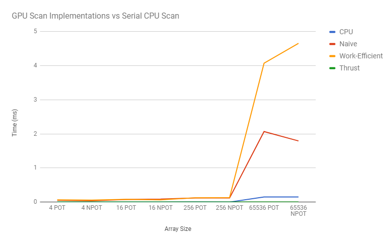
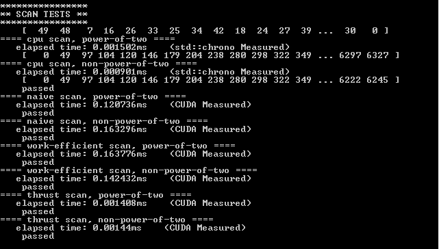
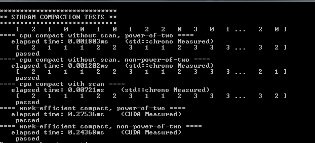

CUDA Stream Compaction
======================

**University of Pennsylvania, CIS 565: GPU Programming and Architecture, Project 2**

* Ricky Rajani
* Tested on: Windows 7, i7-6700 @ 3.40GHz 16GB, NVIDIA Quadro K620 (Moore 100C Lab)

This project implements GPU stream compaction in CUDA, from scratch. The algorithm will later be used for acceleration a path trace project. The algorithms implemented take advantage of the GPU's massive parrallelism, specfically data parrallelism.

Different versions of the Scan (Prefix Sum) algorithm were implemented:
- CPU version
- "Naive"
- "Work-efficient"
- GPU stream compaction

### Performance Analysis

Optimal blocksize = 128

Write a brief explanation of the phenomena you see here. Can you find the performance bottlenecks? Is it memory I/O? Computation? Is it different for each implementation?

Scan Test Results:

Stream Compaction Test Results:

