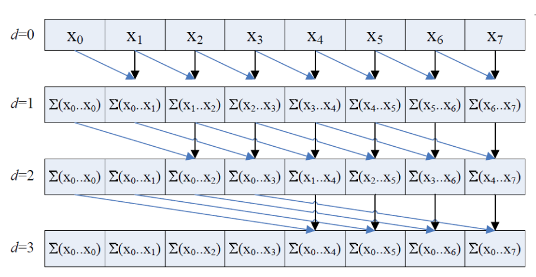
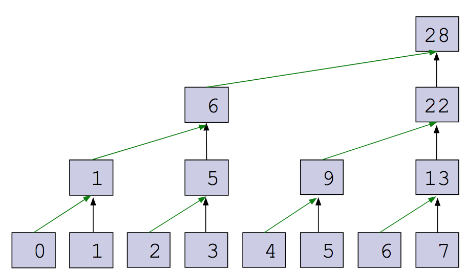
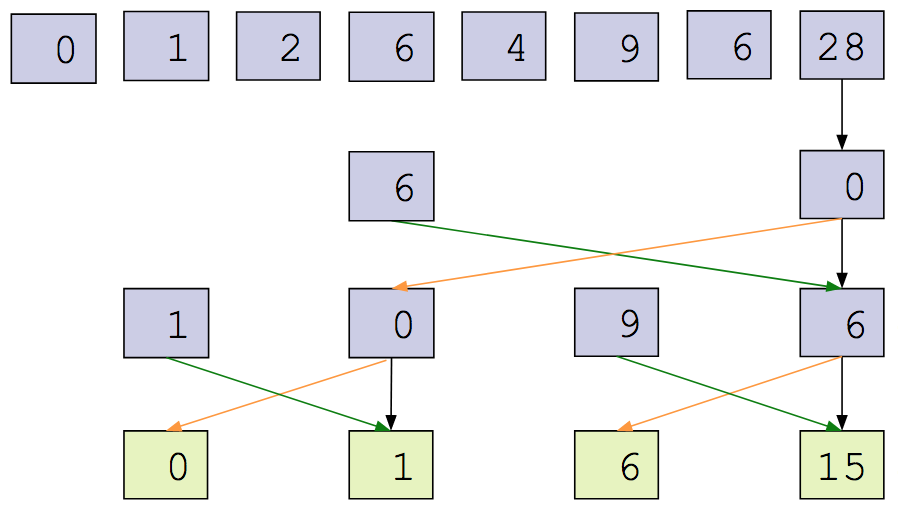
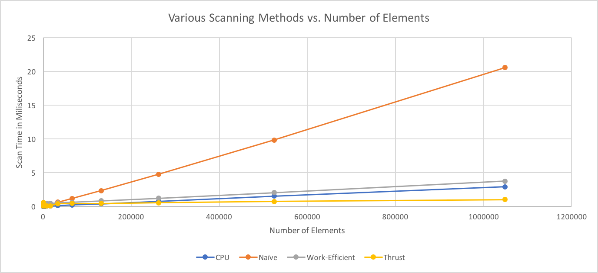
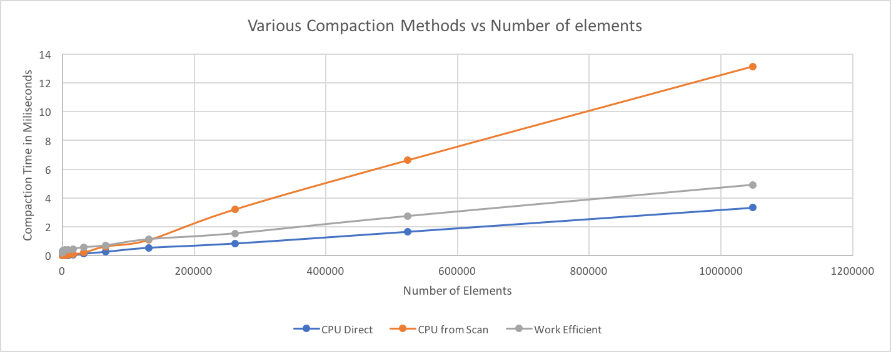

CUDA Stream Compaction
======================


**University of Pennsylvania, CIS 565: GPU Programming and Architecture, Project 2**

* Daniel Daley-Mongtomery
* Tested on: MacBook Pro, OSX 10.12, i7 @ 2.3GHz, 16GB RAM, GT 750M 2048MB (Personal Machine)

## Details

This project is an exploration of a somewhat simple concept, stream compaction, and how it relates to more complex parallel algorithms. Stream compaction consists of removing array elements based on some predicate (in our case 'Is this element equal to 0?') and is used to discard irrelevant data before it reaches a more computationally intensive stage in a program. [My path tracer,](https://github.com/illDivino/Project3-CUDA-Path-Tracer) for example, uses stream compaction to prevent launching unnecessary expensive kernels if they're just going to contribute 0 anyway.

#### Scan

   This project first tests the efectiveness of several scanning methods, where array element *x* is replaced with the sum of all preceding elements. This will be used later for stream compaction, but also provides another opportunity to explore a parallel system. The high-level approximations for each algortihm for number of elements *n* are as follows:

###### Basic CPU:
```
for i < n - 1 {
    elements[i+1] = elements[i] + elements[i+1]
    i++
}
```
This is pretty self explanatory. It sums every pair of elements in series, and will scale linearly with the number of elements.

###### Naive GPU:
```
for stride = 1; stride < n {

  for all i < n in parallel {
    if (i >= stride) 
        elements[i] = elements[i-stride] + elements[i]
  }
  
  stride *= 2
}
 
```



Every iteration of the outer loop will sum an element with the element *stride* away. By log2(n) iterations, every element will be full. Unfortunately, while it will only take log(n) kernel launches, each of this will perform n operations. This nlog(n) runtime makes this less work-efficient than the CPU version.

###### Work-Efficient GPU:
```
//upsweep
for stride = 2; stride < n {
    for i < (n/stride) in parallel {
        index = i * stride - 1
        if (index + stride < n) 
            elements[index+stride] = elements[index+stride] + elements[index+(stride/2)]
    }
    stride *= 2
}
```



```
// Downsweep
x[n - 1] = 0
for stride = n; stride >= 2 {
    for i < (n/stride) in parallel {
        temp = elements[i + stride – 1];
        elements[i + stride – 1] = elements[i + (2*stride) – 1];
        elements[i + (stride * 2) – 1] += temp;
    }               
}
```



This method allows us to perform n adds on the upsweep, then n adds and n copies on the down, keeping us within the complexity of the CPU version, but still reaping the benefits of the GPU. Let's see how they measure up. This project printed the following text upon execution, which I collected and averaged to create the below graph:

```
****************
** SCAN TESTS **
****************
a[SIZE]:
    [  44  34   5  30  42  18  12  23  14   1  12  32   1 ...   7   0 ]
a[NPOT]:
    [  44  34   5  30  42  18  12  23  14   1  12  32   1 ...  27  45 ]
==== cpu scan, power-of-two ====
   elapsed time: 2.31825ms    (std::chrono Measured)
    [   0  44  78  83 113 155 173 185 208 222 223 235 267 ... 25692019 25692026 ]
==== cpu scan, non-power-of-two ====
   elapsed time: 2.28568ms    (std::chrono Measured)
    [   0  44  78  83 113 155 173 185 208 222 223 235 267 ... 25691912 25691939 ]
    passed
==== naive scan, power-of-two ====
   elapsed time: 16.4329ms    (CUDA Measured)
    [   0  44  78  83 113 155 173 185 208 222 223 235 267 ... 25692019 25692026 ]
    passed
==== naive scan, non-power-of-two ====
   elapsed time: 16.4599ms    (CUDA Measured)
    [   0  44  78  83 113 155 173 185 208 222 223 235 267 ... 25691912 25691939 ]
    passed
==== work-efficient scan, power-of-two ====
   elapsed time: 2.88461ms    (CUDA Measured)
    [   0  44  78  83 113 155 173 185 208 222 223 235 267 ... 25692019 25692026 ]
    passed
==== work-efficient scan, non-power-of-two ====
   elapsed time: 3.04077ms    (CUDA Measured)
    [   0  44  78  83 113 155 173 185 208 222 223 235 267 ... 25691912 25691939 ]
    passed
==== thrust scan, power-of-two ====
   elapsed time: 2.89341ms    (CUDA Measured)
    [   0  44  78  83 113 155 173 185 208 222 223 235 267 ... 25692019 25692026 ]
    passed
==== thrust scan, non-power-of-two ====
   elapsed time: 0.731264ms    (CUDA Measured)
    [   0  44  78  83 113 155 173 185 208 222 223 235 267 ... 25691912 25691939 ]
    passed
```



   Unfortunately, my GPU skills are not quite on par with the developers of [thrust](https://github.com/thrust/thrust), whose thrust library outperformed both my implementations and the plain CPU implementation. Because of the simplicity of the operations within the kernel, my expectation is that global memory access bloated my execution time. Shared memory would prevent the immense effort of accessing these global elements and perhaps help me compete with thrust and CPU.

#### Stream Compaction

   Even if I'm not winning the race, I still wanted to execute the original goal and use my scan to perform stream compaction. The method is simple enough: fill a binary array with 1 (keep) or 0 (remove), then execute an exclusive scan on that array. We can then access each element of this scanned array in parallel, check if we have a freshly incremented value, and use that value as the new index in the compacted array. Let's see how that worked out:

```
*****************************
** STREAM COMPACTION TESTS **
*****************************
    [   0   0   1   2   2   0   2   1   0   1   0   0   1 ...   1   0 ]
==== cpu compact without scan, power-of-two ====
   elapsed time: 2.66989ms    (std::chrono Measured)
    [   1   2   2   2   1   1   1   3   2   1   3   2   2 ...   1   1 ]
    passed
==== cpu compact without scan, non-power-of-two ====
   elapsed time: 2.62928ms    (std::chrono Measured)
    [   1   2   2   2   1   1   1   3   2   1   3   2   2 ...   3   3 ]
    passed
==== cpu compact with scan ====
   elapsed time: 10.7862ms    (std::chrono Measured)
    [   1   2   2   2   1   1   1   3   2   1   3   2   2 ...   1   1 ]
    passed
==== work-efficient compact, power-of-two ====
   elapsed time: 3.89808ms    (CUDA Measured)
    [   1   2   2   2   1   1   1   3   2   1   3   2   2 ...   1   1 ]
    passed
==== work-efficient compact, non-power-of-two ====
   elapsed time: 3.88435ms    (CUDA Measured)
    [   1   2   2   2   1   1   1   3   2   1   3   2   2 ...   3   3 ]
    passed

```



Again, the CPU wins. Like above, operations this small are especially penalized by the overhead of kernel launches and global memory. Hopefully, as I get into more complex work on the GPU, I'll be able to find more opportunities to get work done faster than the CPU like I did with the [boids](https://github.com/illDivino/Project1-CUDA-Flocking).
