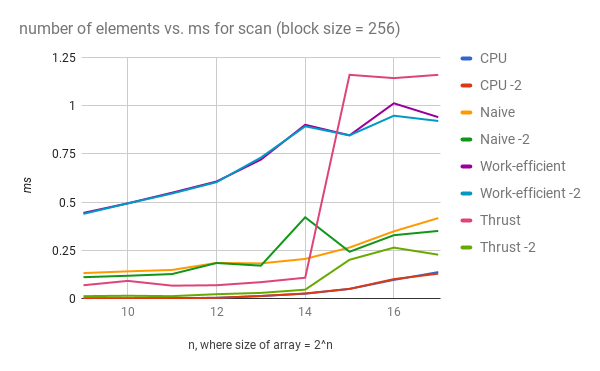
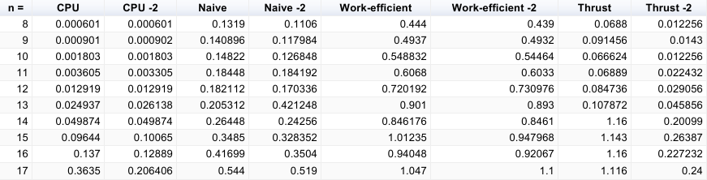

CUDA Stream Compaction
======================

**University of Pennsylvania, CIS 565: GPU Programming and Architecture, Project 2**

* Wenli Zhao
* Tested on: Windows 7, i7-6700 CPU @ 3.40GHz, NVIDIA Quadro K620 (Moore 100C Lab)

### README
This project GPU stream compaction in CUDA. The implemented features include:
1. CPU scan and stream compaction.
   * primarily used for performance comparison.
2. Naive GPU scan algorithm.
3. Work efficient GPU scan and stream compaction algorithm.
4. Calling Thrust's implementation

Analysis
========
In order to analyze the performance of stream compaction, I first found the highest multiple of 2 for which my program ran correctly and optimized for block size. I chose a block size of 256 which seemed to be optimized for my GPU implementation on 2^17 elements. I then collected and analyzed the runtimes for the scan algorithm.

### Figure 1


### Figure 2
#### Data corresponding to Figure 1


Figure one shows the array size vs. the runtime of each implementation in ms. Unfortunately, the results were not quite what we wanted. My work efficient implementation is slower than my naive implementation, which is slower than my CPU implementation. This could be due to many factors. One is the amount of global memory access that I am performing in my work efficient. As the array size increases, the memory access becomes more and more costly. 

It is hard to accurately say, but the trend for work efficient is that its runtime is leveling off, whereas Naive and CPU have an upward trend. Potentially, the work efficient implementation will succeed for greater array sizes, but my implementation limits me to 2^17. 

The Thrust implementation seems relatively efficient, but has arbitrary spikes in performance time. I think this is a thrust-specific implementation. There is some behavior underlying thrust that makes the first invokation of my thrust scan slower. If I call the scan on the same array twice, the second time will run faster. Perhaps thrust caches the inputs and is quicker for later invocations.

Although my GPU scan implementations are slower than the CPU implementation, the work-efficient compact is more efficient than cpu-compact-with-scan.


```

****************
** SCAN TESTS **
****************
    [  28  17  26   2  41  12   6  34  18  12  12  33  23 ...  21   0 ]
==== cpu scan, power-of-two ====
   elapsed time: 0.012919ms    (std::chrono Measured)
    [   0  28  45  71  73 114 126 132 166 184 196 208 241 ... 200656 200677 ]
==== cpu scan, non-power-of-two ====
   elapsed time: 0.012919ms    (std::chrono Measured)
    [   0  28  45  71  73 114 126 132 166 184 196 208 241 ... 200635 200635 ]
    passed
==== naive scan, power-of-two ====
   elapsed time: 0.180576ms    (CUDA Measured)
    passed
==== naive scan, non-power-of-two ====
   elapsed time: 0.171488ms    (CUDA Measured)
    passed
==== work-efficient scan, power-of-two ====
   elapsed time: 0.698912ms    (CUDA Measured)
    passed
==== work-efficient scan, non-power-of-two ====
   elapsed time: 1.96842ms    (CUDA Measured)
    passed
==== thrust scan, power-of-two ====
   elapsed time: 0.080352ms    (CUDA Measured)
    passed
==== thrust scan, non-power-of-two ====
   elapsed time: 0.030464ms    (CUDA Measured)
    passed

*****************************
** STREAM COMPACTION TESTS **
*****************************
==== cpu compact without scan, power-of-two ====
   elapsed time: 0.034251ms    (std::chrono Measured)
    [   0  28  45  71  73 114 126 132 166 184 196 208 241 ... 151975 152019 ]
    passed
==== cpu compact without scan, non-power-of-two ====
   elapsed time: 0.019829ms    (std::chrono Measured)
    [   1   1   3   1   3   2   3   1   2   2   3   2   1 ...   3   3 ]
    passed
==== cpu compact with scan ====
   elapsed time: 0.055282ms    (std::chrono Measured)
    [   1   1   3   1   3   2   3   1   2   2   3   2   1 ...   3   2 ]
    passed
==== work-efficient compact, power-of-two ====
   elapsed time: 0.047008ms    (CUDA Measured)
    passed
==== work-efficient compact, non-power-of-two ====
   elapsed time: 0.048704ms    (CUDA Measured)
    passed
Press any key to continue . . .

