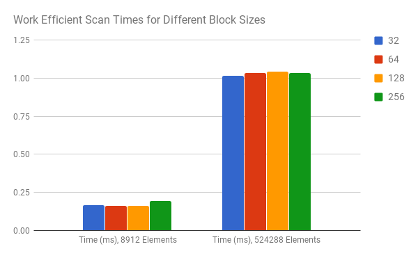
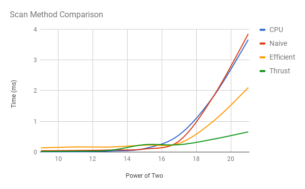
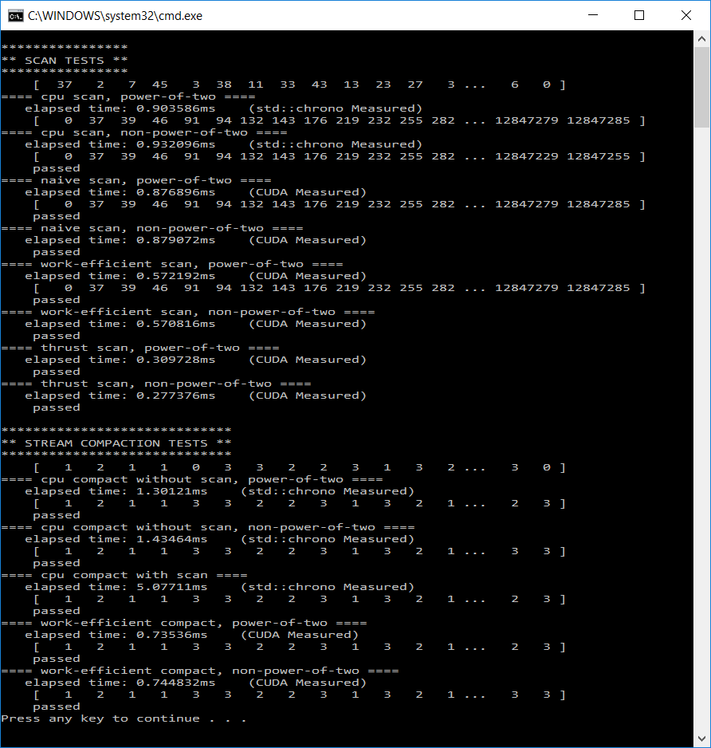

CUDA Stream Compaction
======================

**University of Pennsylvania, CIS 565: GPU Programming and Architecture, Project 2**

* Daniel McCann
* Tested on: Windows 10, i7-5700HQ CPU @ 2.70GHz, GeForce GTX 970M, 16 GB RAM

### Overview

This is an introduction to parallelizing algorithms that are written very simply on the CPU.
* Scan: given an array, make an array that is a running sum of all previous elements.
* Compact: given an array, make an array that has all zero elements pruned.

### Runtime Analysis

## Block Size

Before recording any data for comparisons between scan methods, I wanted to ensure I picked the best block size for testing. Here is the data:

| Block Size | Time (ms), 8912 Elements | Time (ms), 524288 Elements |
| --- | --- | --- |
| 32 | 0.1661 | 1.0133 |
| 64 | 0.1619 | 1.0326 |
| 128 | 0.1635 | 1.0431 |
| 256 | 0.1950 | 1.0347 |

The differences are marginal. 64 gave the fastest time for 8912 elements. But for over half a million, 32 was clearly the fastest. 256 Was the worst for the smaller element count but better than 128 for the higher element count.

## Method Comparison

I tested four different methods for scans. On the CPU, a Naive parallel GPU, an Efficient GPU, and Thrust's solution on the GPU.

| Power of Two | CPU | Naive | Efficient | Thrust |
| --- | --- | --- | --- | --- |
| 9 | 0.0019 | 0.0417 | 0.1361 | 0.0209 |
| 11 | 0.0072 | 0.0510 | 0.1680 | 0.0281 |
| 13 | 0.0315 | 0.0665 | 0.1661 | 0.0569 |
| 15 | 0.1137 | 0.0998 | 0.2266 | 0.2410 |
| 17 | 0.5577 | 0.3611 | 0.2848 | 0.2410 |
| 19 | 1.8206 | 1.8258 | 1.0133 | 0.4213 |
| 21 | 3.6619 | 3.8506 | 2.1019 | 0.6583 |

There are some oddities in the graph. A few of the recordings seemed to have a high variance. Here are some main takeaways:

* Efficient is worse than both CPU and Naive until there is a large number of elements. This is likely because it requires a lot of memory access in more kernels.
* Once the number of elements is high enough, efficient is much better than the CPU solution.
* Naive GPU and CPU have surprisingly similar results. 
* Thrust is fast. Really fast. Oddly, in debug mode it was very slow, taking over 11 ms for 2^19 elements.
* I did not record the times, but I noticed that efficient was actually faster for non powers of two. 

## Efficient GPU Implementation Notes

My kernels for the Efficient method are made to be called with the minimal number of threads / block size for completing the pass. This is based on the observations that:
* on each pass up or down, the number of operations halves or doubles, respectively
* on each pass up or down, the distance between array elements in operations doubles or halves, respectively

So I found a way to scale the index to make up for the reduced number of threads. The alternative is making N threads every pass, which is terribly inefficient. On the very first pass, half would do nothing. On the second, three fourths. Then seven eigths, and so on. It would likely be worse than the naive solution, even for large numbers.

## Compaction Implementation Notes

The CPU implementation of compaction is extremely simple; append nonzero elements to an ongoing list / array. Emulating the GPU process using scan and scatter was very inefficient. Despite this, GPU compaction is faster than the CPU implementation at a high number of elements.

For 2^18 elements, CPU, CPU scan and GPU solved in 1.3864, 4.8756, and 1.0340 milliseconds, respectively. 

### Example Output:

