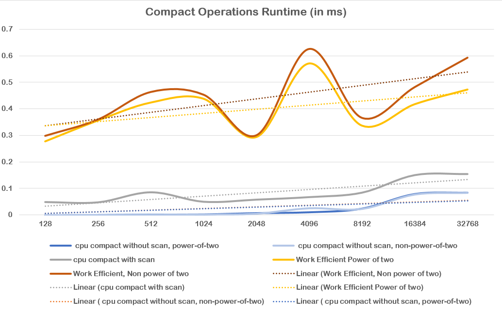
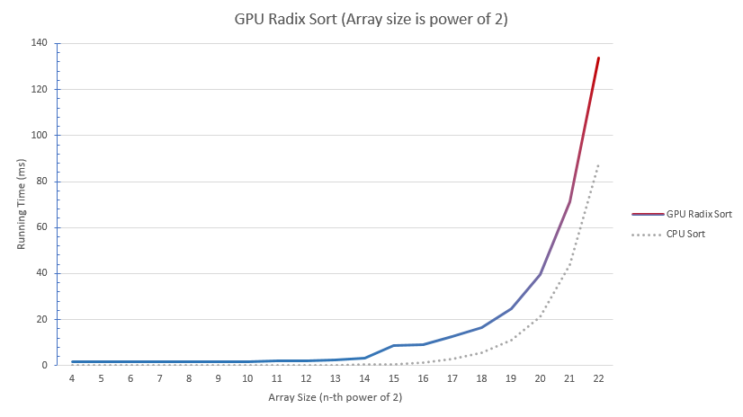

University of Pennsylvania, CIS 565: GPU Programming and Architecture, Project 2 CUDA Stream Compaction
======================
* Ziyu Li
* Tested on: Windows 7, i7-3840QM @ 2.8GHz 16GB, Nivida Quadro K4000M 4096MB (Personal Laptop)

## Performance Analysis
#### Efficient Scan without Optimization
This implementation is achieved by reduction and down-sweep in GPU. The performance of this method is much better than naive scan but actually still slow compare to CPU. 

For the benchmark and result, please check **Performance** section

#### Efficient Scan with Optimization
To avoid the efficient scan method uses extra non-working threads, simply change the index pattern to perform the kernels. So this optimization can reduce a huge amount of threads to perform useless operations and increase the overall performance.

For the benchmark and result, please check **Performance** section


#### More Efficient Scan with Shared Memory
The optimized method which states above still is not efficiency enough. Actually by performing the operations in shared memory can highly achieve the maximum the performance. The whole implementation can split into three parts.

* Scan each blocks seperatly and use a auxiliary array to store each block sum
* Scan the block sums
* Add scanned block sum to next scanned block


(Figure 1: Algorithm for Performing a Sum Scan on a Large Array of Values, Nvidia GPU Gems)


This implementation is relatively easy to achieve, however using share memory will sometimes suffer from bank conflicts which could hurt the performance significantly by access those memory everytime. To avoid these bank conflict, we have to add padding to share memory every certain elements. And those offset can be easily implement by a macro.

```c++
#define CONFLICT_FREE_OFFSET(n) \ ((n) >> NUM_BANKS + (n) >> (2 * LOG_NUM_BANKS))
```

For the benchmark and result, please check **Performance** section

#### Radix Sort
One of the most significant application for GPU scan is radix sort which is a sorting algorithm for parallel processors.  

To use radix sort function, please call the function below:
```c++
StreamCompaction::Radix::sort(int n, int *odata, int *idata);
```
* The first argument is the array size. (input)
* The second argument is sorted array. (output)
* The third argument is unsorted array. (input)

For the benchmark and result, please check **Performance** section

## Performance
#### Scan Performace Measurement and Result
The benckmark is performed the scan operation under 128 threads per block for array size from 2^4 to 2^22. (Since there is only one grid, 2^22 is the maximum amount for a 128 block size.)

The benchmark also makes a running time comparision between CPU, GPU Naive, GPU Efficient, GPU Efficient With Optimization, GPU Efficient With Share Memory and GPU Thrust Scan.


(For the detail result, please check the data in the **benckmark** folder)

#### Compact Performace Measurement and Result
The benckmark is performed the compaction operation under 128-512 threads per block for array size from 2^4 to 2^24. (128 block size for array size 2^4 to 2^22, 256 block size for 2^23 and 512 block size for 2^24)

The benchmark also makes a running time comparision between CPU without scan, CPU with scan and GPU with scan.




(For the detail result, please check the data in the **benckmark** folder)

#### Radix Sort Performance Measurement and Result
The benchmark is performed the radix sort operation under 128 threads per block for array size from 2^4 to 2^24.

The benchmark makes a running time comparison between CPU 3-part hybrid sort (standard sort function in STL) and GPU radix sort




## Questions
#### Roughly optimize the block sizes of each of your implementations for minimal run time on your GPU.

Based on large number (larger than 2^20) benchmark result. The optimize block sizes for each implementation:

|   Methods  | Naive | Efficient | Efficient (Optimize) | Efficient (ShareMem) | Thrust |
|:----------:|-------|-----------|----------------------|----------------------|--------|
| Block Size |  1024 |    128    |          128         | 256                  | 1024   |

#### Compare all of these GPU Scan implementations (Naive, Work-Efficient, and Thrust) to the serial CPU version of Scan. Plot a graph of the comparison

For Thrust implementation, the highest occupancy in GPU is cudaMalloc and cudaMemcpy related function calls based on Nsight Timeline. However, there are three most significant functions in Thrust scan *accumlate_tiles*, *exculsive_scan_n* and *exclusive_downsweep* are not really use too much GPU time.

I believe the performance bottlenecks is memory bandwidth for Thrust scan. The computation time compare to memory I/O time is trivial. As for my implementation, the efficient method waste a huge amount of time on launching non-working threads. For efficient with optimization, the memory I/O become the most inefficient factor in whole system.  By using shared memory can highly increase memory I/O efficiency and decrease memory latency to achieve maximum efficiency.

For the benchmark and graph, please check **Performance** section