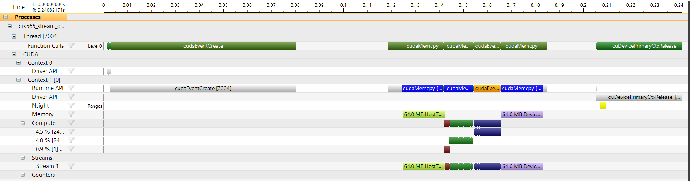

**University of Pennsylvania, CIS 565: GPU Programming and Architecture,
Project 2 - Stream Compaction**

* Josh Lawrence
* Tested on: Windows 10, i7-6700HQ @ 2.6GHz 8GB, GTX 960M 2GB  Personal

**CMakeLists.txt Additions**<br />
radix.h<br />
radix.cu<br />
sharedandbank.h<br />
sharedandbank.cu<br />

**Overview**<br />
Overiew of the prefix scan, compaction, radix sort algorithms and their applications:
https://developer.nvidia.com/gpugems/GPUGems3/gpugems3_ch39.html

**Highlights**<br />
    Across all tests (scan, compact, radix), the CPU implementation beats out the GPU implementations for small data sets, as expected due to the host to device overhead required for GPU implementations. Across all tests, data sets of size 65536 (or 2^16) seems to be when the GPU implementation perf matches that of the CPU(except radix sort which catches up at 2^20), and after this point bigO takes over and the perf gap(CPU vs Shared) favors the GPU: 1.8x for radix sort, 2.9x for compact, and 3.5x for scan.
<br />
    The key to the "Efficient" scan implentation was to make sure you were only launching as many blocks as were required for the depth passes in both the up and down sweeps as well as making sure threads that were running were consecutive. The key to Shared memory was to make a device memory pointer array to store the scans of the reduced sums of previous blocks. Also you must add this missing info back up through the recursion tree so that the original scan blocks include the running total of the previous blocks on their recursion level. This is process described with diagrams in the GPU Gems article linked in the Overview section.
<br />
    Oddly enough, I did not see any perf improvements from adding the bank conflict avoidance feature. Sad.
<br />
    The last few images are of the NSight debugger for the thrust kernel (its kernel info and its timeline). Looking at the timeline I was suprised to see how little of the time is spent actually doing compute work (the rest is memory related). Also, judging from thrust's kernel launch info, it is using shared memory. Perhaps it's using the optimizations mentioned in the GPU Gems 3 Ch. 39 article linked in the Overview section. Recursive calls are required for that implementation but I see no multiple kernel calls so I'm not quite sure what optimizations it's using.

**Data**<br />


**Exclusive Scan**<br />


**Compaction**<br />


**Radix Sort vs std::sort**<br />


**Thrust Kernel Info**<br />


**Thrust Timeline**<br />


**Efficient Timeline**<br />


**Shared Timeline**<br />


**GPU Device Properties**<br />
https://devblogs.nvidia.com/parallelforall/5-things-you-should-know-about-new-maxwell-gpu-architecture/<br />
cuda cores 640<br />
mem bandwidth 86.4 GB/s<br />
L2 cache size 2MB<br />
num banks in shared memory 32<br />
number of multiprocessor 5<br />
max blocks per multiprocessor 32<br />
total shared mem per block 49152 bytes<br />
total shared mem per MP 65536 bytes<br />
total regs per block and MP 65536<br />
max threads per block 1024<br />
max threads per mp 2048<br />
total const memory 65536<br />
max reg per thread 255<br />
max concurrent warps 64<br />
total global mem 2G<br />
<br />
max dims for block 1024 1024 64<br />
max dims for a grid 2,147,483,647 65536 65536<br />
clock rate 1,097,5000<br />
texture alignment 512<br />
concurrent copy and execution yes<br />
major.minor 5.0<br />

```
    [  13  37  15   2  33  20  18   9  34  39  33  40  20 ...  38  13  19   5  19   0 ]
SIZE: 256

*****************************
**** BEGIN RADIX TESTS ******
*****************************
==== std::sort, power-of-two(full array) ====
   elapsed time: 0.011456ms    (std::chrono Measured)
    [   0   0   0   0   1   1   1   2   2   2   2   2   2 ...  49  49  49  49  49  49 ]
==== std::sort, non-power-of-two ====
   elapsed time: 0.022914ms    (std::chrono Measured)
    [   0   0   0   1   1   1   2   2   2   2   2   2   2 ...  49  49  49  49  49  49 ]
==== CPU radix sort, power-of-two ====
   elapsed time: 0.012247ms    (std::chrono Measured)
    [   0   0   0   0   1   1   1   2   2   2   2   2   2 ...  49  49  49  49  49  49 ]
    passed
==== CPU radix sort, non power-of-two ====
   elapsed time: 0.028049ms    (std::chrono Measured)
    [   0   0   0   1   1   1   2   2   2   2   2   2   2 ...  49  49  49  49  49  49 ]
    passed
==== GPU radix sort, power-of-two ====
   elapsed time: 1.86752ms    (CUDA Measured)
    [   0   0   0   0   1   1   1   2   2   2   2   2   2 ...  49  49  49  49  49  49 ]
    passed
==== GPU radix sort, non power-of-two ====
   elapsed time: 1.27574ms    (CUDA Measured)
    [   0   0   0   1   1   1   2   2   2   2   2   2   2 ...  49  49  49  49  49  49 ]
    passed
****************
** SCAN TESTS **
****************
==== cpu scan, power-of-two ====
   elapsed time: 0.00079ms    (std::chrono Measured)
    [   0  13  50  65  67 100 120 138 147 181 220 253 293 ... 6424 6462 6475 6494 6499 6518 ]
==== cpu scan, non-power-of-two ====
   elapsed time: 0.000395ms    (std::chrono Measured)
    [   0  13  50  65  67 100 120 138 147 181 220 253 293 ... 6351 6373 6394 6424 6462 6475 ]
    passed
==== naive scan, power-of-two ====
   elapsed time: 0.037984ms    (CUDA Measured)
    [   0  13  50  65  67 100 120 138 147 181 220 253 293 ... 6424 6462 6475 6494 6499 6518 ]
    passed
==== naive scan, non-power-of-two ====
   elapsed time: 0.037568ms    (CUDA Measured)
    [   0  13  50  65  67 100 120 138 147 181 220 253 293 ... 6424 6462 6475   0   0   0 ]
    passed
==== work-efficient scan, power-of-two ====
   elapsed time: 0.111968ms    (CUDA Measured)
    [   0  13  50  65  67 100 120 138 147 181 220 253 293 ... 6424 6462 6475 6494 6499 6518 ]
    passed
==== work-efficient scan, non-power-of-two ====
   elapsed time: 0.110336ms    (CUDA Measured)
    [   0  13  50  65  67 100 120 138 147 181 220 253 293 ... 6351 6373 6394 6424 6462 6475 ]
    passed
==== thrust scan, power-of-two ====
   elapsed time: 0.023424ms    (CUDA Measured)
    [   0  13  50  65  67 100 120 138 147 181 220 253 293 ... 6424 6462 6475 6494 6499 6518 ]
    passed
==== thrust scan, non-power-of-two ====
   elapsed time: 0.017856ms    (CUDA Measured)
    [   0  13  50  65  67 100 120 138 147 181 220 253 293 ... 6351 6373 6394 6424 6462 6475 ]
    passed
==== work-efficient shared mem and bank conflict free scan, power-of-two ====
   elapsed time: 0.014048ms    (CUDA Measured)
    [   0  13  50  65  67 100 120 138 147 181 220 253 293 ... 6424 6462 6475 6494 6499 6518 ]
    passed
==== work-efficient shared mem and bank conflict free scan, non-power-of-two ====
   elapsed time: 0.013728ms    (CUDA Measured)
    [   0  13  50  65  67 100 120 138 147 181 220 253 293 ... 6351 6373 6394 6424 6462 6475 ]
    passed

*****************************
** STREAM COMPACTION TESTS **
*****************************
    [   3   3   3   0   0   2   3   2   0   3   3   0   1 ...   1   1   1   1   3   0 ]
==== cpu compact without scan, power-of-two ====
   elapsed time: 0.00079ms    (std::chrono Measured)
    [   3   3   3   2   3   2   3   3   1   3   3   1   3 ...   2   1   1   1   1   3 ]
    passed
==== cpu compact without scan, non-power-of-two ====
   elapsed time: 0.001185ms    (std::chrono Measured)
    [   3   3   3   2   3   2   3   3   1   3   3   1   3 ...   2   2   2   1   1   1 ]
    passed
==== cpu compact with scan ====
   elapsed time: 0.019753ms    (std::chrono Measured)
    [   3   3   3   2   3   2   3   3   1   3   3   1   3 ...   2   1   1   1   1   3 ]
    passed
==== work-efficient compact, power-of-two ====
   elapsed time: 0.2032ms    (CUDA Measured)
    [   3   3   3   2   3   2   3   3   1   3   3   1   3 ...   2   1   1   1   1   3 ]
    passed
==== work-efficient compact, non-power-of-two ====
   elapsed time: 0.129376ms    (CUDA Measured)
    [   3   3   3   2   3   2   3   3   1   3   3   1   3 ...   2   2   2   1   1   1 ]
    passed
==== work-efficient, sharedmem bank conflict avoid compact, power-of-two ====
   elapsed time: 0.044128ms    (CUDA Measured)
    [   3   3   3   2   3   2   3   3   1   3   3   1   3 ...   2   1   1   1   1   3 ]
    passed
==== work-efficient, sharedmem bank conflict avoid compact, non-power-of-two ====
   elapsed time: 0.021408ms    (CUDA Measured)
    [   3   3   3   2   3   2   3   3   1   3   3   1   3 ...   2   2   2   1   1   1 ]
    passed
Press any key to continue . . .
```

