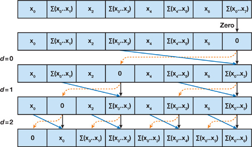

CUDA Stream Compaction
======================

**University of Pennsylvania, CIS 565: GPU Programming and Architecture, Project 2**

* Mohamad Moneimne
* Tested on: Windows 10, i7-4700HQ @ 2.40GHz 8GB, GT 750M 2019MB (Personal Laptop)

###### (Images of algorithms taken from [GPU Gems 3](https://developer.nvidia.com/gpugems/GPUGems3/gpugems3_ch39.html))

### Overview

In this project, I was able to explore how to parallelize a typically compact and sequential algorithm, **scanning**. In a scan algorithm, an input array is transformed to an output array such that every position in the output array is equal to a _specified operation_ over every array before it in the input array. For example, given an input array _x = {1, 3, 5, 9}_ and the addition operation, any element in the output array, _y[i]_, is equal to _x[0] + x[1] + ... + x[i]_. This means that the output array in our example would become _{1, 1+3, 1+3+5, 1+3+5+9} = {1, 4, 9, 18}_. When the first element of the output array is simply a copy of the first element of the input array, as is the case here, this is called an _inclusive_ scan.

We can easily modify an algorithm to create an _exclusive_ scan by delaying the addition of elements by one index to the right. This means that for any element in the output array, _y[i]_, we return _x[0] + x[1] + ... + x[i-1]_. In this case, _y[0]_ would always be 0. If we follow the same example from above, the output array would become _{0, 1, 1+3, 1+3+5} = {0, 1, 4, 9}_. You will notice that this simply is the result of the inclusive scan shifted to the right and a 0 in the first index.

Once we have accomplished the implementation of our scan algorithm, we can use it for many practical purposes. For this assignment, we use it for **stream compaction**. With stream compaction, we can take an array of elements and remove any elements that don't meet a certain requirement. For example, in an array of integers, we may want to remove all zeros from the array. The algorithmic details for this won't be explained in this README. Instead, I will focus on an analysis of the algorithms used to implement scanning.

#### A CPU Algorithm

One can easily picture what the sequential scanning algorithm for adding integers would look like. Create an _accumulator_ variable and loop over the input array, adding the current index to the accumulator and saving the result in an output array. This algorithm is very lean and only needs to run in _O(N)_ time while doing _O(N)_ work, where _N_ is the number of elements in the array.

#### A Naive Parallel Algorithm

Attempting to improve the scan algorithm by making it parallel is surprisingly difficult! In this project, I approach this by simulating the behavior of a [Kogge-Stone adder](https://en.wikipedia.org/wiki/Kogge%E2%80%93Stone_adder). This is considered a _naive_ algorithm because it isn't work-efficient. To implement it, we iterate over the elements in parallel _log(N)_ times. On the first iteration, each pair of elements is summed, creating partial sums that we will use in the next iterations.


Although you only need to call a kernel _log(N)_ times to achieve this, the algorithm is considered _work-inefficient_. This is because every element is still loaded and has some operations done on them for every call of the kernel, leading to _O(N*log(N))_ work being done, as opposed to the _O(N)_ work done by the CPU implementation. Let's see if we can improve this! 

_(Note that this is an inclusive scan, but we would like to do an exclusive scan for future purposes of this project. In order to accomplish this, we can do some index manipulation to ensure an element doesn't add itself to the partial sums _OR_ simply shift the result of the inclusive scan to the right.)_

#### A Work-Efficient Algorithm

In an attempt to alleviate the issues in work-efficiency introduced by the naive algorithm, we can try minimizing the amount of work done by using a reduction tree algorithm. This algorithm is split into two phases, an upward sweep and a downward sweep. In the upward sweep, threads collaborate to generate partial sums across the input array while traversing "upwards" in a tree like fashion. By the end of this phase, we have partial sums leading up to the final element, which contains a sum of all values in the input array.


Now that we have generated these partial sums, we can begin the downsweep phase. We initially replace the last element with a zero (in order to achieve an exclusive scan). We then traverse back down the tree, replacing the left child of each element with the current value and the right child with the sum of the old left child and the current value.



As can be seen above, we end up with an exculsive scan by the time the tree reaches back to the bottom. This algorithm runs _2*log(N)_ times, _log(N)_ times for the upsweep phase and _log(N)_ times for the downsweep phase. However, this is an improvement in terms of work-efficiency since for each the upsweep and the downsweep, we are only doing _O(N)_ work.

#### Thrust's Algorithm

Finally, in order to have a parallel benchmark to compare to, we also use Thrust's implementation of exlusive scanning. The library provides a simple function call, _Thrust::exclusive_scan()_, which can be used on any Thrust device vector.

### Performance Analysis

While gathering data for this, I noticed that the resulting running times fluctuated quite a bit from execution to execution. Because of this, I took three trials for each algorithm and compared the averages to each other. For each of these tests, the kernels were run with a block size of 128 threads with an increasing number of elements within the arrays.


The first thing you might think while looking at the graph above is, "Wait, I thought you tried four algorithms! Why do I only see three lines?". That is because the CPU implementation (blue line) is so much faster than the parallel implementations that it is practically at zero at this scale.

So what happened? We definitely expected parallel algorithms to run faster than the CPU implemntation, at least at a higher number of elements. What we get instead is parallel implementations that start off slower and even get slower at a faster rate than the CPU implementation as the number of elements increases. Let's look at each method in turn to see if we can make any sense of this.

#### CPU Implementation

Although it isn't noticeable in Figure 1, the CPU implementation does become slower as the number of elements increases. Considering the sequential algorithm is so lean, iterating over all the input elements and simply doing an add and write operation has minimal overhead compared to launching kernels in the first place. We can also assume that this algorithm benefits from aggressive caching on the CPU . Since we are accessing the elements purely sequentially, there is a lot of spatial locality to be used here.

#### Naive Implementation

We already know that the naive implementation is work-inefficient, but we might have expected it to run faster than the CPU implementation anyway. It is likely that the overhead of calling the kernel _log(N)_ times incurs a more severe penalty than we might have expected, which explains why it runs so slowly compared to the CPU implementation at baseline. 

As for the increasing running time, it is likely that our implementation is simply too inconsiderate towards the number of threads that are launching. For the first iteration of the algorithm, almost one thread for every element in the array needs to contribute to the partial sums. However, as the iterations pass, we need exponentially fewer threads to manage the partial sums! As the implementation stands now, we are launching _N_ threads for every iteration, which is wasteful. This leads to the clogging of our blocks and SMs with largely idle threads, which contributes to how slow this algorithm runs.

We can also take a moment to look at the shape of our curve. I made sure to test values at power-of-two and non-power-of-two array sizes to see if the increase in running time would be linear. As can be seen in Figure 1, this isn't the case. Instead, we have almost a step function in which at every power-of-two, the running time jumps up then remains fairly constant until it reaches the next power of two. This is likely because our algorithm jumps by powers-of-two at each iteration. When we increase the array size within the next power-of-two, the partial sums computed leading up to the power-of-two element will also solve the values for the elements to the right and we won't need another iteration until we hit the next power-of-two.

#### Work-Efficient Implementation

An interesting observation to note here is that work-efficient does _not_ necessarily mean faster. We mentioned that our algorithm is more work-efficient because it only does _O(N)_ work over the elements, but we have to invoke double the number of kernels in order to accomplish the scan. This might be a part of the reason why our work-efficient implementation is slower than the naive one. 

Furthermore, a case can be made for the effect of warp divergence as being an additional reason. In our naive implementation, the threads that did the work were always separated from the threads that were idle. This would cause warp divergence in a single warp at any given iteration. Also, we would only see warp divergence in the first 5 iterations. Since we have 32 threads per warp, breaking past the first 5 iterations will lead to jumps that are a factor of 32. This means that any warp will either have completely idle threads or active threads. In the case of the work-efficient implementation, we are traversing our array in a tree-like fashion. This means we will experience warp divergence in every warp leading up to the fifth iteration. Once we pass this, there will be fewer warp divergences, decreasing up to only a single divergence at the final iteration due to checking the condition of the last element. Not only are there many more warp divergences within a single tree traversal, but we also have to do this traversal twice! My guess is that these divergences add quite a toll on our work-efficient implementation.

Looking at the overall shape of the curve, we see that it is similar to that of the naive one. There is a step-like behavior as we increase the number of elements in the array, but it steps at a different point! Instead of the running time increasing once we hit the next power-of-two (like in the naive implementation), the running time increases right after a power-of-two and increases only slightly until it _passes_ the next power-of-two. This is likely because of the downsweep phase. In order to implement the downsweep, we needed to increase the input array size to the next power-of-two and fill the left-most elements with zeros. For example, if we have an array of size 2048, we only need to launch 2048 threads. However, as soon as we have 2049 elements in the array, we change the input array to be 4096 elements and padded with 2047 zeros on the left. This requires 4096 threads to be launched, which will stay the case until we reach an array size of 4096. We still get a modest increase in the running time though, which is likely because more work still needs to be done, leading warps to need more time before retiring.

#### Thurst Implementation

Overall, Thrust's implementation seems to be slower than ours at the tested range. My guess is that this is because Thrust is templated and has to deal with the overhead of being a large library. Considering it has to deal with scanning any type of array, it likely isn't able to optimize for integers. However, it seems that if we were to continue running on larger arrays, our naive and work-efficient implementations might become slower than Thrust's. This is likely because Thrust is optimizing for the number of threads launched per iteration of the scan algorithm dynamically, something that we aren't doing in our parallel scans.

As for the shape of Thrust's curve, I am pretty confused as to what is going on. It seems like the implementation runs significantly faster at non-power-of-twos than both neighboring power-of-two array sizes. I tried looking into the Thrust implemenation, but got lost in the GitHub repo with no luck. If anyone happens to have any explanation (or comments on any of the analysis above), please feel free to submit an issue to this repo!

### Console Output

```
****************
** SCAN TESTS **
****************
    [   2  44  45  45  10  27   9   6  24  12  23  21  33 ...  30   0 ]
==== cpu scan, power-of-two ====
   elapsed time: 0.000428ms    (std::chrono Measured)
    [   0   2  46  91 136 146 173 182 188 212 224 247 268 ... 6166 6196 ]
==== cpu scan, non-power-of-two ====
   elapsed time: 0.000427ms    (std::chrono Measured)
    [   0   2  46  91 136 146 173 182 188 212 224 247 268 ... 6116 6161 ]
    passed
==== naive scan, power-of-two ====
   elapsed time: 5.73277ms    (CUDA Measured)
    passed
==== naive scan, non-power-of-two ====
   elapsed time: 3.17341ms    (CUDA Measured)
    passed
==== work-efficient scan, power-of-two ====
   elapsed time: 6.33299ms    (CUDA Measured)
    passed
==== work-efficient scan, non-power-of-two ====
   elapsed time: 4.90083ms    (CUDA Measured)
    passed
==== thrust scan, power-of-two ====
   elapsed time: 28.7407ms    (CUDA Measured)
    passed
==== thrust scan, non-power-of-two ====
   elapsed time: 0.716128ms    (CUDA Measured)
    passed

*****************************
** STREAM COMPACTION TESTS **
*****************************
    [   2   0   3   3   2   1   3   0   0   0   3   3   1 ...   0   0 ]
==== cpu compact without scan, power-of-two ====
   elapsed time: 0.000855ms    (std::chrono Measured)
    [   2   3   3   2   1   3   3   3   1   2   2   1   2 ...   1   1 ]
    passed
==== cpu compact without scan, non-power-of-two ====
   elapsed time: 0.000855ms    (std::chrono Measured)
    [   2   3   3   2   1   3   3   3   1   2   2   1   2 ...   1   1 ]
    passed
==== cpu compact with scan ====
   elapsed time: 1.34411ms    (std::chrono Measured)
    [   2   3   3   2   1   3   3   3   1   2   2   1   2 ...   1   1 ]
    passed
==== work-efficient compact, power-of-two ====
   elapsed time: 11.982ms    (CUDA Measured)
    passed
==== work-efficient compact, non-power-of-two ====
   elapsed time: 7.51837ms    (CUDA Measured)
    passed
```