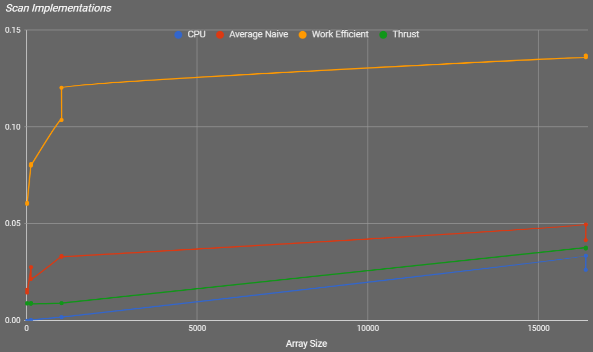
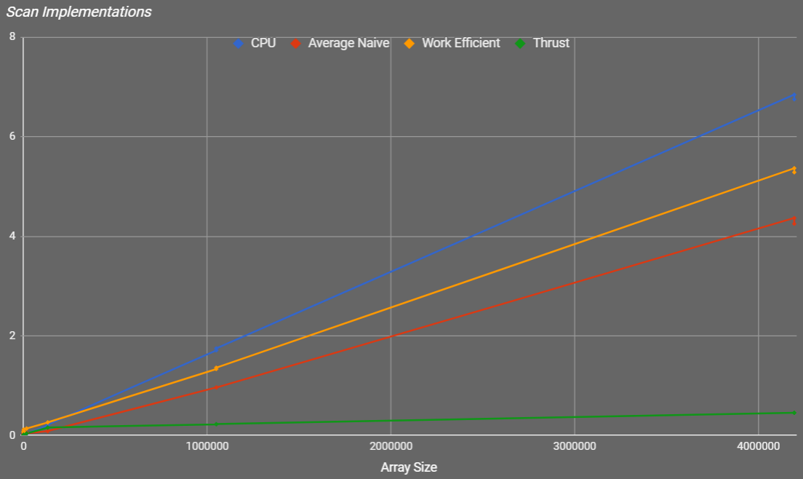
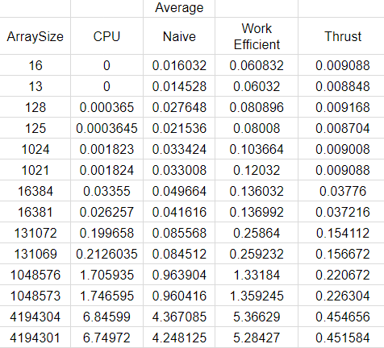

CUDA Stream Compaction
======================

**University of Pennsylvania, CIS 565: GPU Programming and Architecture, Project 2**

* Aman Sachan
* Tested on: Windows 10, i7-7700HQ @ 2.8GHz 32GB, GTX 1070(laptop GPU) 8074MB (Personal Machine: Customized MSI GT62VR 7RE)

### Overview

Stream compaction is a technique that performs the following: given an array and some condition, creates and returns a new array that contains only those elements from the original array that satisy the condition, while preserving the order of the elements.


It is used to reduce the bandwidth from the GPU to the CPU.
It is commonly used in applications such as path tracing, collision detection, sparse matrix compression, etc.

A efficient parallelized Stream Compaction algorithm uses the scan algorithm as its backbone. Scanning involves converting an input arrayinto an output array such that every position in the output array is equal to a specified operation over every element before it in the input array.

For example, given an input array x = {1, 3, 5, 9} and the addition operation, any element in the output array, y[i], is equal to x[0] + x[1] + ... + x[i]. This makes y = {1, 1+3, 1+3+5, 1+3+5+9} = {1, 4, 9, 18}. 

When the first element of the output array is simply a copy of the first element of the input array, as is the case here, this is called an Inclusive Scan.

An Exclusive Scan is an inclusive scan shifted to the right by one element and filling in a '0' where the first element of the array was.

### CPU Scan

This is a simple loop over all the N elements in an array which keeps accumulating value in its successive elements. This algorithm is very lean and runs in O(N) time.

### Naive GPU Scan


_(Note that this is an inclusive scan, but we want an exclusive scan for this project. In order to accomplish this, we can simply shift the result of the inclusive scan to the right.)_

The naive parallel implementation found in the solution file is essentially a [Kogge-Stone Adder](https://en.wikipedia.org/wiki/Kogge%E2%80%93Stone_adder). This is naive because it isn't work efficient (it does relatively excessive amournt of work). We simply traverse over the N elements log N times in parallel. On the first iteration, each pair of elements is summed, creating partial sums that we will use in the next iterations. It does O(N log N) work.

### Work Efficient GPU Scan


_(UpSweep)_


_(DownSweep)_

### Thrust GPU Scan

Finally, in order to have a parallel benchmark to compare to, we use Thrust's implementation of exlusive scanning. via the function Thrust::exclusive_scan().

### Performance Analysis

All of the measurements in the performance analysis EXCLUDE memory management (copy, allocations, free) operations whenever they are not necessary for the execution of the algorithm by itself.




_(Scan Data Zoomed In to a lower Range)_



_(Overall Scan Data)_



_(Scan Data values)_

### Test Results
```
****************
** SCAN TESTS **
****************

Array Sizes
Power of 2 size:       1024
Non-Power of 2 size:   1021

** Original Array **
    [   7   3  49  12  28   2  29  34  43  19   7  39  35 ...  20   0 ]

==== cpu scan, power-of-two ====
   elapsed time: 0.001823ms    (std::chrono Measured)
    [   0   7  10  59  71  99 101 130 164 207 226 233 272 ... 24470 24490 ]
==== cpu scan, non-power-of-two ====
   elapsed time: 0.001824ms    (std::chrono Measured)
    [   0   7  10  59  71  99 101 130 164 207 226 233 272 ... 24416 24432 ]
    passed
==== naive scan, power-of-two ====
   elapsed time: 0.036992ms    (CUDA Measured)
    passed
==== naive scan, non-power-of-two ====
   elapsed time: 0.029952ms    (CUDA Measured)
    passed
==== work-efficient scan, power-of-two ====
   elapsed time: 0.101856ms    (CUDA Measured)
    passed
==== work-efficient scan, non-power-of-two ====
   elapsed time: 0.103456ms    (CUDA Measured)
    passed
==== thrust scan, power-of-two ====
   elapsed time: 0.009056ms    (CUDA Measured)
    passed
==== thrust scan, non-power-of-two ====
   elapsed time: 0.009152ms    (CUDA Measured)
    passed

*****************************
** STREAM COMPACTION TESTS **
*****************************

** Original Array **
    [   1   1   1   2   2   0   1   2   3   1   1   1   1 ...   0   0 ]

==== cpu compact without scan, power-of-two ====
   elapsed time: 0.002553ms    (std::chrono Measured)
    [   1   1   1   2   2   1   2   3   1   1   1   1   1 ...   3   2 ]
    passed
==== cpu compact without scan, non-power-of-two ====
   elapsed time: 0.002552ms    (std::chrono Measured)
    [   1   1   1   2   2   1   2   3   1   1   1   1   1 ...   3   2 ]
    passed
==== cpu compact with scan ====
   elapsed time: 0.018963ms    (std::chrono Measured)
    [   1   1   1   2   2   1   2   3   1   1   1   1   1 ...   3   2 ]
    passed
==== work-efficient compact, power-of-two ====
   elapsed time: 0.140384ms    (CUDA Measured)
    passed
==== work-efficient compact, non-power-of-two ====
   elapsed time: 0.113664ms    (CUDA Measured)
    passed
```

```
****************
** SCAN TESTS **
****************

Array Sizes
Power of 2 size:       4194304
Non-Power of 2 size:   4194301

** Original Array **
    [  40   0  28   7   9  12  14  33   4  13  16  36  10 ...  12   0 ]

==== cpu scan, power-of-two ====
   elapsed time: 6.42297ms    (std::chrono Measured)
    [   0  40  40  68  75  84  96 110 143 147 160 176 212 ... 102754573 102754585 ]
==== cpu scan, non-power-of-two ====
   elapsed time: 6.80333ms    (std::chrono Measured)
    [   0  40  40  68  75  84  96 110 143 147 160 176 212 ... 102754474 102754500 ]
    passed
==== naive scan, power-of-two ====
   elapsed time: 4.50378ms    (CUDA Measured)
    passed
==== naive scan, non-power-of-two ====
   elapsed time: 4.40029ms    (CUDA Measured)
    passed
==== work-efficient scan, power-of-two ====
   elapsed time: 5.47786ms    (CUDA Measured)
    passed
==== work-efficient scan, non-power-of-two ====
   elapsed time: 5.52653ms    (CUDA Measured)
    passed
==== thrust scan, power-of-two ====
   elapsed time: 0.479232ms    (CUDA Measured)
    passed
==== thrust scan, non-power-of-two ====
   elapsed time: 0.443392ms    (CUDA Measured)
    passed

*****************************
** STREAM COMPACTION TESTS **
*****************************

** Original Array **
    [   3   2   3   3   0   3   0   2   2   3   2   2   3 ...   3   0 ]

==== cpu compact without scan, power-of-two ====
   elapsed time: 10.6827ms    (std::chrono Measured)
    [   3   2   3   3   3   2   2   3   2   2   3   1   2 ...   3   3 ]
    passed
==== cpu compact without scan, non-power-of-two ====
   elapsed time: 12.009ms    (std::chrono Measured)
    [   3   2   3   3   3   2   2   3   2   2   3   1   2 ...   2   2 ]
    passed
==== cpu compact with scan ====
   elapsed time: 27.9798ms    (std::chrono Measured)
    [   3   2   3   3   3   2   2   3   2   2   3   1   2 ...   3   3 ]
    passed
==== work-efficient compact, power-of-two ====
   elapsed time: 5.84595ms    (CUDA Measured)
    passed
==== work-efficient compact, non-power-of-two ====
   elapsed time: 5.97152ms    (CUDA Measured)
    passed
```