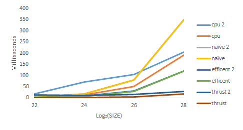

CUDA Stream Compaction
======================

**University of Pennsylvania, CIS 565: GPU Programming and Architecture, Project 2**

Sarah Forcier
Tested on GeForce GTX 1070

### Algorithm Descriptions
#### Scan
#### Stream Compaction
#### Radix Sort

### Test Program Output

#### Scan

```
 [   0  31  19  29  27   6  28  18  48  16  43   0   5  49  24   0 ]
==== cpu scan, power-of-two ====
   elapsed time: 0ms    (std::chrono Measured)
    [   0   0  31  50  79 106 112 140 158 206 222 265 265 270 319 343 ]
==== cpu scan, non-power-of-two ====
   elapsed time: 0ms    (std::chrono Measured)
    [   0   0  31  50  79 106 112 140 158 206 222 265 265 ]
    passed
==== naive scan, power-of-two ====
   elapsed time: 0.011904ms    (CUDA Measured)
    [   0   0  31  50  79 106 112 140 158 206 222 265 265 270 319 343 ]
    passed
==== naive scan, non-power-of-two ====
   elapsed time: 0.0112ms    (CUDA Measured)
    [   0   0  31  50  79 106 112 140 158 206 222 265 265 ]
    passed
==== work-efficient scan, power-of-two ====
   elapsed time: 0.018048ms    (CUDA Measured)
    [   0   0  31  50  79 106 112 140 158 206 222 265 265 270 319 343 ]
    passed
==== work-efficient scan, non-power-of-two ====
   elapsed time: 0.017888ms    (CUDA Measured)
    [   0   0  31  50  79 106 112 140 158 206 222 265 265 ]
    passed
==== thrust scan, power-of-two ====
   elapsed time: 10.8968ms    (CUDA Measured)
    [   0   0  31  50  79 106 112 140 158 206 222 265 265 270 319 343 ]
    passed
==== thrust scan, non-power-of-two ====
   elapsed time: 0.013568ms    (CUDA Measured)
    [   0   0  31  50  79 106 112 140 158 206 222 265 265 ]
    passed
```

#### Stream Compaction

```
	[   0   3   3   3   1   0   0   0   2   2   3   2   1   3   2   0 ]
==== cpu compact without scan, power-of-two ====
   elapsed time: 0.000277ms    (std::chrono Measured)
    [   3   3   3   1   2   2   3   2   1   3   2 ]
    passed
==== cpu compact without scan, non-power-of-two ====
   elapsed time: 0.000277ms    (std::chrono Measured)
    [   3   3   3   1   2   2   3   2   1 ]
    passed
==== cpu compact with scan ====
   elapsed time: 0.000278ms    (std::chrono Measured)
    [   3   3   3   1   2   2   3   2   1   3   2 ]
    passed
==== work-efficient compact, power-of-two ====
   elapsed time: 0.217408ms    (CUDA Measured)
    [   3   3   3   1   2   2   3   2   1   3   2 ]
    passed
==== work-efficient compact, non-power-of-two ====
   elapsed time: 0.201632ms    (CUDA Measured)
    [   3   3   3   1   2   2   3   2   1 ]
    passed
```

#### Radix Sort

```
    [   8  15   7   7  13  12  12   8  14  14   3   2   1   3  10   0 ]
==== cpu sort, power-of-two ====
   elapsed time: 0.00111ms    (std::chrono Measured)
    [   0   1   2   3   3   7   7   8   8  10  12  12  13  14  14  15 ]
==== cpu sort, non-power-of-two ====
   elapsed time: 0.000555ms    (std::chrono Measured)
    [   1   2   3   7   7   8   8  12  12  13  14  14  15 ]
==== radix sort, power-of-two ====
   elapsed time: 0.784896ms    (CUDA Measured)
    [   0   1   2   3   3   7   7   8   8  10  12  12  13  14  14  15 ]
    passed
==== radix sort, non-power-of-two ====
   elapsed time: 0.656448ms    (CUDA Measured)
    [   1   2   3   7   7   8   8  12  12  13  14  14  15 ]
    passed
 ```

### Performance Analysis

#### Scan

| Scan for SIZE < 20K | Scan for SIZE > 4M | 
| ------------- | ----------- |
|  |  |

 

#### Stream Compaction

| Compact for SIZE < 20K | Compact for SIZE > 4M | 
| ------------- | ----------- |
|  |  |

#### Radix Sort

| Radix Sort for SIZE < 20K | Radix Sort for SIZE > 4M | 
| ------------- | ----------- |
|  |  |

### Q&A

#### Compare GPU Scan implementations to the serial CPU version?

#### Where are the performance bottlenecks?
