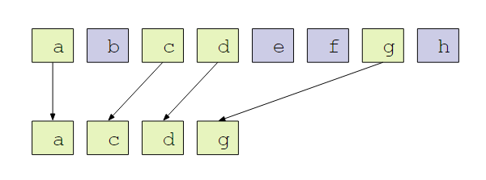

CUDA Stream Compaction
======================

**University of Pennsylvania, CIS 565: GPU Programming and Architecture, Project 2**

* Yalun Hu
* Tested on: Windows 10, i7-6700HQ CPU @ 2.60GHz 32GB, GTX 1070 8192MB (Personal computer)

# Stream Compaction

<p align="center">
  
</p>

Given an array of elements, create a new array with elements that meet a certain criteria(e.g. non null), preserving the order of the input elements.

# Features

## 1. CPU Scan & Stream Compaction

**scan**
compute the exclusive prefix sum using a for loop

**stream compaction**
* without scan function: use a for loop to find elements that is not zero.
* with scan function: map the input data array to a bool array, scan the map array to get an index array, scatter the input data to the output data using the index array.

The following figure shows how stream compaction works.

<p align="center">
  
</p>

## 2. Naive GPU Scan Algorithm (using shared memory)

**Exclusive scan:** each element j of the result is the sum of all elements up to but not including j in the input array.

**Inclusive scan:** all elements including j are summed.
An exclusive scan can be generated from an inclusive scan by shifting the resulting array right by one element and inserting the identity. Here I only implemented exclusive scan.

Following is the illustration of inclusive scan.

<p align="center">
  
</p>


## 3. Work-Efficient GPU Scan & Stream Compaction

The work-efficient scan algorithm consists of two phases: the reduce phase (also known as the up-sweep phase) and the down-sweep phase.
* In the **up-sweep** phase, we traverse the tree from leaves to root computing partial sums at internal nodes of the tree.

<p align="center">
  
</p>

* In the **down-sweep** phase, we traverse back down the tree from the root, using the partial sums from the reduce phase to build the scan in place on the array.  We start by inserting zero at the root of the tree, and on each step, each node at the current level passes its own value to its left child, and the sum of its value and the former value of its left child to its right child.

<p align="center">
  
</p>

The compact algorithm is the same as in cpu compaction.

## 4. Thrust's Implementation of GPU Scan

Use `thrust::exclusive_scan` to implement GPU scan.

# Performance Analysis

### Performance Plot: time with increasing array size

<p align="center">
  
</p>
<p align="center">
  
</p>

The above figures show that both naive and work-effiecient scan use less than 0.01ms, and the the running time of work-effiecient scan approaches 0ms. However, the thrust scan has the lowest performance.


I guess the thrust scan is much more slower because the built in function has a lot of extra operations, which may depend on video card driver, the hardware, operating system etc.

I think the performance bottleneck includes:
* Memory I/O: the naive scan reads iput data more times than the work efficient scan.
* Computation: the work-efficient scan has more computation, but its impact to running time is smaller than memory I/O.
So the bottleneck is different to each implementation.

### Output of test programm

```
****************
** SCAN TESTS **
****************
    [  49   3  36   2  49  27  45   0  13  11   8  23  19 ...  22   0 ]
==== cpu scan, power-of-two ====
   elapsed time: 0.001185ms    (std::chrono Measured)
    [   0  49  52  88  90 139 166 211 211 224 235 243 266 ... 6015 6037 ]
==== cpu scan, non-power-of-two ====
   elapsed time: 0.000395ms    (std::chrono Measured)
    [   0  49  52  88  90 139 166 211 211 224 235 243 266 ... 5961 5968 ]
    passed
==== naive scan, power-of-two ====
   elapsed time: 0.007168ms    (CUDA Measured)
    [   0  49  52  88  90 139 166 211 211 224 235 243 266 ... 6015 6037 ]
    passed
==== naive scan, non-power-of-two ====
   elapsed time: 0.005472ms    (CUDA Measured)
    [   0  49  52  88  90 139 166 211 211 224 235 243 266 ...   0   0 ]
    passed
==== work-efficient scan, power-of-two ====
   elapsed time: 0ms    (CUDA Measured)
    [   0  49  52  88  90 139 166 211 211 224 235 243 266 ... 6015 6037 ]
    passed
==== work-efficient scan, non-power-of-two ====
   elapsed time: 0ms    (CUDA Measured)
    [   0  49  52  88  90 139 166 211 211 224 235 243 266 ... 5961 5968 ]
    passed
==== thrust scan, power-of-two ====
   elapsed time: 15.4419ms    (CUDA Measured)
    [   0  49  52  88  90 139 166 211 211 224 235 243 266 ... 6015 6037 ]
    passed
==== thrust scan, non-power-of-two ====
   elapsed time: 0.015392ms    (CUDA Measured)
    [   0  49  52  88  90 139 166 211 211 224 235 243 266 ... 5961 5968 ]
    passed

*****************************
** STREAM COMPACTION TESTS **
*****************************
    [   0   1   1   1   1   0   3   3   1   3   2   3   0 ...   2   0 ]
==== cpu compact without scan, power-of-two ====
   elapsed time: 0.001185ms    (std::chrono Measured)
    [   1   1   1   1   3   3   1   3   2   3   2   3   1 ...   1   2 ]
    passed
==== cpu compact without scan, non-power-of-two ====
   elapsed time: 0.001185ms    (std::chrono Measured)
    [   1   1   1   1   3   3   1   3   2   3   2   3   1 ...   3   1 ]
    passed
==== cpu compact with scan ====
   elapsed time: 0.017383ms    (std::chrono Measured)
    [   1   1   1   1   3   3   1   3   2   3   2   3   1 ...   1   2 ]
    passed
==== work-efficient compact, power-of-two ====
   elapsed time: 0.03072ms    (CUDA Measured)
    [   1   1   1   1   3   3   1   3   2   3   2   3   1 ...   1   2 ]
    passed
==== work-efficient compact, non-power-of-two ====
   elapsed time: 0.021472ms    (CUDA Measured)
    [   1   1   1   1   3   3   1   3   2   3   2   3   1 ...   3   1 ]
    passed
```
