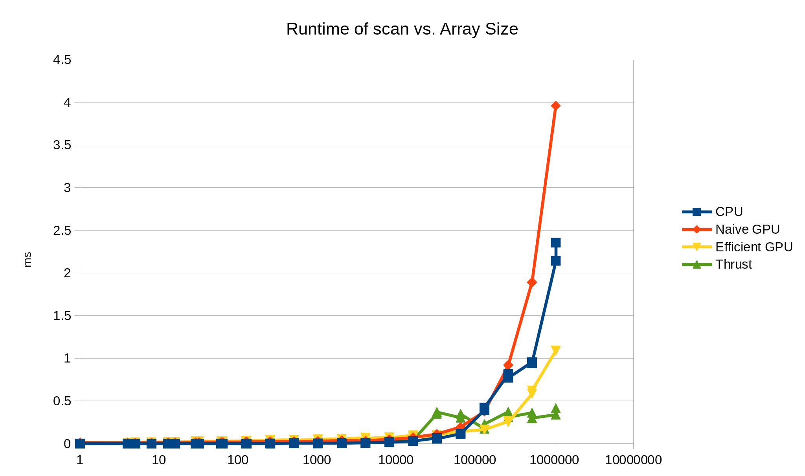

CUDA Stream Compaction
======================

**University of Pennsylvania, CIS 565: GPU Programming and Architecture, Project 2**

* Mauricio Mutai
* Tested on: Windows 10, i7-7700HQ @ 2.2280GHz 16GB, GTX 1050Ti 4GB (Personal Computer)

### Overview

#### Introduction

The main aim of this project was to implement a few simple, but crucial GPU algorithms, understand their performance and how to improve it. The algorithms implemented were: exclusive scan, stream compaction, and radix sort.

For the exclusive scan (hereafter referred to as simply "scan"), multiple different implementations were made. A serial CPU version was created to check for correctness and as a comparison point. Then, a "naive" GPU version and a more "work-efficient" GPU version were implemented. Finally, a version of the work-efficient implementation was modified to use shared memory.

Below is a full list of the features implemented in this project:

* Serial CPU scan
* Naive GPU scan
* Work-efficient GPU scan with global memory (handles arbitrary arrays large enough to fit in the GPU's global memory)
* Work-efficient GPU scan with shared memory (only handles array as large as those that can fit in a single block's worth of threads)
* Thrust GPU scan
* GPU stream compaction
* GPU radix sort

### Performance Analysis

#### Rough optimization of block size

Below are two graphs showing some measurements of the runtime of the naive and work-efficient GPU scans, taken at different block sizes (that is, how many threads at most would be allocated to each block). The measurements were made with an array of size 1024.


For the naive scan, the optimal block size appears to be 32, while for the work-efficient version, it is 16.

#### Comparison of GPU scans vs. CPU scans

Below is a graph showing the runtime of the CPU scan along with the naive, work-efficient with global memory, and Thrust GPU scans. The logarithmic x-axis shows the size of the array used for that measurement.



Looking at just this view, it is hard to analyze the graph. Below is a view of one half of the graph, where the x-axis only goes up to 10000:


Here, we can see that for relatively small arrays (size < 10000), the serial CPU algorithm is clearly superior. Even Thrust's optimized GPU implementation cannot outperform the CPU. Interestingly, the work-efficient GPU scan also performs worse than the naive version.

Regarding the CPU's superiority, we have to consider that the main benefit of the GPU implementations is that their parallel nature allow us to reduce a serial O(n) computation into one that is performed in something closer to O(log n) steps, since at each step, we process approximately half of the input we processed in the previous iteration. However, this incurs a significant overhead in terms of access to global memory and thread scheduling. It is likely that, for smaller arrays, this overhead is much too large and outweighs the benefit of the parallel algorithms.

Similarly, the work-efficient GPU scan has increased overhead compared to the naive version, since it performs two passes over the array ("sweeps") instead of just one. This probably causes it to be slower than the naive implementation.


On the other hand, for larger arrays (size >= 2^17), the Thrust and work-efficient GPU implementations start outperforming the CPU scan. The naive GPU scan, unfortunately, is never faster than the CPU scan. It is also noteworthy that the work-efficient GPU scan has comparable performance with the Thrust scan from sizes between 2^17 and 2^18.

For larger sizes, the parallel nature of the GPU algorithms allows them to scale better than the CPU scan, making them outperform it in spite of the overhead mentioned above. The lack of work-efficiency in the naive scan exaggerates the effect of this overhead, such that it still cannot truly benefit from the parallel algorithm.


### Output of test program

```
****************
** SCAN TESTS **
****************
    [   0   2   4   6   8  10  12  14  16  18  20  22  24 ... 2097148   0 ]
==== cpu scan, power-of-two ====
   elapsed time: 2.00278ms    (std::chrono Measured)
    [   0   0   2   6  12  20  30  42  56  72  90 110 132 ... -5242874 -3145726 ]
==== cpu scan, non-power-of-two ====
   elapsed time: 2.06076ms    (std::chrono Measured)
    [   0   0   2   6  12  20  30  42  56  72  90 110 132 ... -11534306 -9437164 ]
    passed
==== naive scan, power-of-two ====
   elapsed time: 3.72906ms    (CUDA Measured)
    passed
==== naive scan, non-power-of-two ====
   elapsed time: 3.71254ms    (CUDA Measured)
    passed
==== (Skipping efficient shared tests due to large array size... ====
==== work-efficient scan, power-of-two ====
   elapsed time: 1.13066ms    (CUDA Measured)
    passed
==== work-efficient scan, non-power-of-two ====
   elapsed time: 1.12355ms    (CUDA Measured)
    passed
==== thrust scan, power-of-two ====
   elapsed time: 0.434176ms    (CUDA Measured)
    [   0   0   2   6  12  20  30  42  56  72  90 110 132 ... -5242874 -3145726 ]
    passed
==== thrust scan, non-power-of-two ====
   elapsed time: 0.324608ms    (CUDA Measured)
    passed

*****************************
** STREAM COMPACTION TESTS **
*****************************
    [   3   0   3   3   2   1   0   1   3   0   1   3   1 ...   0   0 ]
==== cpu compact without scan, power-of-two ====
   elapsed time: 4.4078ms    (std::chrono Measured)
    [   3   3   3   2   1   1   3   1   3   1   2   2   1 ...   1   1 ]
    passed
==== cpu compact without scan, non-power-of-two ====
   elapsed time: 4.15727ms    (std::chrono Measured)
    [   3   3   3   2   1   1   3   1   3   1   2   2   1 ...   1   1 ]
    passed
==== cpu compact with scan ====
   elapsed time: 12.2661ms    (std::chrono Measured)
    [   3   3   3   2   1   1   3   1   3   1   2   2   1 ...   1   1 ]
    passed
==== work-efficient compact, power-of-two ====
   elapsed time: 1.6975ms    (CUDA Measured)
    passed
==== work-efficient compact, non-power-of-two ====
   elapsed time: 1.66893ms    (CUDA Measured)
    passed

****************
** SORT TESTS **
****************
    [  31 224 191 175 102  29  20 205 247 228 145  35 209 ...  32   0 ]
==== cpu std::sort, power-of-two ====
   elapsed time: 12.2661ms    (std::chrono Measured)
    [   0   0   0   0   0   0   0   0   0   0   0   0   0 ... 255 255 ]
==== gpu radix sort, power-of-two ====
   elapsed time: 14.8428ms    (CUDA Measured)
    [   0   0   0   0   0   0   0   0   0   0   0   0   0 ... 255 255 ]
    passed
==== cpu std::sort, non-power-of-two ====
   elapsed time: 12.2661ms    (std::chrono Measured)
    [   0   0   0   0   0   0   0   0   0   0   0   0   0 ... 255 255 ]
==== gpu radix sort, non-power-of-two ====
   elapsed time: 15.3363ms    (CUDA Measured)
    [   0   0   0   0   0   0   0   0   0   0   0   0   0 ... 255 255 ]
    passed
```
