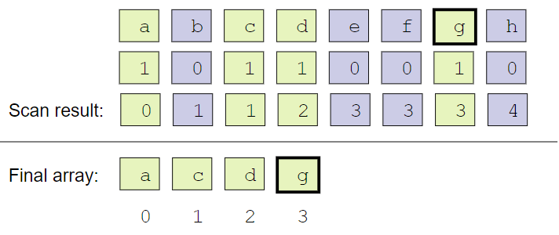

CUDA Stream Compaction
======================

**University of Pennsylvania, CIS 565: GPU Programming and Architecture, Project 2**

* Rudraksha D. Shah
* Tested on: Windows 10, i7-7700HQ @ 2.80GHz 16GB, GTX 1050 4096MB (Personal Computer)


## Overview
-------------------

__Scan:__ In scan we iterates through an input array and based on a given operator (which could be any mathematical operator) produce a new array as output where each value at a given index `i` in the output array is a result of performing the operator on every preceeding value. 
    
There are two types of scan:
-   Inclusive Scan: The operator is applied on every preceeding value and the value at the index `i` as well to produce the output.

-   Exclusive Scan: The operator is applied on every preceeding value excluding the value at the index `i` to produce the output.
    
I implemented the scan algorithm on the CPU and the GPU. The scan operator is `+` (addition) so we will be performing inclusive and exclusive sum.

-   CPU: The CPU implementation of the scan is straightforward the scan iteration is a simple for loop that goes through every element and keeps the accumulated sum of all the previous iterations in a variable adding it to each new element and placing it in the second array.

    The algorithm performs `N` additions and has a time complexity of `O(n)`, where N,n - No of elements in the array.

-   GPU Naive: The Naive GPU implentation is based on the scan algorithm presented by Hillis and Steele [1986](http://www.umiacs.umd.edu/~ramani/cmsc828e_gpusci/ScanTalk.pdf). The figure below shows the iteration steps for the algorythm. We iterate over each element and take the addition of the next element basd on the depth where with each depth we skip 2^depth values and add.

    The drawback of this method is that it performs `n*log(n)` addition operations as compared to `N` operations in case of the CPU implementation.

     

-   GPU Work-Efficient: This algorithm performs with the efficiency of the secquential algorithm on the CPU with only `N` addition operations. This algorithm is based on the one presented by Blelloch [1990](https://www.mimuw.edu.pl/~ps209291/kgkp/slides/scan.pdf). For this method we will create a psudo balanced tree structure inplace in the array we are performing the scan on. For an array of size `n` the number of levels will be `log(n)` and for each level `l` there will be `2^l` nodes. If we perform one addition per node we will perform a total of `n` additions making the complexity of this algorithm as `O(n)`.

    There are essentially two steps in this algorithm: 
    -   Up-Sweep or parallel reduction: During this step we start from the leaf nodes i.e. the original array and travel up the tree calculating the partial sums at each level. The root node contains the sum of all the elements of the array.

        

    -   Down-Sweep: During this step we start from the root node and replace it with `0`. For each level each node's current value is stored in the left child and the addition of it's value and the former left child's value is placed in the current node's right child. This produces an exclusive sum scan array.

        

-   Thrust: Thrust is a librray that poduces the scan output for any input array that is wrapped in the `thrust::Device_Vector` using the function `thrust::exclusive_scan(first, last, result)`.

__Scatter:__ This is the final process for string compaction. In the current implementation we want to remove the elements that are `0` from the input array. For this we produce a boolean index array where for each position we store either `0` or `1` based on the value at that position is non-zero or not. We perform scan on this boolean indexed array and use the scanned result array to determine the position/index of the non-zero elements to be placed in the new array.

 


#### Performance Analysis
----------------------------

For the performance analysis I have used a block size of 128 and logged the execution times for the scan with incrementing array sizes.

* Table:

    

* Chart:

    


- Analysis:

    From the performance data and the chart we can see that through all the implementtaions CPU implementation is the fastest. This is to be expected as the CPU implementation even though is synchronous and serial the operation is highly sequential which leads to very low cache misses in the RAM as well as the CPU is highly optimised for such sequential memory fuctions. 

    On the other hand the GPU Naive implementation performs `n*log(n)` more computations as compared to the CPU implementation and is expectantly slow compared to the CPU despite being massively parallel. Similarly for the GPU Work-Efficient implemetation, even though it performs the same number of additions as the CPU it is also slower than the CPU version.

    Bottle Neck: The primary bottle neck for the GPU implementation is global memory access. For each thread is relatively light for each thread we do a minimum of two memory calls to the global memory to fetch the two values to be added. The second bottle neck I think is due to the inefficient use of the GPU threads. For each subsequent level the number of threads working per wrap reduces. These inactive threads stay there doing nothing and utilizing the resources of the GPU. Thus the overhead of these threads also slows down the GPU implementation.

    Unexpected Result: Wait... in the GPU implementation the efficient implementation should be faster as compared to the inefficient implementation!!! But for my analysis I find that the GPU Work-Efficient implementation is nearly as fast as the inefficient implementation and even slower as the number of elements in the array increases. This is a very confusing result to me that i am not able to explain. I tried debugging my code and going through it to make sure I was not doning anything wrong but I could not find anything. If anyone can explain a probable reason to me I would love to hear it!

    Thrust Implementation: Thrust performed more or less consistantly throughout the increasing array sizes. Over the final array size values `2^20 - 2^22` the speed reduces as expected. The implementation overall was the slpwest of them all for all the array sizes which is rather expected as the library would be doing lot many things that may not be necessary for the scan. A proper analysis would be possible with a more clear understanding of the base code.

``` 

****************
** SCAN TESTS **
****************
    [  30  31  46  44  34  30  14  45  47  29  37   0  38 ...  48   0 ]
==== cpu scan, power-of-two ====
   elapsed time: 1.67895ms    (std::chrono Measured)
    [   0  30  61 107 151 185 215 229 274 321 350 387 387 ... 25684633 25684681 ]
==== cpu scan, non-power-of-two ====
   elapsed time: 1.74022ms    (std::chrono Measured)
    [   0  30  61 107 151 185 215 229 274 321 350 387 387 ... 25684565 25684600 ]
    passed
==== naive scan, power-of-two ====
   elapsed time: 2.16678ms    (CUDA Measured)
    [   0  30  61 107 151 185 215 229 274 321 350 387 387 ... 25684633 25684681 ]
    passed
==== naive scan, non-power-of-two ====
   elapsed time: 2.16525ms    (CUDA Measured)
    [   0  30  61 107 151 185 215 229 274 321 350 387 387 ...   0   0 ]
    passed
==== work-efficient scan, power-of-two ====
   elapsed time: 3.21434ms    (CUDA Measured)
    [   0  30  61 107 151 185 215 229 274 321 350 387 387 ... 25684633 25684681 ]
    passed
==== work-efficient scan, non-power-of-two ====
   elapsed time: 3.2415ms    (CUDA Measured)
    [   0  30  61 107 151 185 215 229 274 321 350 387 387 ... 25684565 25684600 ]
    passed
==== thrust scan, power-of-two ====
   elapsed time: 4.51072ms    (CUDA Measured)
    [   0  30  61 107 151 185 215 229 274 321 350 387 387 ... 25684633 25684681 ]
    passed
==== thrust scan, non-power-of-two ====
   elapsed time: 0.342016ms    (CUDA Measured)
    [   0  30  61 107 151 185 215 229 274 321 350 387 387 ... 25684565 25684600 ]
    passed

*****************************
** STREAM COMPACTION TESTS **
*****************************
    [   1   3   2   3   1   2   0   2   2   3   3   0   3 ...   3   0 ]
==== cpu compact without scan, power-of-two ====
   elapsed time: 2.93525ms    (std::chrono Measured)
    [   1   3   2   3   1   2   2   2   3   3   3   3   1 ...   2   3 ]
    passed
==== cpu compact without scan, non-power-of-two ====
   elapsed time: 2.90024ms    (std::chrono Measured)
    [   1   3   2   3   1   2   2   2   3   3   3   3   1 ...   3   3 ]
    passed
==== cpu compact with scan ====
   elapsed time: 10.3574ms    (std::chrono Measured)
    [   1   3   2   3   1   2   2   2   3   3   3   3   1 ...   2   3 ]
    passed
==== work-efficient compact, power-of-two ====
   elapsed time: 3.39251ms    (CUDA Measured)
    [   1   3   2   3   1   2   2   2   3   3   3   3   1 ...   2   3 ]
    passed
==== work-efficient compact, non-power-of-two ====
   elapsed time: 3.42634ms    (CUDA Measured)
    [   1   3   2   3   1   2   2   2   3   3   3   3   1 ...   3   3 ]
    passed

``` 


