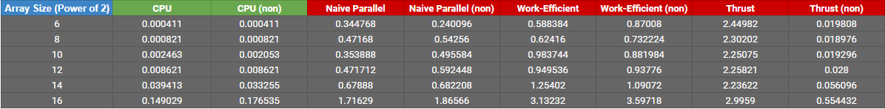

CUDA Stream Compaction
======================

**University of Pennsylvania, CIS 565: GPU Programming and Architecture, Project 2**

* Name: Meghana Seshadri
* Tested on: Windows 10, i7-4870HQ @ 2.50GHz 16GB, GeForce GT 750M 2048MB (personal computer)


## Project Overview

The goal of this project was to get an introduction to the GPU stream compaction in CUDA. This algorithm is often used to quickly process large sets of data according to certain conditions - hence very useful in parallel programming. In this project, the stream compaction will remove zero's from an array of int's. 


The following four versions of stream compaction were implemented:

* CPU algorithm
* Naive parallel algorithm 
* Work-efficient algorithm 
* Thrust-based algorithm


The stream compaction algorithm breaks down into a scan function and a compat function. The scan function computes an exclusive prefix sum. The compact function maps an input array to an array of zero's and one's, scans it, and then uses scatter to produce the output. 

The following descriptions dive a bit deeper into the different approaches:

### CPU
* `n - 1` adds for an array of length `n` --> O(n) number of adds


### Naive Parallel
* log2(n) passes on n elements --> O(n log2 (n)) numer of adds


### Work-Efficient
* This algorithm organizes the data into a balanced binary tree
* The occurs in two phases: 
	- Up-sweep = implementing parallel reduction 
	- Down-sweep = traversing back down the tree using partial sums to build the scan in place
* Up Sweep = O(n - 1) adds
* Down Sweep = O(n - 1) adds, O(n - 1) swaps


### Thrust-Based
* The Thrust library has a function "Thrust::exclusive_scan()" that we use to compare the above algorithms to.


## Performance Analysis 

### Block Comparison

Below is a graph that shows which would be the best block size to test on. The times below are for the work-efficient algorithm, comparing 64 elements and 65536 elements.


Based on the chart above, block size 128 on average, seems to be the most efficient. The rest of the analysis below will be using that block size.


### Algorithm Comparison

Below are charts showing tests across all 4 algorithms, both testing with power-of-two sized arrays and non-power-of-two sized arrays.





First things first - why is the GPU implementation so much slower than the Naive Parallel and CPU versions? Isn't the GPU supposed to be faster? 

Take a look at the example diagram of a down sweep process below. 


After iteration 0, only 4 out of the 8 elements are being computed and written to the output array. After iteration 1, only two are being computed and written, and after iteration 2, only one final answer is being outputted. 

Within each iteration, the same number of blocks are being launched. Essentially, every index is being allocated a block of memory (aka 32 threads). However, only one thread in 4 blocks for iteration 0, 2 blocks for iteration 1, and 1 block for iteration 2 are actually being used. This means that at least 4 blocks are not being used at all per iteration, and most of the threads per block are not even doing any work. So, really, the actual power of the GPU isn't being used at all. 

In order to optimize the code, it would be better to try and allocate only the necessary blocks needed per iteration, and to try and push computation to be done on earlier threads to achieve early termination of the block. In this example, this means that at iteration 0: 

* Having the computation and write at index 1 use thread #0 instead of thread #1
* Having the computation and write at index 3 use thread #1 instead of thread #3
* Having the computation and write at index 5 use thread #2 instead of thread #5
* Having the computation and write at index 7 use thread #3 instead of thread #7

This way you only use the number of threads required and push them to be the first couple of ones so that the block can retire early and be used elsewhere. 


Despite this explanation, it can be seen that Thrust implementation, up until size power of 14, becomes more efficient with increasing array size. It's interesting to note that there's a drastic increase in computation time across all algorithms with array size power of 14 and above.


### Scan and Stream Compaction Test Results

The following tests were run on 128 elements at a block size of 128.

```
****************
** SCAN TESTS **
****************
    [  40  12   3  21  27   2  32  20   1   4  41  34  15 ...  34   0 ]
==== cpu scan, power-of-two ====
   elapsed time: 0.000821ms    (std::chrono Measured)
    [   0  40  52  55  76 103 105 137 157 158 162 203 237 ... 6112 6146 ]
==== cpu scan, non-power-of-two ====
   elapsed time: 0.000821ms    (std::chrono Measured)
    [   0  40  52  55  76 103 105 137 157 158 162 203 237 ... 6063 6064 ]
    passed
==== naive scan, power-of-two ====
   elapsed time: 0.44064ms    (CUDA Measured)
    [   0  40  52  55  76 103 105 137 157 158 162 203 237 ... 6112 6146 ]
    passed
==== naive scan, non-power-of-two ====
   elapsed time: 0.433024ms    (CUDA Measured)
    [   0  40  52  55  76 103 105 137 157 158 162 203 237 ... 6063 6064 ]
    passed
==== work-efficient scan, power-of-two ====
   elapsed time: 0.781184ms    (CUDA Measured)
    [   0  40  52  55  76 103 105 137 157 158 162 203 237 ... 6112 6146 ]
    passed
==== work-efficient scan, non-power-of-two ====
   elapsed time: 1.20867ms    (CUDA Measured)
    [   0  40  52  55  76 103 105 137 157 158 162 203 237 ... 6099 6099 ]
    [   0  40  52  55  76 103 105 137 157 158 162 203 237 ... 6063 6064 ]
    passed
==== thrust scan, power-of-two ====
   elapsed time: 2.34442ms    (CUDA Measured)
    [   0  40  52  55  76 103 105 137 157 158 162 203 237 ... 6112 6146 ]
    passed
==== thrust scan, non-power-of-two ====
   elapsed time: 0.019392ms    (CUDA Measured)
    [   0  40  52  55  76 103 105 137 157 158 162 203 237 ... 6063 6064 ]
    passed

*****************************
** STREAM COMPACTION TESTS **
*****************************
    [   2   0   1   3   1   0   0   2   1   0   1   0   1 ...   0   0 ]
==== cpu compact without scan, power-of-two ====
   elapsed time: 0.000821ms    (std::chrono Measured)
    [   2   1   3   1   2   1   1   1   3   3   3   3   3 ...   1   1 ]
    passed
==== cpu compact without scan, non-power-of-two ====
   elapsed time: 0.000821ms    (std::chrono Measured)
    [   2   1   3   1   2   1   1   1   3   3   3   3   3 ...   3   1 ]
    passed
==== cpu compact with scan ====
   elapsed time: 0.962322ms    (std::chrono Measured)
    [   2   1   3   1   2   1   1   1   3   3   3   3   3 ...   1   1 ]
    passed
==== work-efficient compact, power-of-two ====
   elapsed time: 2.22262ms    (CUDA Measured)
    [   2   1   3   1   2   1   1   1   3   3   3   3   3 ...   1   1 ]
    passed
==== work-efficient compact, non-power-of-two ====
   elapsed time: 2.10656ms    (CUDA Measured)
    [   2   1   3   1   2   1   1   1   3   3   3   3   3 ...   3   1 ]
    passed
Press any key to continue . . .
```