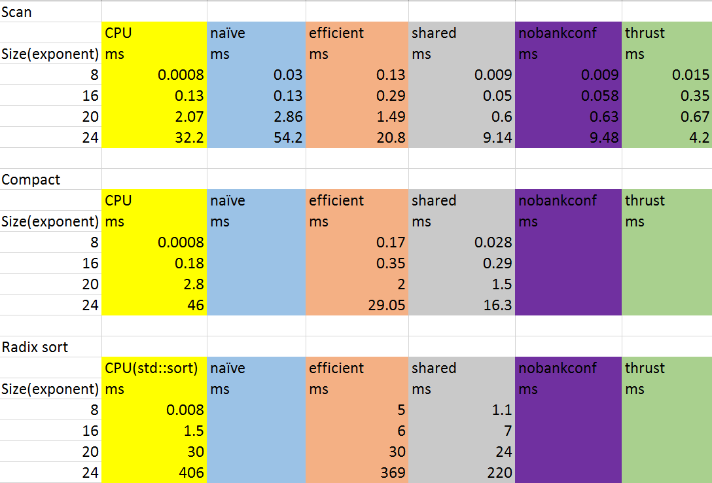
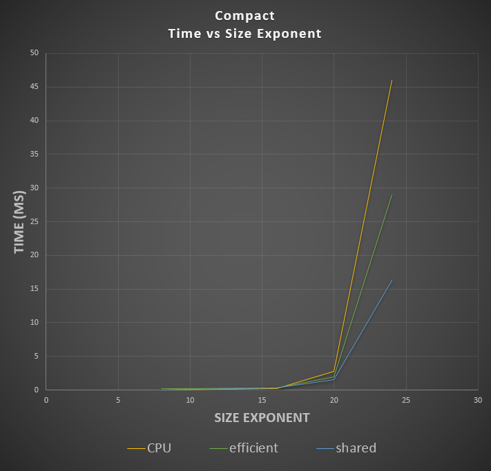

**University of Pennsylvania, CIS 565: GPU Programming and Architecture,
Project 2 - Stream Compaction**

* Josh Lawrence
* Tested on: Windows 10, i7-6700HQ @ 2.6GHz 8GB, GTX 960M 2GB  Personal

**CMakeLists.txt Additions**<br />
radix.h<br />
radix.cu<br />
sharedandbank.h<br />
sharedandbank.cu<br />

**Overview**<br />
Overiew of the prefix scan, compaction, radix sort algorithms and their applications:
https://developer.nvidia.com/gpugems/GPUGems3/gpugems3_ch39.html

**Highlights**<br />
Across all tests (scan, compact, radix), the CPU implementation beats out the GPU implementations for small data sets, as expected due to the host to device data transfer required for GPU implementations. Across all tests, data sets of size 65536 (or 2^16) seems to be when the GPU implementation perf matches that of the CPU, and after this point the perf gap is severe: 3.5x for radix sort, 5.3x for compact, and 6x for scan. The key to the "Efficient" scan implentation was to make sure you were only launching as many blocks as were required for the depth passes in both the up and down sweeps as well as making sure threads that were running were consecutive. 
<br />
The last few images are of the NSight debugger for the thrust kernel (its kernel info and its timeline). Looking at the timeline I was suprised to see how little of the time is spent actually doing compute work (the rest is memory related). Also, judging from thrust's kernel launch info, it is using shared memory and calling itself more than once. It is likely an implementation of the optimizations mentioned in the GPU Gems 3 Ch. 39 article linked in the Overview section. Recursive calls are required for that implementation so it makes sense that it is calling its functions more than once. 

**Data**<br />


**Inclusive Scan**<br />


**Compaction**<br />


**Radix Sort vs std::sort**<br />


**Thrust Kernel Info**<br />


**Thrust Timeline**<br />


**Efficient Timeline**<br />


**GPU Device Properties**<br />
https://devblogs.nvidia.com/parallelforall/5-things-you-should-know-about-new-maxwell-gpu-architecture/<br />
cuda cores 640<br />
mem bandwidth 86.4 GB/s<br />
L2 cache size 2MB<br />
number of multiprocessor 5<br />
max blocks per multiprocessor 32<br />
total shared mem per block 49152 bytes<br />
total shared mem per MP 65536 bytes<br />
total regs per block and MP 65536<br />
max threads per block 1024<br />
max threads per mp 2048<br />
total const memory 65536<br />
max reg per thread 255<br />
max concurrent warps 64<br />
total global mem 2G<br />
<br />
max dims for block 1024 1024 64<br />
max dims for a grid 2,147,483,647 65536 65536<br />
clock rate 1,097,5000<br />
texture alignment 512<br />
concurrent copy and execution yes<br />
major.minor 5.0<br />

```[  48  27   7  35  22   1  46  38  31  23  36  14  10 ...  10   0 ]
```SIZE: 16777216
```
```*****************************
```**** BEGIN RADIX TESTS ******
```*****************************
```==== std::sort, power-of-two(full array) ====
```   elapsed time: 1252.06ms    (std::chrono Measured)
```    [   0   0   0   0   0   0   0   0   0   0   0   0   0 ...  49  49 ]
```==== std::sort, non-power-of-two ====
```   elapsed time: 1228.38ms    (std::chrono Measured)
```    [   0   0   0   0   0   0   0   0   0   0   0   0   0 ...  49  49 ]
```==== CPU radix sort, power-of-two ====
```   elapsed time: 2722.52ms    (std::chrono Measured)
```    [   0   0   0   0   0   0   0   0   0   0   0   0   0 ...  49  49 ]
```    passed
```==== CPU radix sort, non power-of-two ====
```   elapsed time: 2313.88ms    (std::chrono Measured)
```    [   0   0   0   0   0   0   0   0   0   0   0   0   0 ...  49  49 ]
```    passed
```==== GPU radix sort, power-of-two ====
```   elapsed time: 380.855ms    (CUDA Measured)
```    [   0   0   0   0   0   0   0   0   0   0   0   0   0 ...  49  49 ]
```    passed
```==== GPU radix sort, non power-of-two ====
```   elapsed time: 367.632ms    (CUDA Measured)
```    [   0   0   0   0   0   0   0   0   0   0   0   0   0 ...  49  49 ]
```    passed
```****************
```** SCAN TESTS **
```****************
```==== cpu scan, power-of-two ====
```   elapsed time: 82.2523ms    (std::chrono Measured)
```    [   0  48  75  82 117 139 140 186 224 255 278 314 328 ... 410943203 410943213 ]
```==== cpu scan, non-power-of-two ====
```   elapsed time: 83.7772ms    (std::chrono Measured)
```    [   0  48  75  82 117 139 140 186 224 255 278 314 328 ... 410943129 410943167 ]
```    passed
```==== naive scan, power-of-two ====
```   elapsed time: 54.4172ms    (CUDA Measured)
```    [   0  48  75  82 117 139 140 186 224 255 278 314 328 ... 410943203 410943213 ]
```    passed
```==== naive scan, non-power-of-two ====
```   elapsed time: 54.393ms    (CUDA Measured)
```    [   0  48  75  82 117 139 140 186 224 255 278 314 328 ...   0   0 ]
```    passed
```==== work-efficient scan, power-of-two ====
```   elapsed time: 20.877ms    (CUDA Measured)
```    [   0  48  75  82 117 139 140 186 224 255 278 314 328 ... 410943203 410943213 ]
```    passed
```==== work-efficient scan, non-power-of-two ====
```   elapsed time: 20.83ms    (CUDA Measured)
```    [   0  48  75  82 117 139 140 186 224 255 278 314 328 ... 410943129 410943167 ]
```    passed
```==== thrust scan, power-of-two ====
```   elapsed time: 4.25725ms    (CUDA Measured)
```    [   0  48  75  82 117 139 140 186 224 255 278 314 328 ... 410943203 410943213 ]
```    passed
```==== thrust scan, non-power-of-two ====
```   elapsed time: 4.14429ms    (CUDA Measured)
```    [   0  48  75  82 117 139 140 186 224 255 278 314 328 ... 410943129 410943167 ]
```    passed
```
```*****************************
```** STREAM COMPACTION TESTS **
```*****************************
```    [   0   3   0   0   0   1   0   0   0   2   3   1   3 ...   0   0 ]
```==== cpu compact without scan, power-of-two ====
```   elapsed time: 123.166ms    (std::chrono Measured)
```    [   3   1   2   3   1   3   2   3   2   2   2   1   2 ...   2   2 ]
```    passed
```==== cpu compact without scan, non-power-of-two ====
```   elapsed time: 121.839ms    (std::chrono Measured)
```    [   3   1   2   3   1   3   2   3   2   2   2   1   2 ...   1   2 ]
```    passed
```==== cpu compact with scan ====
```   elapsed time: 471.391ms    (std::chrono Measured)
```    [   3   1   2   3   1   3   2   3   2   2   2   1   2 ...   2   2 ]
```    passed
```==== work-efficient compact, power-of-two ====
```   elapsed time: 29.8227ms    (CUDA Measured)
```    [   3   1   2   3   1   3   2   3   2   2   2   1   2 ...   2   2 ]
```    passed
```==== work-efficient compact, non-power-of-two ====
```   elapsed time: 29.8634ms    (CUDA Measured)
```    [   3   1   2   3   1   3   2   3   2   2   2   1   2 ...   1   2 ]
```    passed
```Press any key to continue . . .


