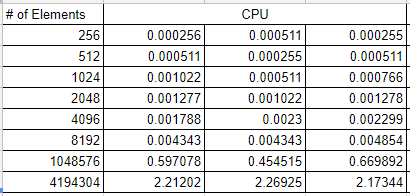
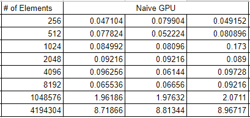
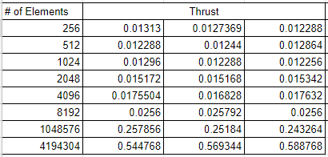
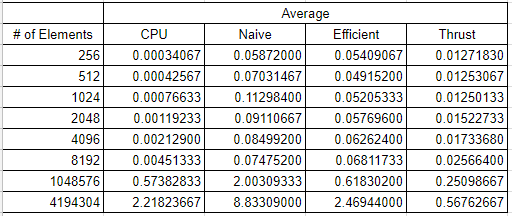

CUDA Stream Compaction
======================

**University of Pennsylvania, CIS 565: GPU Programming and Architecture, Project 2**

* Charles Wang
* Tested on: Windows 10, i7-6700K @ 4.00GHz 16GB, GTX 1060 6GB (Personal Computer)

**Project Overview and Goals**

The goal of this project was to learn, implement, and compare various algorithms for Stream Compaction. This includes:
* CPU (serial) implementations with and without Scan functions
* GPU (parallel) implementation with Naive Scan Algorithm
* GPU (parallel) implementation wtih Work Efficient Scan Algorithm

First, let's quickly go over the implementational details of each algorithm:

Scan:
A scan of an input array is an output array is such that each array indice's element contains the sum of all previous indicie's elements.

Stream Compaction:
Performing Stream Compaction on an input array filters out all array elements that do not fit a given criteria. In our case, all 0's get filtered out.

CPU Inclusive/Exclusive Scan:

This one is simple:\
For an inclusive scan: \
Start a sum at 0, and for each array element, add the value to the sum and enter the new sum into the same index in the output array. \
For an exclusive scan: \
Shift every value from the inclusive scan to the right and fill the first element with 0 (or the appropriate identity value).

CPU Stream Compaction:

Keep a counter of how many elements are filtered into the output array starting with 0. \
Step through the input array:\
If the element meets the criteria, add it to the output array as the "count"th index, and increment the counter.
If the element doesn't meet the criteria, skip it.

GPU Naive Scan Algorithm:

This algorithm requires an extra buffer to avoid overriding data needed for other threads in the same iteration. This algorithm requires log(n) iterations.\
Every iteration, every element in array index greater than or equal to 2^d where d is the iteration depth, the new element at array index is computed by adding the element in the same index and the index 2^d indices before it.

A helpful diagram illustrating the algorithm:

GPU Work Efficient Scan Algorithm:

The Work Efficient Scan can be performed in place on the input array because the array element a thread is writing to will never be accessed by another thread in the same iteration.\
There are two phases to a Work Efficient Scan Algorithm: the Upsweep, and the Downsweep.

During the upsweep, array elements at intervals 2^(d+1) (say, index k) are computed as arr[k] + arr[k - 2^d].

Before the downsweep, (n-1)th element is 0'd\
For the downsweep, instead of increasing the depth level from 0  to log(n) - 1, decrement the depth from log(n) - 1 to 0; (reverse the order of the depth in the diagram). For each array elements at intervals 2^(d+1) (say, index k):
arr[k - 2^d] = arr[k] and arr[k] = arr[k] + arr[k - 2^d].

GPU Stream Compaction:

We can use the scan algorithm as a part of our stream compaction algorithm (this can also be done on the cpu but, it's much more interesting in parallel).

First, create a boolean array the same size as the input array. For each element that meets the stream compaction criteria, set the corresponding boolean array element to 1, and set 0 for all those that do not meet the critera.

Then, perform a scan on the boolean array and store that result in a separate array. 

Finally, for each array element that meets the stream compaction criteria (check the boolean array), look up the value that corresponds in the scan result array and store the element in the output array spot from the scan result array.

The results section of this write-up will compare the performance of the different Scan algorithms.

**Results**
 
 Three trials were recorded for each algorithm.
 My GPU fails to run with array sizes over 2^22 (4194304), so I calculated a couple measurements to test the greatest range possible.

 All trials are ran with block size of 128.

If we average the three trials from each implementation, we get the graph below:

This section will compare the CPU Scan implementation to the Naive GPU implementation, the Efficient GPU implementation, and the Thrust implementation.

First, let's look at the plot up to 2^10 for a tighter fit.

If we plot the four implementations against each other, we don't get much information as to how each function grows.

The growth in CPU runtime is still hard to see at this graph scale.

If we plot just the CPU implementation's data, we can understand that the runtime increases fairly dramatically (relative to the overall scale) when the number of elements increases.

If we want to predict how the implementations grow as the array size approaches infinity (given that GPU memory constraints are not an issue), we can plot the 2^20 and 2^22 data for a (somewhat misleading) graph:

**Conclusion and Evaluation**

My CPU implementation ended up being faster than both GPU algorithms I implemented in this project. \
It seems that there is a huge bottleneck in global memory access.\
Though the Naive and Work Efficient implementations have fairly similar overall runtimes for array sizes under 10,0000, it is clear that the Work Efficient performs better for large array sizes.

Overall, I'm not terribly surprised by the results of this project because there are very few low-cost arithmetic operations. A bulk of the latency comes from memory access.

Optimizations (minor):
* For GPU implementations, I made sure to only call the necessary number of threads. Checking that operations are done on the correct array indicies (by the proper 2^d offset) is done implicitly by calling only the number of threads that will have array index values written to and calculating the proper index within the kernel

Potential Future Optimizations:
* Using Shared Memory instead of global memory would allow for quicker array access (that has to happen multiple times per thread). The main drawback would be that we'd be restricted by the number of threads available on a block. However, arrays can be split up and scanned separately and later combined for a total scan. 

The result of my output dialogue looks like this:

(note: to run stream compaction with scan, make sure that only one of the two functions called timer.start())
