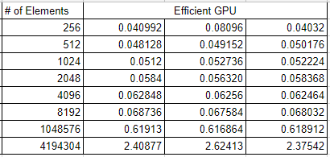
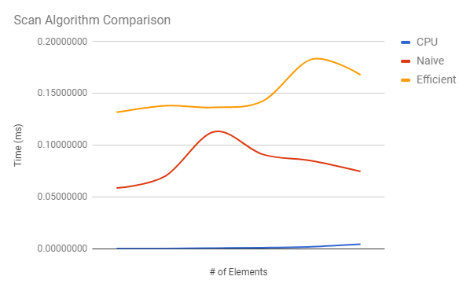
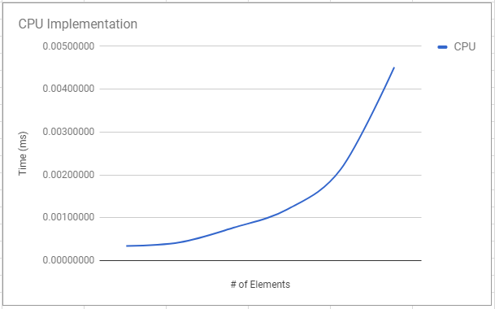

CUDA Stream Compaction
======================

**University of Pennsylvania, CIS 565: GPU Programming and Architecture, Project 2**

* Charles Wang
* Tested on: Windows 10, i7-6700K @ 4.00GHz 16GB, GTX 1060 6GB (Personal Computer)

**Project Overview and Goals**

The goal of this project was to learn, implement, and compare various algorithms for Stream Compaction. This includes:
* CPU (serial) implementations with and without Scan functions
* GPU (parallel) implementation with Naive Scan Algorithm
* GPU (parallel) implementation wtih Work Efficient Scan Algorithm

The results section of this write-up will compare the performance of the different Scan algorithms.

**Results**
 
 Three trials were recorded for each algorithm.

If we average the three trials from each implementation, we get the graph below:

This section will compare the CPU Scan implementation to the Naive GPU implementation, the Efficient GPU implementation, and the Thrust implementation.

If we plot the four implementations against each other, we don't get much information as to how each function grows.

Removing the Thrust data points from the graph allows a clearer picture of how each implementation grows as the number of array elements increases.

The growth in CPU runtime is still hard to see at this graph scale.

If we plot just the CPU implementation's data, we can understand that the runtime increases fairly dramatically (relative to the overall scale) when the number of elements increases.

**Conclusion and Evaluation**

