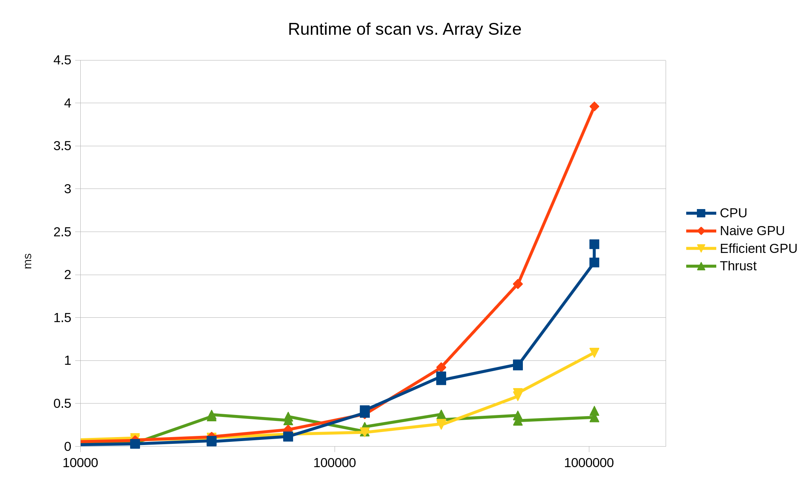

CUDA Stream Compaction
======================

**University of Pennsylvania, CIS 565: GPU Programming and Architecture, Project 2**

* Mauricio Mutai
* Tested on: Windows 10, i7-7700HQ @ 2.2280GHz 16GB, GTX 1050Ti 4GB (Personal Computer)

### Overview

#### Introduction

The main aim of this project was to implement a few simple, but crucial GPU algorithms, understand their performance and how to improve it. The algorithms implemented were: exclusive scan, stream compaction, and radix sort.

For the exclusive scan (hereafter referred to as simply "scan"), multiple different implementations were made. A serial CPU version was created to check for correctness and as a comparison point. Then, a "naive" GPU version and a more "work-efficient" GPU version were implemented. Finally, a version of the work-efficient implementation was modified to use shared memory.

Below is a full list of the features implemented in this project:

* Serial CPU scan
* Naive GPU scan
* Work-efficient GPU scan with global memory (handles arbitrary arrays large enough to fit in the GPU's global memory)
* Work-efficient GPU scan with shared memory (only handles array as large as those that can fit in a single block's worth of threads)
* Thrust GPU scan
* GPU stream compaction
* GPU radix sort

### Performance Analysis

#### Rough optimization of block size

Below are two graphs showing some measurements of the runtime of the naive and work-efficient GPU scans, taken at different block sizes (that is, how many threads at most would be allocated to each block). The measurements were made with an array of size 1024.


For the naive scan, the optimal block size appears to be 32, while for the work-efficient version, it is 16.

#### Comparison of GPU scans vs. CPU scans

Below is a graph showing the runtime of the CPU scan along with the naive, work-efficient with global memory, and Thrust GPU scans. The logarithmic x-axis shows the size of the array used for that measurement.


Looking at just this view, it is hard to analyze the graph. Below is a view of one half of the graph, where the x-axis only goes up to 10000:


Here, we can see that for relatively small arrays (size < 10000), the serial CPU algorithm is clearly superior. Even Thrust's optimized GPU implementation cannot outperform the CPU. Interestingly, the work-efficient GPU scan also performs worse than the naive version.

Regarding the CPU's superiority, we have to consider that the main benefit of the GPU implementations is that their parallel nature allow us to reduce a serial O(n) computation into one that is performed in something closer to O(log n) steps, since at each step, we process approximately half of the input we processed in the previous iteration. However, this incurs a significant overhead in terms of access to global memory and thread scheduling. It is likely that, for smaller arrays, this overhead is much too large and outweighs the benefit of the parallel algorithms.

Similarly, the work-efficient GPU scan has increased overhead compared to the naive version, since it performs two passes over the array ("sweeps") instead of just one. This probably causes it to be slower than the naive implementation.



On the other hand, for larger arrays (size >= 2^17), the Thrust and work-efficient GPU implementations start outperforming the CPU scan. The naive GPU scan, unfortunately, is never faster than the CPU scan. It is also noteworthy that the work-efficient GPU scan has comparable performance with the Thrust scan from sizes between 2^17 and 2^18.

For larger sizes, the parallel nature of the GPU algorithms allows them to scale better than the CPU scan, making them outperform it in spite of the overhead mentioned above. The lack of work-efficiency in the naive scan exaggerates the effect of this overhead, such that it still cannot truly benefit from the parallel algorithm.

#### Thrust implementation analysis

Below is an image taken from the Nsight timeline after running only the Thrust scan, and below it is a zoomed-in view:


This was run with an array size of 2^20, which explains the 4 MB copy from the host and, later, back to the host.

It's not very clear how memory is being accessed. From looking at the GPU vs. CPU graphs above, we can see that the Thrust has a noticeable drop in performance in the are around the array sizes of 2^16 and 2^18. Perhaps this is due to an algorithm involving shared memory that can no longer function optimally for such large arrays, requiring, for example, more blocks to be run and their results to be combined later.

#### Possible bottlenecks

There is good evidence here that the main bottleneck for the GPU scans is memory access. We know global memory access is very slow, but this cost can be amortized by having additional warps in flight. As the array size grows, we can hide more and more of the memory access latency, until the GPU implementations (except for Naive) begin outperforming the CPU.

#### Shared memory

Below is a graph comparing the work-efficient GPU scan with shared memory versus the version with global memory and Thrust's scan.


We can clearly see that using the much faster on-chip shared memory greatly improves performance. In fact, it is likely that due to device-specific optimizations, such as using the number of banks to avoid bank conflicts, our implementation of scan is even faster than Thrust's.

Unfortunately, this specific implementation is limited in that it only correctly runs if executed in a single block. It is definitely possible to expand this to use multiple blocks ("scan of scans"), though.

### Optimization to improve work-efficient GPU approach ("Part 5")

I noticed I could invoke my up-sweep and down-sweep kernels with a different number of blocks and threads per block at each iteration, since each iteration operates on a different number of elements in the array. This, together with a calculation of a "nodeIdx" in those kernels, allow me to invoke fewer kernels when the algorithm allows for it (i.e. when the sweeps are closer to the root).

### Radix Sort ("Part 6")

I implemented a GPU radix sort using my work-efficient GPU scan with global memory. It may be invoked with:

`
StreamCompaction::RadixSort::radixSort(size, out, in, ascending);
`

The radix sort is tested in the main test program by comparing its output with std::sort. Below is a graph comparing the runtimes of the GPU radix sort and the CPU std::sort:


We can see the CPU sort starts out faster, but the parallel nature of the GPU sort allows it to scale better and peform better for larger arrays. Again, this is likely due to the overhead of launching multiple threads and accessing global memory slowing down the GPU approach initially, but as the arrays grow, more warps can be launched in order to amortize those costs.

It should be noted the elements in the array were all <= 256. This is perhaps an advantage for the radix sort, as it thrives when it has to compare keys that that require fewer bits to be represented in memory.

### GPU scan with shared memory ("Part 7")

The performance of the work-efficient GPU scan with shared memory has been analyzed above. It may be invoked as follows:

`
StreamCompaction::EfficientShared::scan(size, out, in);
`

In my GPU, it can only handle arrays of size up to 2^11.

### Output of test program

The output below was generated with an array size of 2^20. It includes tests for the **GPU radix sort**, but not the work-efficient with shared memory GPU scan, due to limited memory.

```
****************
** SCAN TESTS **
****************
    [  32  17  17  36   3   8   3  30  39  24  10  45  22 ...   0   0 ]
==== cpu scan, power-of-two ====
   elapsed time: 2.52317ms    (std::chrono Measured)
    [   0  32  49  66 102 105 113 116 146 185 209 219 264 ... 25664601 25664601 ]
==== cpu scan, non-power-of-two ====
   elapsed time: 2.00643ms    (std::chrono Measured)
    [   0  32  49  66 102 105 113 116 146 185 209 219 264 ... 25664563 25664573 ]
    passed
==== naive scan, power-of-two ====
   elapsed time: 3.7417ms    (CUDA Measured)
    passed
==== naive scan, non-power-of-two ====
   elapsed time: 3.7159ms    (CUDA Measured)
    passed
==== (Skipping efficient shared tests due to large array size... ====
==== work-efficient scan, power-of-two ====
   elapsed time: 1.09261ms    (CUDA Measured)
    passed
==== work-efficient scan, non-power-of-two ====
   elapsed time: 1.08237ms    (CUDA Measured)
    passed
==== thrust scan, power-of-two ====
   elapsed time: 0.388096ms    (CUDA Measured)
    [   0  32  49  66 102 105 113 116 146 185 209 219 264 ... 25664601 25664601 ]
    passed
==== thrust scan, non-power-of-two ====
   elapsed time: 0.384ms    (CUDA Measured)
    passed

*****************************
** STREAM COMPACTION TESTS **
*****************************
    [   0   1   3   2   1   2   3   0   1   2   2   1   2 ...   2   0 ]
==== cpu compact without scan, power-of-two ====
   elapsed time: 3.63104ms    (std::chrono Measured)
    [   1   3   2   1   2   3   1   2   2   1   2   2   3 ...   2   2 ]
    passed
==== cpu compact without scan, non-power-of-two ====
   elapsed time: 3.01912ms    (std::chrono Measured)
    [   1   3   2   1   2   3   1   2   2   1   2   2   3 ...   3   2 ]
    passed
==== cpu compact with scan ====
   elapsed time: 12.9889ms    (std::chrono Measured)
    [   1   3   2   1   2   3   1   2   2   1   2   2   3 ...   2   2 ]
    passed
==== work-efficient compact, power-of-two ====
   elapsed time: 1.89542ms    (CUDA Measured)
    passed
==== work-efficient compact, non-power-of-two ====
   elapsed time: 1.64707ms    (CUDA Measured)
    passed

****************
** SORT TESTS **
****************
    [ 236 229 255  78 121 226  91 132  61 166  26 101 126 ...  18   0 ]
==== cpu std::sort, power-of-two ====
   elapsed time: 12.9889ms    (std::chrono Measured)
    [   0   0   0   0   0   0   0   0   0   0   0   0   0 ... 255 255 ]
==== gpu radix sort, power-of-two ====
   elapsed time: 14.8291ms    (CUDA Measured)
    [   0   0   0   0   0   0   0   0   0   0   0   0   0 ... 255 255 ]
    passed
==== cpu std::sort, non-power-of-two ====
   elapsed time: 12.9889ms    (std::chrono Measured)
    [   0   0   0   0   0   0   0   0   0   0   0   0   0 ... 255 255 ]
==== gpu radix sort, non-power-of-two ====
   elapsed time: 14.8316ms    (CUDA Measured)
    [   0   0   0   0   0   0   0   0   0   0   0   0   0 ... 255 255 ]
    passed
Press any key to continue . . .

```

The output below was generated with a size of 2^10, and does include the **shared memory scan**.

```
****************
** SCAN TESTS **
****************
    [  28  25  45  12   4  47  26  36  15  40  46  40  46 ...  22   0 ]
==== cpu scan, power-of-two ====
   elapsed time: 0.001824ms    (std::chrono Measured)
    [   0  28  53  98 110 114 161 187 223 238 278 324 364 ... 25226 25248 ]
==== cpu scan, non-power-of-two ====
   elapsed time: 0.001824ms    (std::chrono Measured)
    [   0  28  53  98 110 114 161 187 223 238 278 324 364 ... 25178 25181 ]
    passed
==== naive scan, power-of-two ====
   elapsed time: 0.026624ms    (CUDA Measured)
    passed
==== naive scan, non-power-of-two ====
   elapsed time: 0.03584ms    (CUDA Measured)
    passed
==== EFFICIENT SHARED scan, power-of-two ====
   elapsed time: 0.009216ms    (CUDA Measured)
    passed
==== EFFICIENT SHARED scan, NON-power-of-two ====
   elapsed time: 0.009728ms    (CUDA Measured)
    [   0  28  53  98 110 114 161 187 223 238 278 324 364 ... 25178 25181 ]
    passed
==== work-efficient scan, power-of-two ====
   elapsed time: 0.047104ms    (CUDA Measured)
    passed
==== work-efficient scan, non-power-of-two ====
   elapsed time: 0.053248ms    (CUDA Measured)
    passed
==== thrust scan, power-of-two ====
   elapsed time: 0.012288ms    (CUDA Measured)
    [   0  28  53  98 110 114 161 187 223 238 278 324 364 ... 25226 25248 ]
    passed
==== thrust scan, non-power-of-two ====
   elapsed time: 0.012288ms    (CUDA Measured)
    passed

*****************************
** STREAM COMPACTION TESTS **
*****************************
    [   0   3   1   2   0   1   0   2   3   0   0   0   0 ...   0   0 ]
==== cpu compact without scan, power-of-two ====
   elapsed time: 0.004376ms    (std::chrono Measured)
    [   3   1   2   1   2   3   3   3   1   3   2   3   3 ...   2   1 ]
    passed
==== cpu compact without scan, non-power-of-two ====
   elapsed time: 0.010941ms    (std::chrono Measured)
    [   3   1   2   1   2   3   3   3   1   3   2   3   3 ...   3   2 ]
    passed
==== cpu compact with scan ====
   elapsed time: 0.02735ms    (std::chrono Measured)
    [   3   1   2   1   2   3   3   3   1   3   2   3   3 ...   2   1 ]
    passed
==== work-efficient compact, power-of-two ====
   elapsed time: 0.153984ms    (CUDA Measured)
    passed
==== work-efficient compact, non-power-of-two ====
   elapsed time: 0.365568ms    (CUDA Measured)
    passed

****************
** SORT TESTS **
****************
    [ 220 195 217 230 192  97  96 114 255  60  72 140 116 ... 216   0 ]
==== cpu std::sort, power-of-two ====
   elapsed time: 0.02735ms    (std::chrono Measured)
    [   0   0   0   0   0   0   0   0   1   1   2   2   3 ... 255 255 ]
==== gpu radix sort, power-of-two ====
   elapsed time: 1.62816ms    (CUDA Measured)
    [   0   0   0   0   0   0   0   0   1   1   2   2   3 ... 255 255 ]
    passed
==== cpu std::sort, non-power-of-two ====
   elapsed time: 0.02735ms    (std::chrono Measured)
    [   0   0   0   0   0   0   0   1   2   2   3   3   3 ... 255 255 ]
==== gpu radix sort, non-power-of-two ====
   elapsed time: 2.15584ms    (CUDA Measured)
    [   0   0   0   0   0   0   0   1   2   2   3   3   3 ... 255 255 ]
    passed
Press any key to continue . . .
```

### Miscellaneous details

I added a "dummy" run of Thrust's scan at the beginning of the test. Nothing is printed or checked from this test, but it is used to avoid a problem where the runtime of the first run of Thrust's scan is much higher than it should be (on the order of tens of milliseconds).

The naive and work-efficient, global memory GPU scans take an optional parameter `internalUse` that specifies whether the scan will be used on its own, or as part of another GPU algorithm, such as compact or radix sort.

